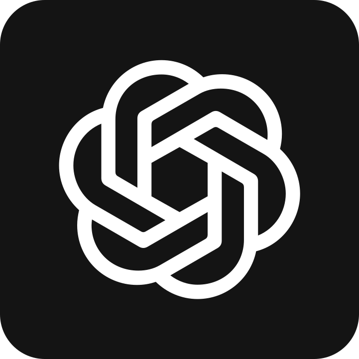
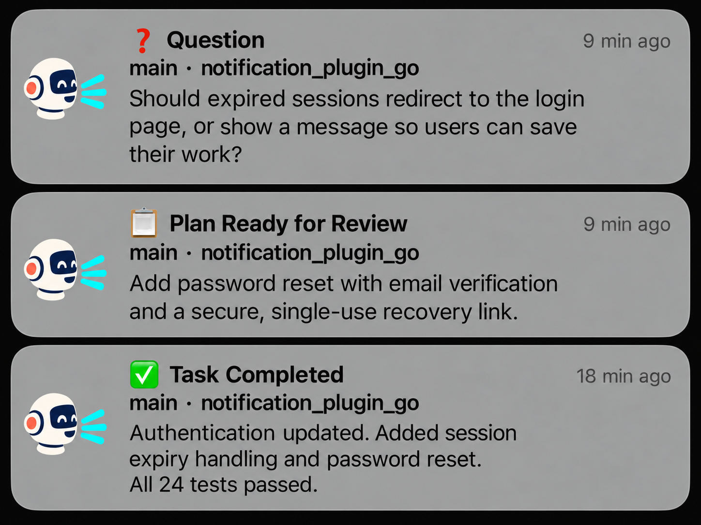
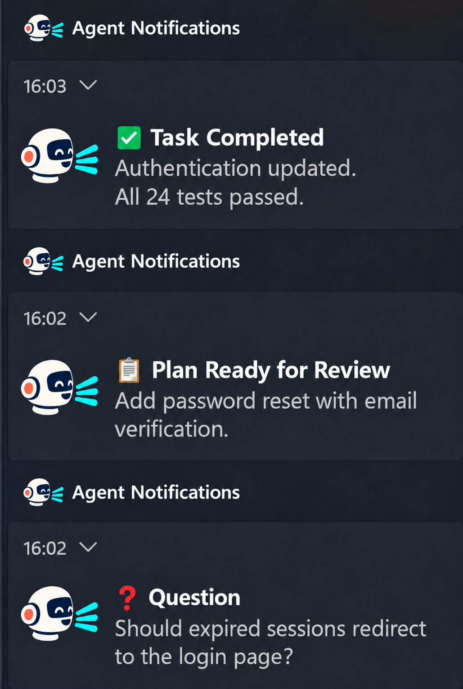
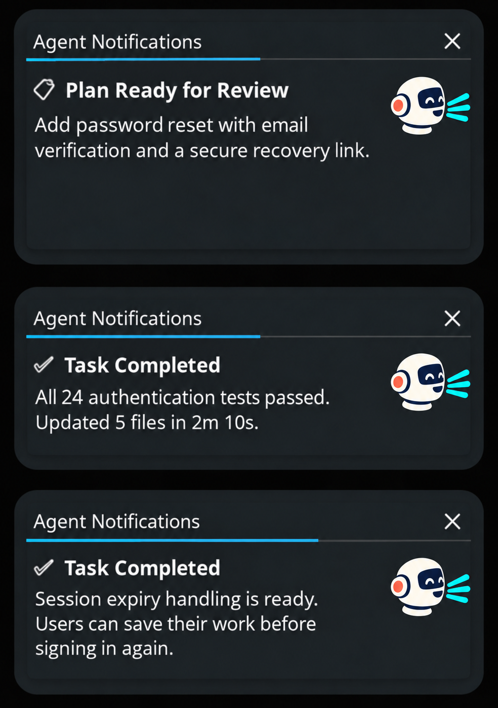

<p align="center">
  <a href="https://777genius.github.io/agent-notifications/"></a>
</p>
<h1 align="center"><a href="https://777genius.github.io/agent-notifications/">Agent Notifications</a></h1>

<p align="center">
  <a href="#install-or-update"></a>
  &nbsp;&nbsp;
  <a href="docs/CODEX.md"></a>
  &nbsp;&nbsp;
  <a href="docs/opencode-notifications.md"></a>
  &nbsp;&nbsp;
  <a href="docs/gemini-notifications.md"></a>
</p>

[](https://github.com/777genius/agent-notifications/actions/workflows/ci-ubuntu.yml?query=branch%3Amain+event%3Apush)
[](https://github.com/777genius/agent-notifications/actions/workflows/ci-macos.yml?query=branch%3Amain+event%3Apush)
[](https://github.com/777genius/agent-notifications/actions/workflows/ci-windows.yml?query=branch%3Amain+event%3Apush)
[](https://pkg.go.dev/github.com/777genius/agent-notifications)
[](https://codecov.io/gh/777genius/agent-notifications)

Desktop notifications for **Claude, Codex CLI and OpenCode**. Know when a task finishes, an agent needs input, or a tool needs approval. Claude and Codex also support sounds and click-to-focus.

<p align="center">
  
  <a href="docs/images/notifications-macos.png"></a>
  <a href="docs/images/notifications-windows.png"></a>
  <a href="docs/images/notifications-linux.png"></a>
</p>

## Install Or Update

**[Guided installer](https://777genius.github.io/agent-notifications/#install)** or run:

```bash
curl -fsSL https://777genius.github.io/agent-notifications/install.sh | bash
```

Choose **Claude**, **Codex CLI**, **OpenCode**, or a combination. Install the selected agent CLIs first. Run the same command to update.

**Windows:** use **Git Bash**, not WSL, for a native Windows installation.

After setup:

- **Claude:** restart Claude.
- **Codex:** restart Codex, then review and trust the installed hooks in `/hooks`.
- **OpenCode:** restart OpenCode; on macOS, [grant notification permission](docs/opencode-notifications.md#macos-notification-permission).

**Gemini CLI:** available in the **[1.47.0 Linux/Windows prerelease](https://github.com/777genius/agent-notifications/releases/tag/v1.47.0)** through its explicit installation instructions. The command above installs stable **1.46.1**, which does not include Gemini. macOS Gemini support is still a candidate.

<details>
<summary>Non-interactive installation and optional notification tools</summary>

For Codex only:

```bash
(set -o pipefail; curl -fsSL https://777genius.github.io/agent-notifications/install.sh | bash -s -- --product codex)
```

Use `--product claude` or `--product both` for Claude or Claude + Codex. For all three stable agents:

```bash
(set -o pipefail; curl -fsSL https://777genius.github.io/agent-notifications/install.sh | bash -s -- --products claude,codex,opencode --desktop)
```

For OpenCode, choose `--desktop`, `--webhook`, or both; webhook destinations need separate configuration. These flags do not change Claude/Codex channels.

Claude/Codex setup also installs the `agent-notify` MCP server and `agent-notifications` skill so an agent can notify you during a task. Open a new session after setup. Use `--skip-agent-notify` for hooks only. [Setup and recovery details](docs/INSTALLATION.md).

</details>

[Manual installation](docs/INSTALLATION.md#manual-install) · [Manual Codex registration](docs/CODEX.md#manual-codex-registration) · [Uninstall](docs/INSTALLATION.md#uninstalling) · [Troubleshooting](docs/troubleshooting.md)

## Features

- **Task and attention alerts:** completions, questions, tool approvals and more, depending on the agent. See the table below.
- **Click-to-focus and sounds (Claude/Codex):** return to the originating terminal or editor; choose built-in or custom sounds, volume and audio output. [Supported terminals](docs/CLICK_TO_FOCUS.md) · [Sound settings](docs/CONFIGURATION.md#sound-options)
- **Useful context:** Claude/Codex show project, git branch and native session names, with generated labels as fallback. OpenCode desktop alerts show native session names when available. Question alerts show the current question when supplied by the host. OpenCode webhooks retain generic text. [Session context](docs/CONFIGURATION.md#session-context) · [OpenCode context](docs/opencode-notifications.md)
- **Less noise:** focus-aware delivery, delays, filters and optional subagent alerts. [Configuration](docs/CONFIGURATION.md#focus-aware--delayed-notifications) · [Do Not Disturb](docs/DO_NOT_DISTURB.md)
- **Webhooks:** Slack, Discord, Telegram, Lark/Feishu and custom endpoints. [Integration guides](docs/webhooks/README.md)
- **Cross-platform:** macOS (Intel/Apple Silicon), Linux (x64/ARM64) and Windows 10+ (x64). Agent and delivery limits are listed below. [Platform details](docs/PLATFORMS.md)

## Supported Agents

| Agent | Alerts | Sounds / click-to-focus | Details |
| --- | --- | --- | --- |
| **Claude** | Completions, reviews, questions, plans, session limits and API errors | Yes | [Notification types](docs/NOTIFICATION_TYPES.md) |
| **Codex CLI** | Turn completion and tool permissions; questions and errors depend on host events or final-message detection | Yes | [Setup and limits](docs/CODEX.md) |
| **OpenCode** | Root-session completion, questions, permissions and errors | No | [Setup and limits](docs/opencode-notifications.md) |
| **Gemini CLI** | Turn completion and tool permissions | No | [Prerelease setup and qualification](docs/gemini-notifications.md) |

Published OpenCode support is tested with **1.18.33**; published V2 support is not declared. The dual-API candidate targets **1.18.33, 2.0.0 and 2.0.21** with one installed plugin; final platform qualification, SDK publication and a clean registry install remain pending. [Candidate setup and qualification limits](docs/opencode-notifications.md). Gemini is tested with **0.62.0**; a completed turn does not necessarily mean task success or a final answer. OpenCode/Gemini alerts require explicit desktop/webhook consent. Gemini alerts and OpenCode webhooks use generic text. OpenCode desktop alerts may include bounded native session titles and current question text.

For the OpenCode candidate on stock Windows V1, the original event age is not always independently verifiable. A delayed completion may notify once and recur after the 24-hour claim lifetime; filters, provenance, deduplication and limits still apply.

## Settings

In Claude, run `/claude-notifications-go:settings` for the settings wizard or `/claude-notifications-go:sounds` to preview sounds.

Use the installed launcher to find or safely inspect settings. The commands below assume `agent-notifications` is on your `PATH`; otherwise, use its full path.

```bash
agent-notifications config path
agent-notifications config inspect --json
```

Settings are shared, with optional per-agent overrides. The `claude-notifications` alias and Claude's existing slash-command names remain supported.

[Configuration reference](docs/CONFIGURATION.md) · [Per-agent overrides](docs/AGENT_CONFIGURATION.md) · [Sound previews](docs/interactive-sound-preview.md)

## Documentation

- [Installation, updates and removal](docs/INSTALLATION.md)
- [Notification types](docs/NOTIFICATION_TYPES.md) and [click-to-focus](docs/CLICK_TO_FOCUS.md)
- [Webhooks](docs/webhooks/README.md)
- [Troubleshooting](docs/troubleshooting.md) and [plugin compatibility](docs/PLUGIN_COMPATIBILITY.md)
- [Architecture](docs/ARCHITECTURE.md) and [local development](docs/LOCAL_DEVELOPMENT.md)
- [Changelog](CHANGELOG.md)

Built with [Universal Agent Plugins](https://github.com/777genius/universal-agent-plugins). [Build plugins for multiple AI agents](https://github.com/777genius/universal-agent-plugins#build-plugins).

## Contributing

See [CONTRIBUTING.md](CONTRIBUTING.md) for development and testing. Pull requests are subject to the [Contributor License Agreement](.github/CLA.md); contributors keep copyright.

GPL-3.0-or-later. See [LICENSE](LICENSE) and [third-party notices](internal/thirdpartynotices/THIRD_PARTY_NOTICES.txt).
