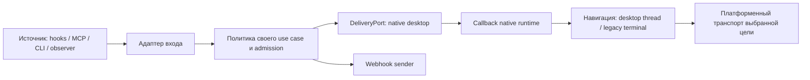

# План: быстрая навигация по уведомлениям и адаптеры источников

Дата: 2026-10-03. Статус: три круга самостоятельного ревью и исправлений завершены; готов для P0/P2. Реализация P3 зависит от подтверждения транспорта в P2.

Основание: запрос владельца на план по [Q](/Users/belief/.codex/skills/q/SKILL.md), адаптеры способов поступления уведомлений и три круга ревью/исправлений. Реализация, выпуск и изменение установленного приложения в эту задачу не входят.

Исследованный upstream: `origin/main`, `e637d0bcecce7b118cd2f2afc33671f888550f58`. Рабочий checkout: `5a33c8f75e1f323dcd43bd83623db22032bad239`; новые upstream-файлы читались через `git show`, чужие рабочие изменения не переносились. Перед реализацией сверить изменения после исследованного SHA.

## 1. Результат и ограничения

Получить быстрый переход из нашего уведомления в выбранный чат там, где клиент и ОС позволяют доказать адресность доставки. Поддерживать расширение источников и платформ без копирования бизнес-правил на каждую комбинацию.

- Сначала macOS/Codex: измерение реального callback, проверка пригодности быстрого транспорта, затем рабочее ускорение.
- Windows/Linux: отдельные этапы с собственным подтверждением native callback и способа открытия клиента. До подтверждения оставлять честный `navigation_unavailable`.
- Уведомления встроенного Codex Desktop принадлежат хосту; этот план управляет callback нашего плагина.
- Уже принятый запрет skill на дубли нативных вопросов/approvals сохраняется. `attention` остаётся категорией подачи, а не доказательством события или владельца уведомления.
- Не обещать открытие видимого чата по успешному вызову API ОС. Без подтверждения клиента можно доказать только передачу запроса.

Не входят: новый daemon для всех ОС, универсальный plugin registry, собственный IPC внутри стороннего Codex, переписывание всех sources, изменение default URI handler, новые runtime approvals и публикация релиза.

## 2. Что уже есть

| Граница | Реализация в исследованном main | Следствие для плана |
| --- | --- | --- |
| Claude/Codex hooks | `internal/hooks/{event,claude_source,codex_source}.go`, `internal/{claudesource,codexsource}` | Уже есть `EventSource`; переиспользовать, не создавать второй decoder |
| Explicit MCP/CLI | `internal/agentnotify/{mcp,cli,origin}`, `Service`, `TargetPort` | Транспорт создаёт origin, модель передаёт только ограниченный payload |
| OpenCode observer | `internal/opencodeevent/consumer.go` | Fixed copy, свой consent, `Navigation=None`; native IDs не публикуются |
| Gemini observer | `internal/{geminisource,geminievent}` | Свои facts/admission, budget и channel claims; не переносить в rich hooks pipeline |
| VS Code Local observer | `internal/{copilotvscodesource,copilotvscodeevent,copilotvscodeinstall}` | Публичный ingress пока нейтрален; наличие consumer не доказывает активную доставку |
| Общая доставка | `internal/notification/delivery.go`, `DeliveryPort`, `ReadinessPort` | Расширять существующий контракт, не вводить параллельный notification service |
| macOS click | Swift `CallbackRouter`, `CallbackLifecycle`, `DesktopThreadExecutor` | Durable typed action, один lifecycle owner, bounded preflight, phase timings уже есть |
| macOS Local authority | `internal/notifier/delivery.go`, `LocalAuthorityLease` | Сохранить retained lease, `BeforeHandoff` и `Complete`; не оборачивать вторым lock owner |
| Windows/Linux structured delivery | `internal/notifier/{delivery_toast,delivery_linux}.go` | Есть доставка без точного chat route; Linux session закрывается после submission |
| Legacy terminal focus | `internal/notifier/notifier.go`, `internal/daemon`, platform focus adapters | Другой тип цели и гарантии; сохранить отдельным совместимым маршрутом |

В `DesktopThreadExecutor` полная `SecStaticCodeCheckValidity` выполняется на каждый клик. Эквивалентная CLI-проверка установленного приложения заняла 6,652 секунды. Это локальное наблюдение одной проверки, а не измерение production callback или доказанный p95.

Текущая проверка возвращает URL приложения, после чего `NSWorkspace.open` получает этот URL. Предложение проверить процесс быстрее и оставить тот же opener само по себе не связывает проверенный экземпляр с получателем. Быстрый путь требует отдельного доказательства транспорта.

## 3. Архитектурные границы по Q

Три оси меняются независимо: источник события, канал доставки, способ открытия цели. Не создавать типы вида `CodexMacNotificationAdapter` для всего конвейера.



Диаграмма показывает исполнение. Зависимости исходного кода направлены к consumer-owned contracts, а SDK, AppKit/WinRT/D-Bus остаются во внешних адаптерах. Webhook не имеет desktop callback.

### 3.1. Адаптеры входа

Под способом поступления понимаются hook, explicit MCP, explicit CLI и observer. Provider и способ поступления должны быть отдельными характеристиками: Codex hook и Codex MCP используют разные admission/provenance, но могут вести к одной логической цели.

| Вход | Владеет | Передаёт дальше |
| --- | --- | --- |
| Claude/Codex hook source | Bounded decoding, SDK-to-product mapping | Существующий `hooks.Event`, затем политика hooks |
| MCP adapter | Framing, cancellation, transport metadata | `agentnotify.Payload` + transport-owned `origin.Context` + первоначальный deadline |
| CLI adapter | Bounded input, безопасное чтение context | Тот же explicit use case; caller-asserted provenance сохраняется |
| OpenCode/Gemini/VS Code Local | Узкие native facts и нейтральный hook response | Существующий consumer, его admission и фиксированный `notification.Request` |

Не нормализовать все входы в огромный универсальный event. Различные политики остаются у своих use cases: rich transcript/enrichment у hooks, explicit journal у agentnotify, минимальные facts у observers. Общая авторитетная точка для одинаковых правил доставки уже существует в `internal/notification`.

Текущий каталог допустимых целей:

| Source/use case | Цель в текущем коде | Правило расширения |
| --- | --- | --- |
| Codex explicit MCP/CLI | Codex thread при явной local routing policy и допусках provenance; иначе unavailable/none | Ускоряется подтверждённый existing route |
| Claude/Codex hooks | Legacy terminal focus либо баннер без focus | SessionID hook не объявляется desktop chat ID; новый route требует доказательства client semantics |
| OpenCode/Gemini observer | `none` | Native session IDs остаются private facts; новый route не выводится из наличия ID |
| VS Code Local | Публичный ingress нейтрален; consumer проектируется с `none` | Этот план не включает его эффекты и не завершает соседний rollout |

Built-in host notification не является входным адаптером нашего плагина. Suppression по host ownership допустим только по документированному trusted host event contract; `provider=codex`, категория, текст и отсутствие native настроек этого не доказывают. В текущем scope действует принятый skill fix, без нового глобального runtime suppression.

### 3.2. Навигация и доставка

- Канальный адаптер отвечает за submission и native callback ownership, но не придумывает идентичность чата.
- Resolver использует проверенный origin и установленный binding, выбирает логическую цель и сообщает фактическую capability.
- Route encoder знает формат конкретного клиента. `threadID` кодируется как один непрозрачный сегмент; scheme/query/fragment не приходят из модельного payload.
- Platform navigator отвечает за discovery, проверку доверия, адресный handoff и активацию.
- Composition root связывает source/use case/delivery/navigator. Никакого DI container или runtime discovery plugins.

Текущие `DesktopTarget.ApplicationPath/TeamID` сохранять до совместимой миграции. При втором подтверждённом platform adapter отделить логическую цель (`provider`, `threadID`) от platform-owned binding. Consumer-owned цель описывает выбранную установку; конкретные bundle/path/team/package/service данные сериализует native adapter в immutable callback snapshot. Не заводить отдельное mutable хранилище только ради интерфейса.

Для Go/Swift native action переиспользовать существующие `swift-notifier/Tests/Fixtures/native-v1.schema.json`, `desktop-thread-v1.actions.json` и описание semantics в `swift-notifier/PROTOCOL.md`. Schema/fixtures задают wire contract; документацию сверять с исполняемым lifecycle, поскольку отдельные старые формулировки уже отстают от кода. Go fixture copy сверяется с canonical Swift fixture, а оба codec выполняются на этих случаях с независимо заданными ожидаемыми результатами. Сохранять codec каждого клиента у route adapter; source не должен второй раз собирать URI. Общий cross-language runtime library и генератор ради этой задачи не вводятся.

### 3.3. Паттерны с конкретной пользой

| Паттерн | Применение | Что защищает |
| --- | --- | --- |
| Ports and Adapters / Adapter | Существующие `EventSource`, `TargetPort`, `DeliveryPort`, native transport seams | Независимость policy от SDK/ОС |
| Strategy | Выбор qualified running transport или cold opener внутри navigator | Различие механизма без копирования lifecycle |
| Explicit state machine | Один callback lifecycle, handoff/outcome/deadline | Запрет второй попытки после неопределённого эффекта |
| Composition Root | Wiring в cmd и native app startup | Отсутствие глобальных singleton registries |
| Compatibility adapter | Legacy terminal focus, только при переносе реального consumer | Сохранение поведения без притворного chat precision |

Не использовать Chain of Responsibility с автоматическим перебором транспорта: нельзя продолжать цепочку после возможного эффекта. Не вводить базовый класс для всех agents или по интерфейсу на каждое поле.

## 4. Контракт навигации

### 4.1. Запрос и snapshot

Использовать существующие target/correlation/action DTO, расширяя только при подтверждённом consumer. В conceptual contract входят:

- Семантическая цель: `none`, `desktop_thread` или существующая legacy terminal action.
- Проверенный origin: provider, ingress/provenance, locality/interface; неизвестные значения не превращаются в desktop/local.
- Выбранная установка и профиль, если профиль реально установлен trusted integration. Путь или foreground не доказывают профиль/store.
- Immutable snapshot маршрута на момент создания уведомления и correlation UUID.
- Versioned bounded native action, достаточная для клика после завершения producer.

OS-specific receiver identity и handles остаются внутри адаптера. PID не является долговременной идентичностью и не сохраняется как единственная цель старого уведомления.

Snapshot не зависит от journal/config/spool producer. Предпочитать встроенный OS payload, как существующий macOS userInfo. Если платформа требует opaque token и локальную запись, её lifetime/immutable data/cleanup принадлежат установленному callback owner; это отдельный обоснованный platform seam. Аргументы активации и token считаются недоверенными: bounded decoding, привязка к owned notification/binding и запрет произвольного URL/path/executable.

### 4.1.1. Два независимых срока

Deadline submission начинается при admission входа и ограничивает отправку баннера. Он не сохраняется как срок клика: уведомление через несколько часов должно оставаться применимым.

Callback получает один новый bounded budget при приёме клика и не продлевает его при смене running/cold стратегии. Текущие macOS 30 секунд для desktop action являются верхней границей, а не задержкой; legacy budget сохраняется. Источник времени и проверки deadline должны учитывать suspend, если он случился внутри attempt; старый boot submission не запрещает новый клик после reboot. Wayland activation token получают для нового клика, не сохраняют из момента отправки.

### 4.2. Результат и эффекты

| Результат | Значение | Повтор/другой транспорт |
| --- | --- | --- |
| `unavailable` / `rejected_before_handoff` | Нет поддержанного маршрута или операция отвергнута до передачи | Cold path допустим только если причина допускает его и доказано отсутствие эффекта |
| `handoff_accepted` | ОС/адресный транспорт принял запрос | Не повторять автоматически |
| `handoff_unknown` | Запрос мог быть передан, подтверждение отсутствует | Не повторять автоматически |
| `target_confirmed` | Клиент подтвердил ту же цель и request | Пока не поддержано; не синтезировать из API ОС |

Это семантика, не поручение переименовать все wire enums. Существующие `open_requested`, `open_unknown`, `submitted`, `unknown` переводятся на границе без слома старых receipts.

Generic error или `open_failed` после вызова внешнего API не считается доказанным no-effect. Разрешённый переход running -> cold должен иметь явный результат адаптера `not_running_before_handoff` либо документированную эквивалентную причину. Signature mismatch, неоднозначность, отказ TCC и истёкший budget завершают attempt; они не запускают обходной транспорт. Возможный handoff фиксируется до внешнего вызова, включая panic/late completion.

`required` требует доступного точного маршрута до submission; `best_effort` разрешает баннер без navigation с явной причиной; `none` вообще не запускает discovery/verifier/opener. Readiness остаётся снимком, а не обещанием результата будущего клика.

Разделять точность адреса цели (`chat_id` означает передачу точного opaque ID), способ привязки receiver и уровень подтверждения результата. Общий контракт selected installation не обещает process binding для cold opener или Windows package activation. Дополнительная гарантия связанного running receiver относится только к qualified running strategy. Эти различия фиксируются в qualification evidence и существующих scope/reason; новые публичные поля добавляются лишь при потребности consumer, без фиктивной одинаковой гарантии всех adapters.

### 4.3. Исполнение клика

1. Decode action и проверка версии, размеров, correlation, permitted click identifier.
2. Создание bounded callback attempt в существующем lifecycle.
3. Разрешение выбранной установки без смены её на первую/foreground/backup копию.
4. Если есть qualified running transport: проверка того же receiver и передача через связанный endpoint.
5. Если running path доказанно не совершил handoff и допускает cold path: полная проверка выбранного приложения и существующий cold opener.
6. Ровно один terminal outcome для attempt, без повторной отправки после unknown.

Проверка по пути/version/mtime не заменяет проверку подписи. Перенос полного сканирования на момент создания уведомления не доказывает безопасность будущего клика.

Гарантия at-most-once относится к одному принятому callback attempt. Correlation уведомления не является уникальным ID каждого клика. Повторный пользовательский клик может быть новой операцией; не подавлять его навсегда по notification ID и не обещать exactly-once между рестартами без стабильного native click ID. Late/double completion одного attempt не создаёт новый handoff. Dismiss/unknown button не исполняют action.

## 5. Платформенные адаптеры

### macOS

Сначала квалифицировать адресный transport для уже работающего Codex. Исследовать public process identity API Security и способ отправки open event тому же receiver. Dynamic signature validation проверяет идентичность процесса, но не равна полной проверке всех resources; границу гарантии явно зафиксировать. Audit token сам по себе не является адресом доставки, повторная проверка PID не делает операцию атомарной.

Не подменять `ApplicationVerifying` динамической проверкой с более слабым постусловием. Cold validation и running receiver binding имеют разные узкие контракты. P2 должен установить, как защищается выполнение resource-кода клиента, и обосновать допустимый threat model; отсутствие такого обоснования означает отказ от fast path. Native helper lease удерживает нашу установку, но не блокирует обновление стороннего Codex. Текущий path-based cold open также не доказывает атомарную привязку к running process; эту гарантию ему не приписывать.

Проверить TCC/Automation prompts, несколько копий приложения, разные профили, relaunch/update/exit между validation и dispatch. Если пригодного связанного транспорта нет, fast path не включать; сохранить существующий проверяемый путь и точные измерения. Доказательство идентичности не должно заменяться молчаливым обращением к default URL handler.

Новый permission prompt не должен неожиданно появляться из fast click path. Если transport требует отдельного Automation consent, сначала подтвердить поддержанный explicit setup и поведение при deny; без этого transport не квалифицирован. Подпись/bundle не доказывают текущий аккаунт/store: signed-out, смена профиля и отсутствующий chat дают client limitation, без поиска другого чата или приложения.

Полную проверку cold path и bounded worker slots сохранить. Перевод работы с `.utility` на `.userInitiated` допустим после измерения queue delay, но не является заменой устранения полного resource scan из быстрого пути.

### Windows

Проверить фактическую поддержанную дистрибуцию клиента, URI registration и выбранную package identity. Для packaged client кандидат: `LauncherOptions.TargetApplicationPackageFamilyName`; это выбор пакета, а не доказательство конкретного процесса или видимого чата.

Отдельно спроектировать активацию callback установленного notifier после завершения sender: сама `Show` toast и `ShellExecute` URI не доказывают это. Protocol/COM activation нашего callback не должна становиться доступом к произвольным executable, shell или чужим targets. Для unpackaged клиента qualified механизм определить отдельно; не имитировать package guarantee.

### Linux

Проверить поддержку клиента, desktop entry и `org.freedesktop.Application.Open`. Зафиксировать выбранную установку/service и способ подтверждения identity её running owner. Для Wayland получать click-time activation token по поддержанному протоколу.

Разделить notification callback и activation клиента. Текущий structured adapter отправляет без actions и закрывает D-Bus connection; добавление URL не создаст durable click handler. Проверить установленный callback owner/активацию после смерти sender отдельно, включая смену владельца notification service и идентичность привязанного notification ID. Не строить универсальный daemon, пока не доказана необходимость для этой платформы.

Если compositor/server/client не поддерживают нужный механизм, capability остаётся unavailable; Linux terminal focus и точный desktop chat не взаимозаменяемы.

## 6. Этапы реализации

Каждый этап имеет отдельный ownership, focused checks и revert. Никакой реализации Windows/Linux до подтверждения native способа и lifetime. Все оценки ориентировочные changed LOC, вместе с тестами, без generated файлов.

| Этап | Результат / ownership | Проверка завершения | LOC |
| --- | --- | --- | --- |
| P0: измерение | Swift callback phases, evidence docs; использовать уже существующие timings | Реальный installed callback на TEST: queue/discovery/validation/handoff измерены отдельно; production app не открывалась для теста | 60-140 |
| P1: контракт | Existing origin/resolver, Swift seams и composition; документация и только необходимые изменения | Supported/unsupported precision честны; `none` без probing; native DTO не просачиваются в policy | 40-100 |
| P2: macOS qualification | Изолированный transport prototype + TEST app fixtures, без изменения production default | Доказаны связанный receiver, TCC и отсутствие misdelivery при exit/relaunch/update/двух копиях | 150-300 |
| P3: macOS vertical slice | Swift navigator/executor и focused callback tests; cold path сохраняется | Измеренное ускорение running path; lifecycle и старые typed actions работают | 350-650 |
| P4: source integration, при необходимости | Один existing ingress/compatibility adapter; без массового переноса источников | Полный ingress -> policy/admission -> delivery -> installed callback; его consent/privacy не ослаблены | 0, если изменений не нужно; иначе 120-260 |
| P5w: Windows | Platform delivery/callback/navigation lane | Installed toast после смерти sender, выбранная supported identity, честный handoff result | Уточнить после qualification |
| P5l: Linux | Platform delivery/callback/navigation lane | Durable callback, выбранный receiver, Wayland activation, server restart semantics | Уточнить после qualification |

P0 и P2 могут быть подготовлены независимо. P3 требует результатов P0/P2 и лишь необходимых изменений P1. Перенос sources не блокирует полезное macOS ускорение. Общую модель обобщать только по требованиям доказанного второго adapter/consumer.

Передача coding-worker содержит exact base SHA, ownership, ограничения TEST environment и тестовые критерии раздела 7. P0/P2 являются bounded evidence work; их не превращать в платформенный framework. P2 оставляет короткое решение: точные public API, receiver lifetime/binding, ресурсные гарантии, consent requirements, измерение latency, поддержанная client distribution и список сценариев с observed outcome. Отрицательный результат также пригоден для решения. Private API/недокументированный запуск клиента не принимаются как production транспорт.

Для P3 оставить текущий `desktop_thread_v1`: смена внутренней стратегии не требует новых action fields или public origin schema. Все источники уже имеют адаптеры; дополнительный новый interface оправдан конкретным изменением, а не желанием заполнить матрицу. MCP/CLI explicit route проверяются как существующие входы; hooks/observers не получают новую навигацию автоматически. Оценка P0-P3 суммарно 600-1190 LOC; дополнительные P4/P5 считаются отдельно.

Checkpoints должны оставаться когерентными и самостоятельно проверяемыми; целевой размер PR до 2000 changed LOC без generated/fixture исключений. Не разбивать native protocol producer/consumer compatibility так, чтобы промежуточный main перестал работать.

Если P2 не проходит, остановить только fast-path lane с evidence и конкретным ограничением. Не ослаблять trust ради выполнения числового latency target. Полезный P0 остаётся самостоятельным checkpoint.

## 7. Проверки наблюдаемого поведения

Перед новым тестом записать, какая поломка делает его красным. Использовать ближайшую сильную границу, а не повторять один mock scenario на каждом слое. Для исправленного бага по возможности показать red на прежнем коде и green после изменения.

| Риск | Проверка / граница |
| --- | --- |
| Source врёт об origin/capability | Source/consumer contract: missing metadata, caller-asserted, remote/headless, observer IDs не превращаются в chat route |
| `none` внезапно открывает приложение | Policy/navigator behavioral test: discovery/verifier/open не вызываются |
| Выбранная A меняется на B | Native installed click: уведомление A -> change setup to B -> producer/config removed -> click сохраняет A или отказывает |
| Validation и dispatch обращаются к разным процессам | Native transport qualification с exit/relaunch/update/reused PID/двумя copies |
| Старое уведомление ошибочно expired | Installed callback спустя submission deadline и после reboot; один свежий click budget, без его продления при fallback |
| Deadline заканчивается во время проверки | Existing callback seams: main queue отвечает, поздняя проверка не начинает open, slot освобождается после реального возврата sync work |
| После unknown создаётся второй эффект | Transport contract: unknown после handoff не вызывает другой opener |
| Теряется concurrent click | Existing lifecycle tests: две разные цели завершаются независимо, reverse completion, idle boundary |
| Повторный completion отправляет второй open | Behavioral attempt test: double/late completion, dismiss/unknown action; отдельный deliberate click не блокируется навсегда |
| Success ошибочно означает visible chat | Receipt test: accepted ОС не создаёт `target_confirmed` |
| Обновление ломает старый баннер | Native installed callback old action -> new helper и rollback compatibility |
| Source migration теряет consent/lease/privacy | Existing consumer tests + один full handoff: revocation under retained lease, fixed copy, отсутствие второго lock owner |
| Sender умер до клика | Установленный native callback на каждой поддержанной ОС; in-memory mock недостаточен |

Только новые TEST/sandbox projects, synthetic chats и отдельные test profiles. Нельзя использовать реальный пользовательский проект как cwd/задание/target, запускать там agent/runtime/terminal. Native app activation производится только на явно тестовой установке; текущий Codex/ChatGPT пользователя не используется для прогона.

Копия `.app` и временный cwd сами по себе не являются изоляцией: клиент может разделять userdata/singleton с текущим приложением. Реальный distribution тестировать в отдельной VM/OS test account с синтетическим профилем, либо после доказательства поддержанной полной изоляции. Controllable signed TEST fixture проверяет transport races, но не квалифицирует поведение настоящего Codex. Native qualification требует обоих видов evidence и поддержанной signing identity; test permission не доказывает разрешение текущего production user.

Focused Go checks для затронутых consumers/notification/notifier и Swift package tests выполняются в изолированной копии. Тяжёлые проверки/сборки предпочтительно на hosted workers; native checks требуют соответствующего OS runner. Полный обязательный CI выполняется на exact head mergeable checkpoint; успешные проверки не повторяются без изменения или нового риска.

Минимальные воспроизводимые команды будущей реализации:

```sh
go test ./internal/agentnotify/origin ./internal/notifier/nativeprotocol ./internal/notifier
swift test --package-path swift-notifier
```

Добавлять source/service packages к focused Go run только при их изменении. CI macOS уже запускает `swift test --package-path swift-notifier` и Go race suite; повторно сверить project gates перед merge. Linux runner не квалифицирует AppKit, cross-compilation не квалифицирует toast callback, а headless CI не подтверждает реальную активацию окна. При отсутствии подходящего изолированного native runner зафиксировать конкретную недоказанную платформу, не запускать текущий пользовательский клиент вместо него.

## 8. Наблюдаемость и выпуск

Сохранять correlation UUID, attempt и фиксированные phase/outcome labels. Не логировать threadID, app path, prompt/body, transcript, raw event или shell. Применять существующий OS log sink, не stderr legacy callback.

Измерять click received -> queue -> discovery -> validation -> handoff completion; app UI render отделён и доступен только при клиентском acknowledgement. Время запуска callback helper до `callback_received` измерять отдельно, когда это позволяет test harness. Не называть его signature delay.

Записать baseline/after на одной TEST identity/version: running и cold отдельно, число samples, ошибки, выбранный transport и условия OS/load. Для running сравнения планировать 50 controlled attempts до/после, публиковать empirical p50/p95 и размер выборки; это не гарантия p95 на всех машинах. Для небольшой cold выборки публиковать median/range, не убедительный p95. Ошибки/unknown не выкидывать из отчёта ради красивой latency. Предварительная цель running handoff p95 <= 500 ms, без обещания UI latency и без ослабления доверия; P0 может уточнить цель на основании evidence с явной записью причины.

Один qualified macOS slice, затем независимые platform lanes. Новые capability включаются только для подтверждённых distributions/transports. Rollback отключает fast path внутри совместимого native runtime и возвращает прежнюю cold strategy; не подменяет helper произвольной старой версией, которая не читает уже отправленные actions. Для первого slice wire остаётся v1. Если будущей платформе/цели нужен v2, сначала поставляется совместимый reader и capability negotiation; producer начинает выпуск v2 только после этого. Минимальная совместимая callback version является floor downgrade, либо существующий installer сохраняет совместимый callback-only runtime. Новую систему retention ради v1 macOS ускорения не строить. Публикация релиза требует отдельного разрешения владельца.

Acceptance первого slice: P2 подтверждён, running latency улучшилась по определённому P0 измерению, нет misdelivery/второго handoff в adversarial fixtures, installed client qualification выполнена, v1/legacy decode сохранены и existing mandatory CI зелёный на exact head. Исправление фактической задержки нельзя объявлять по unit tests или одному CLI codesign benchmark.

## 9. Три круга ревью и исправлений

Ревью выполняет основной агент. Здесь фиксируются конкретные находки, изменения плана и оставшиеся ограничения; архитектурное ревью плана не считается native qualification или техническим ревью будущего кода.

### R1: границы, provenance и Q - выполнено

Находки и исправления:

1. Диаграмма ошибочно проводила webhook через desktop callback. Разделены выходы desktop и webhook.
2. Общая формулировка sources могла разрешить превращение observer sessionID в desktop chat ID и включение незавершённого Local ingress. Добавлен каталог текущих целей и запрет такого расширения без client evidence.
3. Не был указан владелец знания Go/Swift action codec. Закреплена существующая native спецификация и behavioral fixtures, без второго encoder в source.
4. Разделены built-in host notification и наш ingress: adapters не обещают детерминированное подавление native дублей по `attention`/provider.

Результат: минимальные границы покрывают фактические оси изменения; универсальная event/platform иерархия не требуется. Остаточное ограничение: конкретный running transport остаётся предметом P2.

### R2: эффекты, lifetime, security и платформы - выполнено

Находки и исправления:

1. Не разделены срок submission и поздний клик. Введены независимые budgets, suspend/reboot semantics и click-time activation token.
2. Общий отказ транспорта мог быть ошибочно признан safe fallback. Добавлена узкая допустимая причина running -> cold и terminal отказ для identity/TCC/ambiguity/expiry.
3. Dynamic validation имела более слабые гарантии, чем existing static verifier. Разделены контракты, обязательны resource-code threat model и receiver binding; helper lease не объявлен lock стороннего приложения.
4. Не определены границы duplicate clicks и durable tokens. Добавлены per-attempt at-most-once, недоверенная callback activation и platform-owned lifetime записи при необходимости.
5. Изоляция TEST app могла разделять singleton/userdata с настоящим клиентом. Уточнены VM/OS account и раздельное evidence fixture/реального distribution.

Результат: план сохраняет отказ после неизвестного эффекта и не обещает универсальную идентичность процесса/профиля. Неопределённость public running transport не скрыта и блокирует только его включение.

### R3: исполнимость, миграция и acceptance - выполнено

Находки и исправления:

1. P1/P4 могли стать обязательным общим refactor перед полезным ускорением. Сужен P1, P4 сделан условным; первая macOS стратегия сохраняет v1 и existing ingress.
2. Названная в R1 документация не была единственным актуальным wire authority. Уточнены существующие schema/fixtures, semantic documentation и behavioral codec проверки.
3. Один общий статус мог скрыть различия process/package/path binding. Отделены точность target ID, receiver guarantee и подтверждение результата, без новых публичных полей ради таблицы.
4. Rollback к старому binary мог потерять новый action codec. Ограничен откат стратегии, определён reader-first порядок и compatibility floor для будущего v2.
5. Не было конкретного evidence output P2, focused commands и измеримого latency acceptance. Добавлены API/binding decision, project checks, sample/error правила и критерии первого slice.

Результат: три последовательных круга закончены, находки исправлены в основном тексте. План готов для bounded P0/P2; public transport viability и наличие native runner остаются открытыми проверяемыми условиями, а не выполненными gates.

## 10. Источники и точные границы знания

- [Q skill](/Users/belief/.codex/skills/q/SKILL.md): consumer-owned contracts, selective extension, минимальные значимые границы.
- Исследованный код `e637d0bc`: пути и ограничения перечислены в разделе 2. Existing agent-notify implementation plan является контекстом; несовпадение плана с кодом не означает наличие реализованной capability.
- [Apple NSWorkspace.open](https://developer.apple.com/documentation/appkit/nsworkspace/open(_:withapplicationat:configuration:completionhandler:)): selected application URL; не PID-addressed API.
- [Apple SecCodeCheckValidity](https://developer.apple.com/documentation/security/seccodecheckvalidity(_:_:_:)): dynamic code validation; само по себе не является механизмом доставки.
- [Microsoft TargetApplicationPackageFamilyName](https://learn.microsoft.com/en-us/uwp/api/windows.system.launcheroptions.targetapplicationpackagefamilyname): адресация выбранного package; пригодность конкретного Codex distribution пока не доказана.
- [Freedesktop D-Bus Activation](https://specifications.freedesktop.org/desktop-entry/latest/dbus.html): требуемый client interface и platform activation data.
- [Freedesktop Notifications](https://specifications.freedesktop.org/notification/latest-single/): submission/actions/callback capabilities; не доказательство наличия installed durable listener.

Итоговые оценки: архитектурное направление 🎯 8/10, ожидаемая надёжность после qualification 🛡️ 9/10, сложность полного направления 🧠 7/10. Уверенность в конкретном macOS running transport пока 🎯 6/10; не маскировать это готовым решением. Оценка 350-650 LOC относится к P3, а не ко всей кроссплатформенной программе.
