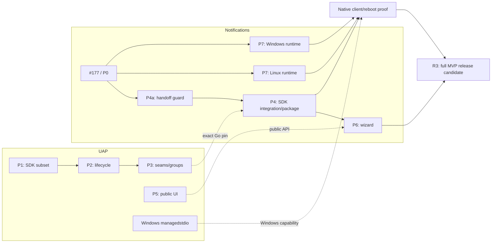

# UAP installer API и единый мастер Agent Notifications

Дата: 2026-09-14. Редакция 10. Статус: согласованы узкий SDK UAP сейчас и новые Notifications PR стеком поверх #177. #177 временно draft до собственной готовности; полный MVP и выпуск оцениваются отдельно. Документ является планом, а не отчётом о реализации или изменении GitHub-статуса.

Этот документ фиксирует результат обсуждения: удобный публичный установочный API UAP, переход Agent Notifications на него и один мастер для пользователя. Он также задаёт отдельный путь к кроссплатформенному notification E2E. Наличие пункта в плане не означает, что соответствующая возможность уже работает.

Навигация: [scope](#2-точные-границы-доставки) · [архитектура](#4-архитектура-и-направление-зависимостей) · [API](#5-контракт-публичного-installer-api) · [handoff/recovery](#7-владение-данными-и-восстановление-двух-систем) · [мастер](#9-единый-мастер-установки) · [порядок PR](#11-последовательность-реализации-и-ownership-pr) · [ОС](#13-отдельный-кроссплатформенный-scope) · [E2E](#15-матрица-product-e2e-и-критерии-готовности) · [оценка](#17-объём-работ-и-контроль-scope).

## 0. Что выпускать сначала и что действительно блокирует PR #177

**Обязательный порядок реализации: #177 завершаем как самостоятельную основу, новые изменения Notifications из этого плана выполняем отдельными stacked PR поверх #177.** Пока #177 не merged, первый дочерний PR создаём от актуального head его ветки `feat/agent-notify-e2e` и указываем эту ветку как base PR; следующие PR направляем на непосредственного родителя согласно §11.1. После merge родителя переносим только собственный delta ребёнка на актуальный `main` и обновляем base по §11.2. Независимые Linux/Windows ветки также используют самое раннее достаточное основание из этой цепочки, без искусственной зависимости от мастера.

В сам #177 вносим только исправления его согласованного scope. Существующий большой PR не разрезаем задним числом, не пересобираем в replacement stack и не включаем в него новую программу SDK/UI/ОС. Узкий SDK UAP развивается одновременно отдельными PR в своём repository от UAP main или предыдущего UAP PR; это не Git-стек поверх Notifications #177. Новую Windows-регистрацию MCP/skills сразу строим через UAP.

Согласовано временно держать #177 draft до закрытия его собственных дефектов и проверок, затем снять draft независимо от готовности дочерних PR. Merge основы не означает завершения всего кроссплатформенного MVP и не обязывает немедленно выпускать релиз. Для полного MVP нужны R1a/R1b/R2 и platform/client evidence §15; ограниченный ранний релиз требует отдельного решения. Редактирование этого файла само по себе не меняет GitHub-статус, не мержит PR и не публикует релиз.

### 0.1. Актуальный baseline и границы доказанного

Проверка от 2026-09-14, PR head `89d8524882fc8fa05f20de1889f8050c6e041cbf`, base `cb287498244e6839b6e345dc3c5c776a7f442615`:

| Проверка | Факт |
|---|---|
| GitHub-статус и размер | На момент чтения #177 открыт, `isDraft=false`; согласованное временное переведение в draft ещё не применено этой правкой документа. 46 612 additions + 464 deletions = 47 076 changed LOC, 315 файлов |
| CI Go 1.25/1.26 на Ubuntu, macOS, Windows | Все шесть jobs зелёные; lint, Swift tests и landing verify также зелёные |
| P2 из ревью `d3233d3` | Windows fixture использует release flags, size guard и отдельный stage; MCP saturation test ждёт завершения handshake |
| Native aliases | P2 закрыт: optional foreign legacy symlink сохраняется; обязательный foreign modern alias по-прежнему даёт отказ |
| Исторические focused проверки | `TestNativeAlias`, `bootstrap_product_test.sh` и отдельная проверка настоящих release bytes относились к `629f538`. Эта редакция прочитала новый delta и текущие CI results, но не повторяла native/client E2E |
| Последний публичный Notifications release | `v1.43.0`; номер версии не означает наличие нового managed-writer protocol |
| Публичная установка Codex | В `8fbd174` добавлена проверка advertised help перед новым флагом и configure command; прежний отказ `v1.43.0` исправлен в коде и parser fixture. Проверку настоящей публичной пары на новом head не подменять этим fixture или старым воспроизведением |
| Неполная MCP-настройка | На `89d8524` отсутствие configure API/бинарника и configure error всё ещё дают warning + exit 0. Нужны capability-aware default и отдельная ошибка явного запроса; это оставшийся scope R0 |
| Полноценный MCP на трёх ОС | Не готов: Windows stdio/storage/clock содержат unsupported, Linux production delivery также не завершён |
| Живой клиент после restart / reboot | Этим ревью не доказан; старые fake/inert E2E не превращаются в свежий native proof |

Историческое ревью `629f538`: https://github.com/777genius/agent-notifications/pull/177#pullrequestreview-5196095158. Новый delta: `8fbd174` исправляет release CLI compatibility; `89d8524` синхронизирует SIGTERM tests с подпиской на сигнал. Эта проверка плана не объявляет полное code review нового head выполненным. При новом commit обновить затронутые факты и checks; таблица не является бессрочным одобрением ветки.

### 0.2. Merge, публичный канал и релиз - разные решения

Технический merge checkpoint требует закрытых дефектов согласованного scope, review текущего head, зелёных применимых CI и безопасного поведения публичных точек входа. Он не требует SDK/UI из разделов 5–9 или всех будущих ОС.

Однако здесь `main` уже является частью пользовательского канала: `bin/bootstrap.sh` скачивается из `main`, бинарник выбирается через latest release. В `629f538` fresh setup берёт installer с тега бинарника, а наличие regular managed ledger выбирает writer из `main`. Это устраняет исходный fresh-install отказ на writer floor, но совместимость включает также команды bootstrap к бинарнику и source bundle. В частности, `v1.43.0` не понимает новый `--skip-agent-notify` и не содержит новый configure API; `8fbd174` уже проверяет advertised capabilities перед вызовом. Это исправляет вызов неизвестной команды, но пропуск недоступного компонента ещё нужно корректно отразить в результате. Merge не должен выставлять пользователям несовместимую связку, даже если workflow выпуска запускается только тегом.

До merge нужно доказать совместимую пару script/source/assets для каждой публичной точки входа. Предпочтительно выбирать их из одной принятой release revision через существующие acquisition adapters. Для legacy и уже managed installation routing учитывает writer floor: возврат к старому writer поверх нового ledger запрещён. Проверить fresh install, update старой установки и повторную установку уже managed runtime. Простое снижение floor или исполнение старого writer исправлением не является.

Это ограниченная задача совместимости доставки, а не повод переписывать установщик или вводить новый release orchestrator. Если выбран отдельный переходный compatibility PR, он нужен до выставления несовместимого `main`; если небольшой фикс помещается в #177, не пересобирать весь PR в новый stack. Подготовка артефакта может идти заранее, публикация требует отдельного разрешения владельца.

### 0.3. Scope основы #177 и возможный ранний релиз

Законченный ограниченный scope основы: **локальный macOS, Claude Code и Codex, текущий installer, hooks + явный MCP notify + skill, базовая navigation=none**. Legacy hooks на Windows/Linux сохраняются; новый неподдержанный MCP там не объявляется готовым. Это не замена согласованному конечному продукту на трёх ОС.

Полный MVP можно выпускать после готовности стека и §15, предварительно мержив безопасные самостоятельные части. Отдельный ранний macOS release остаётся возможностью, а не обязательным этапом и не уже данным разрешением на публикацию. Для него нужны следующие проверки; относящиеся к совместимости и truthful setup пункты также входят в готовность самой основы:

1. Закрыть совместимость публичного installer с реально доступными assets (§0.2), назначить новую версию и проверить согласованность manifest/Go/changelog. Существующий tag/asset не переписывать.
2. В текущих bootstrap/`setup-codex` различать установленные hooks и неудачную настройку выбранного MCP. Если поддерживаемый выбранный компонент не настроен, результат incomplete/nonzero плюс пригодная команда продолжения; уже committed hooks не откатывать. Учесть существующий reserved exit code 3 для config-init: не переиспользовать его с другим смыслом.
3. Default-on применяется к реально доступным возможностям, включая OS/arch, версию release CLI и capability клиента. Для auto-default недоступного MCP сохранить hooks-only путь, заранее показать skipped/unsupported с причиной и не называть результат полной MCP-установкой. Явный `--agent-notify` при отсутствии configure API или поддержанной ОС отклоняется на preflight до live setup; flags `auto/explicit enable/explicit disable` не сводятся к одному bool. Если capability есть, но её configure упал, вернуть incomplete/nonzero. Не ослаблять admission/consent и не заменять ошибку явного запроса warning.
4. На macOS из **подготовленного release artifact** пройти новый тестовый профиль Claude и Codex: установка → новый сеанс видит tools/skill → один вызов MCP → один hook event → наблюдаемый OS outcome/баннер → повтор после client restart. Сохранить IDs/digests и минимальный лог по §15.
5. Для заявления «работает после reboot» проверить reboot/login в выделенной тестовой машине/VM. Пока этого нет, не делать такое заявление; это остаётся незавершённым acceptance целевого продукта, а не препятствием выпуску честно ограниченного режима.
6. Проверить обновление/repair/remove на той же версии artifacts. Exact-chat navigation остаётся отдельной capability с отдельным E2E; никакой inference из имени клиента или ОС.

Для этого не нужны новый picker, portable asset UAP, public installer API, handoff protocol v2 или перенос ownership. Shell/Go adapters используют существующую конфигурацию и runtime kernel. Ошибку configure надо исправить здесь, а не откладывать до нового мастера.

### 0.4. Принятое устройство PR и смысл draft

✅ **Зафиксировано:** новые Notifications изменения идут стеком поверх #177; SDK UAP ведётся отдельно. Оценка выбранной организации: 🎯 9/10 · 🛡️ 9/10 · 🧠 5/10. Само разделение на PR добавляет примерно 0 production LOC; оно не уменьшает объём функции и не создаёт новый workflow engine.

| Решение | Условие и граница |
|---|---|
| #177 временно draft | До закрытия собственных подтверждённых дефектов, проверки публичного bootstrap и применимых тестов. Draft не запрещает ревью или создание дочерних PR |
| Снять draft | Собственный scope закончен, review/CI относятся к проверяемому head, описание и test plan соответствуют доказанному поведению. SDK/UI и все будущие ОС не являются условием |
| Мержить #177 | Выполнены его критерии §19, включая безопасность публичного `main`; отдельное решение о merge. Нет требования сначала дописать весь стек |
| Новая SDK-интеграция и мастер | Дочерние Notifications PR; не сливать их в ветку #177 ради сборки общего результата |
| Linux/Windows runtime | Ветки от самого раннего достаточного основания, обычно #177; не ставить их после UI без зависимости исходного кода |
| UAP | Свои PR от UAP main или собственного предыдущего PR. Связь с Notifications выражается точным Go pin и ссылками, а не общим Git stack |
| Полный продуктовый релиз | После всей заявленной матрицы возможностей/клиентов/ОС и отдельного разрешения на публикацию. Готовность основания не считается готовностью полного MVP |

#177 не держится draft до завершения всей программы. Новые PR можно рассматривать до мержа основания; сливать их в родительскую feature-ветку нельзя, иначе весь будущий scope снова попадёт в #177. После мержа родителя переносим только собственную дельту дочерней ветки на новый main; порядок описан в §11.2.

Текущий `isDraft=false` в §0.1 является наблюдаемым состоянием GitHub, а таблица выше - согласованным целевым порядком. При фактическом изменении статуса обновить evidence; не описывать запланированное действие как уже выполненное.

### 0.5. Полнота установки и удобство до нового мастера

В текущем bootstrap уже есть числовой TTY-выбор `1) Claude 2) Codex 3) Both` и `--product claude|codex|both` для скриптов. Новый мастер улучшает discovery, выбор компонентов, progress и recovery; он не является условием работоспособности MCP/skills. Прямой managed installer может полноценно настроить оба клиента в квалифицированном macOS scope.

Обязательный минимум R0: совместимые release commands, truthful результат выбранных компонентов, понятные OS/client permissions и restart instructions, рабочий повтор настройки. Если MCP configure упал, нельзя называть результат полной установкой. Текущий код пока печатает warning и продолжает success; это остаётся работой до заявления о полноценном default-on пути, даже при зелёном CI. Hooks, доступность MCP tool, использование skill моделью и OS delivery проверяются отдельно.

Для обещания одинакового MCP опыта на Windows/Linux требуется §13. Для первого macOS выпуска не требуется предварительно переносить engine в UAP. Начало SDK и направление последующей интеграции согласованы; сам перенос не подмешивается в исправление текущего installer и включается после доказанных зависимостей.

## 1. Цель и принятые решения

Пользователь запускает существующий installer Agent Notifications, выбирает Claude Code, Codex или оба. По умолчанию предложены hooks, MCP и skill. Мастер устанавливает необходимые компоненты, показывает состояние каждого клиента, объясняет оставшиеся разрешения/перезапуски и предоставляет точную команду восстановления при незавершённой настройке.

После успешной настройки и требуемого перезапуска клиента:

- hooks автоматически отправляют уведомления по поддержанным событиям клиента;
- агент может вызвать MCP `notify` по своей инициативе;
- skill объясняет, когда и как использовать MCP; он не подменяет hooks и не гарантирует вызов инструмента моделью;
- настройки переживают завершение MCP-процесса, замену plugin cache и перезапуск клиентской сессии;
- заявленная работа после reboot подтверждается отдельно на соответствующей ОС;
- результат доставки различает принятие ОС, отказ и неопределённый исход; показ баннера не выводится из успешного возврата функции.

### 1.1. Зафиксировано пользователем

| Решение | Следствие |
|---|---|
| Узкий SDK UAP сейчас; #177/R0 независимо | Новое решение от 2026-09-14 заменяет прежнюю последовательность «текущий installer → E2E → решение о переносе». SDK не ждёт R0 и не становится условием его выпуска |
| Новые Notifications изменения стеком поверх #177 | Сохраняем сам #177 и review history; его временный draft снимается по собственной готовности, общий MVP выпускается отдельно |
| SDK UAP в отдельном repository | Нет межрепозиторного Git stack; Notifications потребляет проверенный точный module pin |
| Движок UAP используется внутри нашего мастера | Установка MCP/skills выполняется через Go API, без запуска внешнего UAP CLI и разбора его stdout |
| Один мастер, стиль выбора агентов как в UAP | Переиспользуем доступные компоненты; CLI-интерактивность открываем отдельно от engine |
| Сначала полноценные Claude Code и Codex | Публичный контракт расширяем, но не обещаем готовность всех клиентов UAP |
| Clean Architecture, SOLID, DRY без overengineering | Сохраняем существующие движок, providers, journals, process runner; добавляем только нужные границы |
| Runtime hooks SDK уже используется; новый API посвящён установке | Codex события обрабатываются через `plugin-kit-ai/sdk/codex`. Hook registration, продуктовые handlers, OS delivery и runtime ledger пока остаются Notifications |
| Обновлением notification-библиотек занимается другой агент | Не включать повторное обновление зависимостей в этот scope; интегрировать проверенный результат |

### 1.2. Конкретные решения этого плана

Это целевой контракт узкого R1a и интеграции, а не обещание вместить все пункты в первый PR. Первый SDK checkpoint выделен в §2.4. Далее описаны проектные решения, не существующие API:

1. Новый публичный пакет installer API внутри существующего Go-модуля `install/integrationctl`.
2. Первая версия получает стандартный локальный пакет `plugin.json` + MCP/skills. Сборка version-bound portable artifact в нашем release pipeline и его получение остаются ответственностью Agent Notifications; SDK не скачивает релизы.
3. Операции: discover/inspect, prepare/apply для install/update/repair/remove, один клиент или группа Claude+Codex. Отдельный узкий Recover завершает уже записанные UAP transactions, без нового package или активации.
4. Две узкие точки расширения: корректировка MCP projection перед staging и регистрация committed binding перед активацией клиента.
5. Встраиваем существующий UAP managed-stdio dispatch в наш executable; отдельный helper binary не вводим без подтверждённой необходимости.
6. Используем существующее пространство UAP state нашего адаптера; чужие CLI-установки автоматически не присваиваем.
7. Пользовательский uninstall удаляет выбранную установочную единицу: hooks и/или portable пакет целиком. Возврат к прямой регистрации MCP является отдельным режимом восстановления, не побочным эффектом uninstall.
8. Сохраняем текущую политику проверки содержимого UAP. Новый security scanner, trust framework или обход через `trusted=true` не создаём.
9. Публичные операции не исполняют callbacks из manifest. Точки расширения доступны только доверенному коду embedding-приложения.
10. В MVP две пользовательские установочные единицы: hooks и пакет «уведомления по инициативе агента» (MCP + skill). Произвольный выбор отдельных компонентов внутри UAP package не добавляем.

## 2. Точные границы доставки

### 2.1. Независимые результаты

| Результат | Что входит | Условие завершения |
|---|---|---|
| R0. Основа #177, текущий installer и его E2E | Собственные дефекты, совместимый публичный канал, truthful configure result; без нового SDK/UI/ОС | Собственный scope проверен на конкретном commit; можно снять draft и отдельно решить merge/ограниченный release |
| R1a. Публичный API UAP | Ограниченный библиотечный контракт поверх existing engine, snapshots, lifecycle/results, внешний consumer | SDK работает независимо от Notifications; не ждёт её writer floor/мастера |
| R1b. Notifications portable migration | Наш adapter, helper, package и межсистемный handoff | Оба клиента и failure recovery проверены; основной installer ещё не переключён |
| R2. Единый мастер на UAP | Общий agent picker, подключение основного configure/bootstrap, диагностика и repair | Один пользовательский flow, без двойного владения MCP/skill, с проверенной установкой |
| R3. Полный кроссплатформенный MVP | R1b/R2 + platform adapters и client/reboot evidence для Claude/Codex на трёх ОС | Заполнена матрица §15; готовность R0 не заменяет этот результат |

Согласованный порядок: узкий R1a начинается сейчас, параллельно завершению #177/R0. После достаточного SDK Notifications подключается через R1b, затем основной мастер через R2. Эти изменения выполняются дочерними PR поверх #177; зависимые части мержатся по порядку, а не обратно в #177. Платформенные adapters разрабатываются независимо от UI; новая Windows-регистрация MCP/skills сразу использует UAP. Дефекты текущего публичного канала R0 не перекладываются на будущий мастер. Включение UAP как основного пути требует доказанных R1a + R1b и соответствующих OS capabilities; публикация релиза остаётся отдельным действием.

### 2.2. Входит в полные R1a/R1b/R2

- Локальная установка в пользовательский профиль Claude Code и Codex.
- Явные нестандартные config roots и пути с пробелами.
- В MVP одна активная client/profile binding на Claude и одна на Codex в данной managed installation. Пока binding жив либо операция pending, его профиль обязателен для update/repair/remove/resume; другой путь даёт conflict. После завершённого удаления binding новый install выбирает профиль заново по §5.5.1, без обещания восстановить удалённую profile history.
- Install, повторный install, update, repair, uninstall выбранного клиента или обоих.
- Общий runtime и раздельные client bindings; удаление одного клиента сохраняет другой.
- Сохранение существующих opt-outs, hooks, звуков и настроек уведомлений.
- Защита чужих записей конфигурации и отказ при конфликте ownership.
- Read-only inspection, корректная отмена, частичные результаты и recovery.
- TTY-выбор и предсказуемая неинтерактивная установка.
- Документированный beta API, пример отдельного внешнего Go-модуля.

### 2.3. Не входит в первую версию SDK

- Полный паритет CLI UAP: Directory/Discovery registry, remote source search, каналы обновлений, весь security feed frontend.
- Новые клиентские adapters для всех агентов, которые перечисляет UAP.
- Универсальная автоустановка hooks через installer API UAP. Существующий runtime hooks SDK сохраняется и не переписывается; его наличие не означает, что SDK уже регистрирует наши hooks в профилях.
- Выборочное materialize/remove отдельных MCP/skill-компонентов внутри standard package. UAP устанавливает пакет целиком; required-components является проверкой полноты, не фильтром содержимого.
- Проектные/team/enterprise scopes, remote hosts, SSH/WSL/container notification forwarding.
- Управление несколькими одновременно активными профилями одного клиента, rebind/switch профиля и автоматическое объединение существующих неоднозначных installations. При обнаружении такого состояния возвращается conflict без mutation.
- Новый notification daemon, брокер сообщений, сетевой сервис или GUI.
- Перенос всей CLI orchestration, общий plugin extension registry, event bus, DI container.
- Сериализованный переносимый plan token, который можно применить после перезапуска процесса.
- Общая транзакция на два независимых storage engine с обещанием глобальной атомарности.
- Общий source-switch/rebind API и purge пользовательских plugin data. Узкий same-source переход retained installation перед reinstall описан в §5.5.1; он переиспользует existing engine и не открывает остальные binding-change режимы.
- Отдельные продуктовые плагины для hooks и MCP. Пока один продукт с явным выбором компонентов.
- Обязательная точная навигация в чат для любого клиента/ОС. Существующие доказанные возможности сохраняются.

Windows support и кроссплатформенная доставка описаны в §13 как отдельная обязательная работа для заявления о поддержке трёх ОС. Они не спрятаны в оценке размера SDK. Notifications stdio/storage/delivery можно проверять без нового UI. Для согласованного Windows install через UAP его managed-stdio является реальной зависимостью; не обходить её временным новым direct writer.

### 2.4. Что именно означает «узкий SDK сейчас»

«Узкий» ограничивает источники, клиентов и режимы. Он не убирает безопасное удаление, recovery или сохранение чужих данных. Полный узкий R1a и его первый полезный PR различаются:

| Capability | Первый SDK checkpoint P1 | Полный узкий R1a, следующие P2/P3 |
|---|---|---|
| Подключение из внешнего Go-модуля | Один публичный constructor с validated paths/env; общий composition с существующим CLI | Стабильный beta contract, без imports raw Store/Kernel у consumer |
| Клиенты и профили | Claude или Codex, один выбранный target на операцию; отдельные sandbox проверки обоих; user scope и явные config roots | Оба клиента в одной операции через существующие group usecases; один active profile каждого клиента |
| Источник | Один локальный standard package с MCP/skills; существующие loader/evaluator/ownership rules | Та же модель; без remote catalog/downloader |
| Discovery и inspect | Только metadata поддержанных providers, текущие bindings/capabilities/conflicts; read-only | Group/retained-state views; без рекурсивного сканера проектов |
| Plan → execute | Process-local Prepare/Apply, проверка drift под существующим lock, явный lifetime source | Lifecycle-specific guards и полная group семантика |
| Lifecycle | Install, no-op повтор той же целой revision, safe remove. Другая revision/повреждённая установка не превращаются в update/repair | Explicit update и repair; remove/reinstall retained state; group partial outcomes |
| Recovery | Исполнимый минимальный source-independent recovery существующего журнала в разрешённом scope. Отказ при неизвестном owner/scope | Полные group/retained cases и согласованные callback reconciliation |
| Результаты | Structured result сохраняется при error; committed/partial/unknown различаются; coarse progress без UI prompts | Полные target results и две узкие host seams §6 |
| Проверки | Внешний sample: install → inspect → repeated install → remove; чужие config entries сохранены, source/plan drift и cancel/recovery проверены | Update/repair/оба клиента, compatibility и fault cases §14.1 |

Открытые single-target install/remove уже в P1 соблюдают revision/ownership/retained-data guards; их нельзя отложить до P3 под видом group функциональности. Production runner/helper lifetime обязателен, fake-only sample не закрывает acceptance. Capability клиента и capability ОС проверяются независимо: наличие Claude/Codex provider не открывает Windows managedstdio автоматически; unsupported target/OS отвергается до mutation.

До реализации update/repair/group они не появляются как фиктивные публичные рабочие методы. Неподдержанная операция отвергается до mutation. SDK checkpoint не становится основным installer Notifications, пока не закрыты необходимые lifecycle и host-seam зависимости.

**Отдельно от SDK, но внутри программы:** Notifications adapter/handoff/package; единый TTY/noninteractive мастер; hooks registration и OS permissions; платформенные delivery/clock/private-state/stdio adapters; native client/reboot E2E. Точки расширения UAP принимают доверенный host-код и общие IDs, не знают `agent-notify`, наших ledger полей или текста уведомлений.

**Не делаем в этом MVP:** новый engine/journal/DI framework, все агенты/профили/scopes, универсальный hooks installer, registry UI, remote delivery, точный переход в чат на всех ОС. Runtime hooks SDK уже существует и продолжает работать.

Цена первого checkpoint P1 **1 200–2 000 changed LOC** не является ценой полного SDK или мастера. Полный узкий R1a оценивается **3 000–5 000**, первый PR входит в эту сумму. Если indispensable lifetime/recovery не помещаются в первый PR, безопасную composition можно поставить отдельно, а beta install открыть следующим когерентным checkpoint; безопасность не урезается ради цифры.

### 2.5. Какие SDK уже участвуют в Codex hooks

В Notifications `629f538` путь обработки события: `handle-hook` → `internal/codexsource` → `plugin-kit-ai/sdk/codex` → наши DTO/notification policy. SDK даёт typed parsing/dispatch для Stop, SubagentStop, PreToolUse и PermissionRequest. Это уже переиспользуемая часть, её не надо переносить заново.

Путь установки: `setup-codex` → `internal/codexsetup` → merge `hooks.json` и `installruntime.Commit`. Он сохраняет stable commands/trust identity, чужие handlers и shared runtime. Новый мастер вызывает этот существующий application adapter. Публичный installer SDK UAP добавляет удобный API установки MCP/skills; подключение runtime hooks SDK и регистрация hook-команд в профиле являются разными обязанностями.

## 3. Источники и исходное состояние

### 3.1. Проверенные версии

- Notifications: первоначальный архитектурный baseline `d3233d37d339df4d2f0555845dbfb3b25be0d133`; актуальный head [PR #177](https://github.com/777genius/agent-notifications/pull/177) при редакции 10 - `89d8524882fc8fa05f20de1889f8050c6e041cbf`. Delta прочитан; release/channel evidence приведено в §0.
- Исследованный UAP: `0fb7df29ab6d6c03ab0bdd29bad69e7742cf4a0f`.
- Промежуточный UAP baseline: `a03ca012c0b1e52e1b32362a197f40a03be9791a`, включая packageview cleanup/descriptor ownership.
- Ранее исследованный baseline `ec9397a63f7c7550a680fcb0f5565902acbf7243` изменил Darwin arm64 profile `packageview-local-darwin-quiescent-apfs-v2`. На текущем pin `packageview` используется authoring-инструментами; standard installer source идёт через `sourceacquisition.AcquireLocal` → `packagedigest.Builder` → loader. Их нельзя отождествлять. APFS/arm64 ограничения authoring capture не становятся ограничениями installer SDK без отдельного решения включить этот adapter. Source lifecycle и digests уточнены в §5.3.
- Notifications закрепляет `integrationctl` на `6af7f412cb4a`. Новый API потребует намеренного изменения pin с проверкой совместимости.
- Основание notification-domain: [существующий план agent-notify](agent-notify-implementation-plan.md). Этот документ дополняет его установочной архитектурой, не отменяет инварианты origin, privacy, admission, receipts и navigation.

Перед реализацией каждого PR записать актуальные base/head SHA. Перечитывать нужно изменившиеся участки, а не заново проводить весь аудит.

Свежая проверка UAP main 2026-09-14: `e02bf7ea3a2de6059132169b281862cb52df2912`. Delta после `9cbc1582` меняет quickstart и authoring docs tests, без `install/integrationctl` или `sdk`. В редакции 9 повторно прочитаны exact source acquisition, оба digest builders и single Remove на этом SHA. Публичный installer API по-прежнему является предстоящей работой, а не результатом этих docs commits.

### 3.2. Что переиспользуем

| Уже существует | Применение |
|---|---|
| UAP `sdk` | Runtime/hooks API сохраняется; не превращаем его в installer |
| UAP `install/plugininstall` | Существующий release-binary installer; не выдаём его за MCP/skills lifecycle |
| UAP `agentplugins/usecase`, planner, providers | Основной installation lifecycle |
| UAP transaction kernel, statev2, processlock, plugin-data manager | Владение, commit и recovery |
| UAP sourceacquisition/packagedigest, loader, evaluator/cache | Канонический source TreeDigest и owned snapshot для SDK; переиспользовать существующий acquisition path |
| UAP packagesnapshot/provider stager | Отдельный digest готового installed artifact и его проверка; не использовать его как source TreeDigest |
| UAP packageview | Отдельная authoring capability; не подключать автоматически к installer и не обещать её guarantees от другого builder |
| UAP production process runner и managedstdio | Запуск/containment, stdio wrapper и идентичность helper |
| UAP terminalprompts/promptio | Выбор, отмена, TTY/plain-mode после выделения публичной границы |
| UAP `sdk/codex` через Notifications codexsource | Уже работающие typed decode/dispatch hook events, независимо от installer API |
| Notifications codexsetup | Существующая установка Codex hooks через hooks.json/kernel |
| Notifications installruntime и portablesetup | Runtime, generation ledger, locator, handoff |
| Notifications agentnotify + notification ports + notifier | Policy/admission, delivery, receipts и платформенные адаптеры |
| Существующие shell/PowerShell installers | Bootstrap, получение бинарника, совместимые точки входа |

Legacy `integrationctl` работает через другой путь с `plugin.yaml` и `.plugin-kit-ai`. Его семантику не меняем на новый standard engine. Полезные legacy возможности, тесты и документацию сохраняем.

### 3.3. Подтверждённые источниками места риска

| Место | Что нужно исправить/сохранить при реализации |
|---|---|
| Notifications `portablesetup/uap.go`, `LoadPackage` | Snapshot закрывается, loader читает исходный root, artifact digest передаётся как source TreeDigest. Новый SDK должен владеть каноническим source snapshot до Apply/Close; старые записанные digests нельзя молча переименовать |
| Там же, `NewMaterializer` | Ручная сборка около 32 строк, но весь bridge 410 строк; миграция шире constructor |
| Там же, `locatorActivator` | Named-field wrapper теряет дополнительные provider interfaces |
| Там же, `composed` | Некорректный helper override молча заменяется; runner задаётся только Claude |
| Portable CLI и main Notifications | Нужен managed-stdio dispatch; пригодность runtime executable не следует из executable bit |
| UAP `providers/activator.go` | Codex может вернуть manual activation без error; результат нельзя потерять |
| UAP CLI `source.go` / `security.go` | Проверка содержимого сейчас не является частью голого usecase.Service |
| UAP usecase preview/native observation | `Confirmed:false` сам по себе не гарантирует отсутствие записи |
| Notifications `notification_configure.go` | Основной путь использует прямой clientsetup; portable adapter ещё не заменяет мастер |
| Notifications `skills/embed.go`, portable templates; UAP repair/stager | Canonical skill уже встроен в binary; новый master не должен пересобирать старую revision текущими шаблонами или считать native projection исходным package |
| UAP managedstdio и Notifications platform stubs | Windows содержит явно unsupported пути |

Эти выводы основаны на чтении кода. Они не означают, что все симптомы воспроизведены, и не подменяют PR review или E2E.

## 4. Архитектура и направление зависимостей

```text
shell / PowerShell bootstrap
             |
             v
Notifications CLI + terminal UI adapter
             |
             v
Notifications setup application service
    |                 |                  |
    v                 v                  v
runtime/hooks     portable setup     permissions/diagnostics
adapters          adapter                 adapters
    |                 |
installruntime        v
                 UAP public installer API
                      |
                 existing UAP usecases
                      |
          planner / providers / state / locks / kernel

MCP / CLI notify -> agentnotify use case -> notification port -> OS delivery
hooks -> existing hook pipeline -> shared low-level OS delivery
```

### 4.1. Правила Clean Architecture для этого кода

1. UI собирает намерение пользователя и отображает plan/result. Не редактирует JSON/TOML, не пишет ledger, не запускает repair самостоятельно.
2. Notifications application service задаёт порядок runtime/hooks/MCP/skill/permissions. Не знает внутреннее устройство UAP state JSON.
3. Portable adapter переводит наши identities и результаты в публичный контракт UAP. UAP не импортирует Notifications.
4. UAP API собирает существующий engine и защищает его контракт. Не копирует planner, transaction kernel или platform provider.
5. Notification use case не зависит от UAP, installer UI или конфигурационных форматов клиентов.
6. OS adapters реализуют существующие delivery/readiness ports. Добавление Linux/Windows не дублирует policy/admission.
7. Composition root остаётся в executable. Глобальные env mutation, сигналы и `os.Exit` запрещены в библиотечной application logic.

### 4.2. SOLID без лишних слоёв

| Принцип | Конкретное применение | Чего не делать |
|---|---|---|
| SRP | Разделить построение engine, lifetime package, lifecycle mapping, UI | Один InstallerManager на все filesystem, UI, permissions и delivery |
| OCP | Использовать существующие providers и две подтверждённые extension seams | Framework произвольных plugins/callbacks ради будущего клиента |
| LSP | Default preflight/readiness/containment сохраняются при кастомизации | Wrapper с потерянными optional interfaces |
| ISP | Небольшие consumer-owned ports по операциям, реально нужным setup | Интерфейс на десятки методов всего UAP |
| DIP | Application service зависит от узких ports; adapters подключаются в main | Импорты provider/statev2 внутри UI или notification domain |
| DRY | Один selection request, одна сборка engine, один receipt mapping | Отдельная логика выбора агентов для hooks, MCP и skills |

Интерфейс добавляется на границе внешнего эффекта, реального consumer или тестового риска. Для каждой структуры интерфейс не нужен. В Go допустимы concrete structs и функции. Количество пакетов ниже является ориентиром ownership, не обязанностью создавать пустые директории.

Публичный UAP API не содержит строк `agent-notify`, `claude-notifications`, нашего locator schema или runtime consumer IDs. Он получает declared server name, opaque host projection revision и typed binding facts. Специфичная формула locator и выбор обязательных MCP/skill остаются в Notifications adapter. Первые два проверенных клиента не превращаются в захардкоженный список возможностей универсального движка: host выбирает целевые IDs, UAP использует существующие providers и честно сообщает unsupported.

Размеры новых контрактов ограничены фактической задачей: один constructor, Prepare/Apply/Inspect, существующий discovery, узкий Recover, одна замена args и одна pre-activation synchronization функция. Recover нужен потому, что interrupted journal может не позволить получить обычный prepared handle; это не второй lifecycle API. Отдельные repositories, factories, builders и services на каждый DTO не создаём. Убирать дублирование нужно на уровне правил/эффектов, не сводить разные lifecycle операции к универсальному `map[string]any`.

### 4.3. Предлагаемые места кода

| Репозиторий/область | Ответственность |
|---|---|
| UAP `install/integrationctl/agentplugins/installer` (новый публичный пакет) | Config, Engine, PreparedOperation, публичные results/errors, две seams |
| Существующие UAP usecase/providers | Только минимальные изменения для сохранения contracts и передачи committed binding |
| UAP `cli/plugin-kit-ai/installerui` (публичный пакет CLI-модуля) | Импортируемый terminal adapter с собственными нейтральными DTO |
| Существующие UAP CLI entrypoints | Делегирование общей сборки, адаптация CLI options/results |
| Notifications `internal/agentnotify/portablesetup` | Наш адаптер UAP и handoff application logic |
| Notifications `internal/installsetup` (если извлечение оправдано) | Узкая application orchestration текущего configure/master |
| Notifications `cmd/claude-notifications` | CLI parsing, composition, protocol dispatch, exit codes |
| Notifications `internal/notifier`, `internal/agentnotify/journal` | Платформенные delivery/clock/storage изменения отдельного scope |

Точные новые package names закрепить в первом PR до появления consumers. Не переносить существующие пакеты ради симметрии структуры. Публичный terminal API не должен в сигнатурах возвращать типы из `internal`.

## 5. Контракт публичного installer API

Раздел описывает полный узкий R1a. Первый checkpoint публикует только subset §2.4; оставшиеся операции открываются после их реализации, не как заглушки.

### 5.1. Поверхность

Иллюстрация будущего API, не готовая компилируемая спецификация:

```go
engine, err := installer.New(config)
if err != nil { return err }
prepared, err := engine.Prepare(ctx, request)
if err != nil { return err } // recovery-required handled separately, see 5.8
defer prepared.Close()
plan := prepared.Plan() // immutable copy for presentation
decision := presentAndConfirm(plan) // host UI, outside mutation locks
result, err := engine.Apply(ctx, prepared, decision) // keep result even on error
```

`request.Operation` допускает install/update/repair/remove. Для remove package не нужен. Для install/update/repair нужен локальный package source. Не вводить одновременно два независимых публичных набора `Apply(Operation)` и `Install/Update/Repair`, которые имеют расходящиеся правила.

Для обычного install/update выбирается один source. Для группового repair input содержит source по каждому target revision; это reuse существующего `RepairGroup`, не remote resolver. `RequiredComponents` задаёт минимум требуемых capabilities: если они не вошли в план, Prepare возвращает incomplete. Оно не вырезает остальные authored components и не изменяет manifest. Notifications передаёт обязательные MCP+skill только при выборе portable пакета; hooks в этот API не передаются.

PreparedOperation группы владеет всеми distinct snapshots и per-target source/revision/digests. Одинаковые source inputs могут разделять один snapshot внутри handle. Close освобождает их ровно один раз. Групповой repair с разными revisions не реализуется циклом одиночных Repair и не требует обхода публичного API.

`Engine` может быть concrete type. Наш adapter определяет только нужный ему interface для тестов. Из публичного пакета нельзя напрямую менять внутренние Service/Kernel/Store или получить mutable StateFileV2. PreparedOperation принадлежит создавшему его Engine; Apply другого instance возвращает typed invalid-handle до effects, даже если paths похожи. Constructor копирует mutable Config inputs, Prepare копирует request/selection; последующая правка caller-owned slices/maps или копии Plan не меняет подтверждённую операцию. Это приватная привязка handle и defensive copies, без публичного token registry.

При ошибке Prepare возвращает nil handle и сам закрывает частично созданные snapshots, сохраняя diagnostic facts в typed error. Владение переходит caller только с успешным handle. Если безопасная уборка не удалась, это отдельная cleanup reason, не повод удалить чужой replacement path. `Close` во время Apply возвращает busy без освобождения используемых ресурсов; после возврата Apply caller закрывает handle обычным способом.

### 5.2. Config и профили

- Минимальный Config требует корень owned state; client/helper execution inputs обязательны только для операций, которые действительно их используют. Остальные managed/data/temp/cache roots получают документированные defaults относительно него; explicit overrides доступны для isolation. Не заставлять каждого consumer вручную собирать все пути, locks и providers. Defaults вычисляются без mkdir/probes; действительные helper identity/capabilities проверяются до mutation.
- `New` проверяет параметры, не создаёт installation directories, не открывает journal и не исполняет helper/client.
- Явные аргументы имеют приоритет над env; env defaults разрешаются один раз на CLI/composition boundary.
- Для Claude учитывается `CLAUDE_CONFIG_DIR`, для Codex `CODEX_HOME`; HOME не используется как случайная замена.
- `os.Setenv` ради конкретного клиента не допускается. Child process получает отдельный разрешённый env.
- Путь executable должен быть явным и проверяемым; версии и capability probes выполняются отдельным этапом для выбранных клиентов.
- Package preparation/evaluator не подменяет проверку пригодности client executable. Install/update/repair с обязательной activation проверяют выбранный executable до live publication. Inspect/Recover не требуют установленного клиента, scanner или рабочего helper. Remove требует только persisted ownership и реально необходимые deactivation prerequisites; недоступный клиент не блокирует чтение/recovery и не считается доказанным external uninstall. Не создавать случайный профиль по умолчанию.
- Read-only discovery читает поверхности клиентов и наличие executable, но не исполняет найденные файлы.
- Не обещаем полностью герметичное окружение всех существующих providers: фиксируем используемые PATH/env зависимости и покрываем профили тестами.
- Не поддерживаем Windows network shares/UNC и reparse aliases автоматически: поддержка определяется доказанным path adapter. Unsupported-path result появляется до mutation.

### 5.3. Source identity и snapshot

1. Источник имеет стабильный логический ID, отдельный от случайного временного каталога.
2. Для нашего release bundle ID остаётся тем же при update; revision/digest меняются явно.
3. API создаёт owned sealed source snapshot через существующие `sourceacquisition/packagedigest` и валидирует standard package через loader. Loader получает snapshot root, `TreeDigestAlgorithm`, TreeDigest и executable metadata из одного результата. `packagesnapshot.Builder` остаётся механизмом installed artifact verification, а не заменой source acquisition.
4. Loader, evaluator и stager получают один snapshot, включая executable metadata.
5. `PreparedOperation` владеет snapshot до Apply/Close; закрытие идемпотентно.
6. После Close применение возвращает typed error без mutation.
7. Одновременные Apply одного handle и Apply после terminal результата не допускаются. Retry выполняется через Inspect + новый Prepare.
8. Crash cleanup использует существующую безопасную уборку временных данных, без нового GC daemon.
9. Удаление/изменение оригинального source **после успешного Prepare** не меняет payload принадлежащего SDK snapshot. Это гарантия законченного capture, не чтения произвольно меняющегося дерева.
10. Local source в MVP является доверенным, неподвижным на время capture деревом. Наш host завершает acquisition в owned directory до Prepare и не пишет туда до окончания повторных Prepare. Внешний consumer обеспечивает отсутствие writers на время capture; sealed copy не обещает защиту от hostile concurrent source replacement. Сохраняются проверки выбранного acquirer. Не добавлять authoring packageview и его OS/filesystem profile без отдельного подтверждённого риска; не обещать его guards от packagedigest.
11. При repair требуется exact установленная revision. Отсутствующий bundle даёт команду получения этой revision или явный update, не скрытую замену.

Archive SHA-256, canonical source TreeDigest с `domain.TreeDigestAlgorithm` и installed projection ArtifactDigest имеют разные framing/назначение. На текущем pin `packagedigest` использует versioned domain `agentplugins.package-tree`, а `packagesnapshot` другой header. Builder релизного package и SDK используют один canonical algorithm; host не реализует свой digest loop. Для старых experimental portable records, созданных прежним bridge с artifact digest в поле TreeDigest, не переписывать identity автоматически: поддержать явно доказанный compatibility adapter либо вернуть конкретный migration/update requirement до effects. Direct installations, у которых такого UAP record нет, не требуют этого migration. Это узкая compatibility проверка P4, не массовый state rewrite.

### 5.4. Prepare, подтверждение и drift

Prepare не меняет installed state/client config/runtime ledger. Допустимы temp snapshot и cache существующего evaluator; эти эффекты документируются. Recovery pending transaction во время preview не выполняется молча: возвращается repair/recovery requirement.

`Confirmed:false` не является read-only контрактом raw Service: `PersistAuthoritativeObservations` в Add способен вызвать `beginMutation(false, true)` и recovery. Prepare использует чистое planning/DryRun с отключённым persistence наблюдений; Inspect не входит в сохраняющие observations ветки. Отрицательное решение/отмена в публичном Apply возвращает cancelled до вызова usecase, recovery и callbacks. VerifyOnly относится только к provider request, а не к отсутствию эффектов всего Service. Проверить эти случаи с намеренно доступным persistence seam, а не только с его nil default.

План фиксирует:

- operation, source identity, revision/digest;
- выбранные client/profile identities, scopes, target paths;
- требуемые компоненты и explicit omissions;
- installation/client binding IDs и ожидаемое ownership;
- существенные изменения managed/native projection;
- identity projection customization и helper protocol/version;
- проверки, ручные действия и unsupported причины.

Apply под существующим mutation lock перечитывает live state и повторяет актуальные guards. Новый pending journal даёт `recovery_required` до начала новой операции; восстановление выполняется отдельным Recover (§5.8), затем нужен новый Prepare. Если изменились source, target, ownership, набор обязательных компонентов или действия для пользователя, возвращает `plan_changed`; не применяет старое подтверждение к другому эффекту. Diagnostic preview можно приложить, только если его удалось достоверно построить; error не обещает пригодный новый handle.

Source здесь означает закреплённую identity и байты принадлежащего handle snapshot. Изменение исходного каталога после Prepare не инвалидирует этот snapshot и не переключает его на новые байты. Если мастер делает новый Prepare после handoff, он отдельно сверяет новый snapshot digest с подтверждённым package digest (§7.3.1).

Изменение нерелевантного mtime или чужой не затронутой записи не должно автоматически ломать установку. Для каждого config format сохраняем существующий механизм owned-object CAS/merge. Если безопасный merge недоказан, возвращаем конфликт; не перезаписываем весь файл.

В неинтерактивном режиме `--yes` подтверждает показанный/сформированный запрос в его границах. Оно не разрешает перезапись чужого ownership, security bypass или смену клиента при drift. На drift команда завершается с actionable result; повторный вызов строит новый план.

### 5.5. Операции и состояние

| Операция | Поведение |
|---|---|
| Install | Добавляет отсутствующий binding или проверяет существующий на тех же bytes; другую revision активного binding не устанавливает |
| Повторный install | Сохраняет identity; не плодит launcher/MCP/skill/consumer и не подменяет явный update |
| Update | Меняет revision существующих bindings; отсутствующий клиент не становится install. Для retained installation допустим только отдельный metadata-only случай ниже |
| Repair | Восстанавливает exact revision доказанного owned binding; отсутствие binding даёт not_installed, потеря его файлов остаётся repairable |
| Remove | Удаляет выбранные owned bindings; доказанно отсутствующий target даёт already_absent. PLUGIN_DATA по умолчанию сохраняется и после последнего клиента |
| Inspect | Возвращает состояние и инструкции; не чинит файлы, не исполняет callbacks и не запрашивает разрешения ОС |
| Recover | Завершает записанные транзакции выбранного UAP state root по их durable receipts; не устанавливает другую revision и не активирует клиента |

Группы используют `AddGroup/UpdateGroup/RepairGroup/RemoveGroup` существующего engine. Managed commit и внешняя активация не объявляются одной атомарной операцией. При сбое второго клиента первый может остаться настроенным; это отражается в Result.

### 5.5.1. Одинаковая семантика для одного клиента и группы

SDK нормализует запрос в один target set с точными IDs, но не превращает lifecycle в upsert. Guard выполняется при Prepare и повторяется под существующим mutation lock. Нельзя реализовать дополнительный revision check только в UI: внешний SDK consumer должен получить то же правило.

| Начальное состояние / запрос | Решение до effects |
|---|---|
| Claude r1, Codex отсутствует; install Codex r1 | Add на записанной desired revision, Claude и installation ID сохраняются |
| Claude r1, Codex отсутствует; install с package r2 | Не менять Claude и не передавать Codex в UpdateGroup. Предложить точный r1 либо явно согласованный update установленных targets до r2, затем Add Codex r2 |
| Claude r2, Codex r1; install r2 выбранного Codex или обоих | Одинаковый `update_required` до staging. Групповой Add не должен молча заменить r1, даже если internal engine это допускает |
| Update подмножества установленных клиентов | Передать existing `CompatibilityChecks` для остальных live bindings плюс проверить наш shared runtime; эти bindings проверяются, но не обновляются |
| Repair обоих при отсутствии одного binding | `not_installed` с точным target до effects всей группы; предложить install отсутствующего либо repair только установленного |
| Remove обоих при отсутствии одного binding | Подтверждённо отсутствующий даёт `already_absent`, существующий входит в одну RemoveGroup. Пустую группу в engine не передавать |
| Повтор Remove полностью отсутствующих targets | unchanged без journal/intent/generation mutation; conflict/unknown либо foreign native entry не считать доказанным отсутствием |

`AddGroup` сегодня проверяет desired bytes установки, но не во всех случаях повторяет одиночный запрет замены revision. P3 выносит этот guard в общий preflight без изменения raw legacy semantics за пределами согласованного SDK контракта. Отсутствующие remove targets фильтруются только после authoritative inspection; их классификация повторяется в той же критической секции перед RemoveGroup. Это нормализация inputs/results, не цикл одиночных удалений.

Retained installation имеет `DataRetained=true`, ноль active bindings, прежние InstallationID/source/receipts. Это отдельное состояние, не fresh install и не сломанный active binding:

- Reinstall той же revision использует Add с прежними bytes и owned data; InstallationID и принадлежащие данным receipts/paths сохраняются. BindingID/target path определяются выбранным client profile по правилу ниже.
- Для новой revision того же logical source и manifest identity SDK допускает `Update` с selector этой installation и пустым target set **только в retained состоянии**. Это metadata-only переход через существующий `SwitchRetained`, с сохранением его data-compatibility warning. Активная установка/другой source/name такой маршрут не получают. RequiredComponents для этого шага не задаются: он не устанавливает компоненты; полнота проекции проверяется последующим Prepare(Install).
- После metadata update новый Prepare(Install) добавляет выбранные targets. Две операции имеют отдельные IDs/results; успешный первый шаг не означает установленного клиента. Не вводить новый `switch` метод, data migration framework или hidden purge.
- При uncertain сохранении metadata сначала Inspect и сравнение old/desired source facts; не сообщать unchanged по одному error и не запускать Add до подтверждения итогового состояния. Видимый desired state после Save error нужно повторно надёжно сохранить штатным mutating путём до завершения попытки: одного read недостаточно для durability. Это переиспользует existing state Save, а не новый journal для source metadata.

После terminal Remove UAP удаляет ClientBinding; retained data и InstallPreferences не хранят гарантированную историю profile path. Для нового install этот отсутствующий target получает выбранный заново профиль из explicit args/текущих env defaults, показанный в плане; BindingID вычисляется по нему и может совпасть с прежним для того же target. Live bindings других клиентов сохраняют прежние profiles. Pending removal всегда продолжает исходный профиль из intent. Не вводить отдельный profile-history store ради uninstall/reinstall и не обещать автоматический возврат к уже удалённому custom path. Reinstall в другой явно выбранный профиль отсутствующего target не является rebind живого binding.

Мастер заранее показывает обе фазы такой переустановки; подтверждение относится к их точным source/targets/data effects. Обычный install при живых bindings не получает разрешение на update только из `--yes`. Политика разных revisions и retained state находится в SDK; host отвечает за понятный выбор и последовательность вызовов (§9.1).

### 5.5.2. Removal preflight до внешней деактивации

В текущем single `Service.Remove` Deactivate вызывается до проверки managed digest/target/содержимого каталога, а DryRun возвращается до этих guards. Поэтому обёртка DryRun → Confirmed сама по себе не реализует безопасный Prepare(remove).

В P1 извлечь общий read-only removal preflight: точный binding/profile, resolve target и persisted-path match, ownership/digest/artifact verification, native deactivation prerequisites и требования сохранения данных последнего binding. Использовать его в Prepare и повторно под existing lock до Deactivate; P3 подключает тот же контракт к group remove. Если данные ещё не имеют receipt, Prepare лишь сообщает необходимый шаг: `prepareRemovedBindingsState` может вызвать EnsureData и потому не является pure preview. Фактический EnsureData выполняется только после подтверждения в mutation path с существующей cleanup/recovery семантикой.

Если preflight находит foreign/непроверяемый artifact, не запускать external uninstall и locator revoke; сначала показать conflict/repair requirement. После внешнего эффекта продолжать повторные guards перед kernel commit: ранний preflight не заменяет CAS. External prerequisite определяется provider, а не одинаковой командой uninstall для всех клиентов (§7.5). Проверка: повреждённый target либо недоступный обязательный data manager дают ноль deactivation/revoke effects и неизменный state. Новый remove engine не нужен.

### 5.6. Result, errors и progress

Result возвращается вместе с error, если часть действий уже состоялась. Mapping не сводится к bool.

Минимальные данные:

- operation/installation IDs;
- общий исход: unchanged, completed, incomplete, recovery_required, conflict, cancelled;
- факт/неопределённость managed commit;
- по каждому клиенту: materialization, activation, authentication, verification, обязательные components;
- сохранённые binding/data receipts в ограниченном публичном представлении;
- reason codes, structured next actions и сведения о допустимом повторе;
- ручные действия, которые невозможно выполнить автоматически.

Не создавать новые status enum для уже существующего публичного контракта без нужды: использовать или однозначно отображать текущие engine outcomes. `retryable` сетевого запроса, `safe to repeat install` и `safe to resend notification` являются разными свойствами.

Progress: coarse phases `prepare`, `preflight`, `stage`, `commit`, `activate`, `verify`, `complete`. Observer не принимает решений, не возвращает управляющую ошибку, не показывает prompt под lock и не запускает вложенный installer. UI адаптер буферизует короткие сообщения; journal/result остаются источником истины. Проценты готовности не выдумываем.

### 5.7. Проверка содержимого и библиотечная стабильность

- Переиспользуем evaluator/cache UAP и его текущие verdicts; отсутствующий evaluator не становится скрытым allow.
- Решение по security assessment отдельно от подтверждения filesystem plan и привязано к package digest.
- SDK сам не задаёт вопрос пользователю: возвращает assessment/required action, host UI применяет существующую политику.
- Offline без пригодного cache даёт явную причину; constructor не начинает download scanner.
- Внешний API сначала beta с документированными поддержанными операциями/ОС. Низкоуровневые domain/provider типы не объявляются стабильными через массовые type aliases.
- Изменение pin Notifications проверяется отдельно от публикации SDK; старый pinned consumer автоматически не получает новую реализацию.
- Внешний sample собирается с `GOWORK=off`, без local replace и импорта `internal`.

### 5.8. Recovery без зависимости от обычного Prepare

Существующий `usecase.beginMutation` вызывает `kernel.Recover` после захвата lock. Сам Recover обрабатывает все open directory receipts данного state root и незавершённые state receipts, а не один выбранный клиент/operation ID. Публичный API должен сохранить эту семантику и не обещать recovery одного target поверх root-wide engine.

Контракт первой версии:

1. `Inspect` возвращает read-only recovery observation: identity state root, IDs/digests pending journals и незавершённых state receipts, включая `state_committed` без journal, затрагиваемые installations/targets и причину недостоверности, если состояние повреждено. Это ограниченные факты, не raw JSON и не переносимый executable plan.
2. `Recover(ctx, observation)` не требует package, helper activation или обычного PreparedOperation. Его scope - только уже записанные эффекты в этом root; UI заранее показывает весь этот scope. Для Notifications используется собственный UAP namespace. Если в общем root есть другие pending installations, нельзя скрывать их за выбором одного клиента.
3. Под тем же existing mutation lock Recover перечитывает observation. Новые/изменённые pending операции дают `plan_changed` до recovery, без автоматического расширения подтверждённого scope. Уже завершённый другим процессом recovery допускает unchanged только после проверки его terminal receipts/состояния; простое исчезновение journal не доказывает успех.
4. Выполняется существующий kernel recovery по durable commit decision. Callback, client activation/authentication, новый install/update и OS effects не добавляются. `RecoveryResult` сохраняет resolved/remaining/unknown receipts даже при error. Повреждённое/непонятное состояние остаётся recovery_required, без force-очистки.
5. После Recover: Inspect → новый Prepare → подтверждённый Apply при необходимости. Binding reconciliation/activation выполняются обычным mutation path §6.2. Read-only Inspect не превращается в repair.

Application service может автоматически продолжить ранее подтверждённый SetupIntent, если root/receipt identities и эффекты совпадают с ним. Чужая новая pending операция требует нового плана. Истечение времени не заменяет это сравнение. При Cancel новый recovery не начинается; записанная операция сохраняется для явного продолжения.

В UAP lock/precondition seam встраивается в существующий путь `beginMutation`: фасад не захватывает lock и затем не вызывает публичный Service, повторно захватывающий тот же lock. Legacy CLI сохраняет прежнюю recovery-семантику; для SDK explicit contract проверяется в той же критической секции. Новый recovery engine, очередь и публичные методы управления отдельными journal files не нужны.

## 6. Две точки расширения и сохранение инвариантов

### 6.1. Projection customization

Назначение: заменить args только нашего MCP server `agent-notify`, чтобы он использовал locator своего binding.

Вход: immutable source/plan identity, client binding identity, выбранный owned plugin-data path. Выход v1: замена args одного явно названного declared MCP server. Для нашего adapter это `agent-notify` и аргументы locator; UAP не знает семантику locator и не содержит имя нашего server. Command, env, другие servers и target filesystem через seam не меняются. Более широкая настройка не нужна первому consumer.

Правила:

1. Вычисление детерминировано и не имеет внешних эффектов.
2. Customization применяется до окончательных schema/path/command/readiness checks проекции и до staging. Security assessment остаётся оценкой исходного snapshot; нельзя выдавать его за сканирование добавленных host-аргументов. Корректировка исходит от доверенного embedding-кода и ограничивается отдельной валидацией, без нового универсального сканера.
3. Исходный package digest и итоговый projection digest хранятся раздельно. При repair identity проекции должна воспроизводить записанный artifact digest; обновление helper/customization требует update, если exact repair иначе невозможен.
4. Prepare и Apply используют одинаковую customization identity и входы; изменение итоговой проекции вызывает drift.
5. Managed data path, зависящий от текущего plan, повторно проверяется под lock.
6. Обычный потребитель без customization получает существующее поведение UAP.

### 6.2. Committed binding handoff

Назначение: после UAP managed commit и до внешней активации зарегистрировать binding/locator в нашем runtime kernel.

Вход: подтверждённые installation/client/binding IDs, revision, owned data receipt и operation ID. Callback не перечитывает state JSON UAP по собственной схеме.

Правила:

1. Callback вызывается только на mutation path, перед запуском клиента.
2. Повторный вызов с тем же committed binding безопасен и не плодит новую generation без изменения состояния.
3. Callback проверяет наш ledger generation и identity; чужую новую generation не затирает.
4. Ошибка callback означает committed-but-not-activated/recovery-required, а не обещание rollback UAP.
5. После crash между UAP commit и callback явный mutating install/repair выполняет reconciliation committed binding до no-change shortcut и до provider VerifyOnly. Этот шаг находится в application mutation path, отдельно от read-only provider verification. Если activation отсутствует, после reconciliation выполняется поддержанный mutating activation path, а не одна проверка.
6. `Inspect`, `VerifyOnly` и обычный preview callback не выполняют. Reconciliation является явной мутацией.
7. Если прежний locator уже существует, его identity проверяется; совпадение пути недостаточно.
8. Для группы каждый callback получает свой binding; shared runtime generation обновляется последовательно через CAS. Идемпотентность keyed по committed binding/revision и сохранённому intent, а не только по новому request OperationID.
9. Callback не реентерабелен: он использует переданный receipt и может войти только в Notifications kernel в заданном порядке. Вызовы UAP Prepare/Apply/Inspect/repair для того же state root из callback запрещены; timeout не является защитой от такого deadlock. Фасад не экспортирует raw service callback как обход этой границы.

Не требуются arbitrary callbacks на каждую фазу. Remove/handoff ordering остаётся в Notifications application service. Не обещаем транзакционный rollback внешнего callback.

### 6.3. Capabilities и lock ordering

- Default provider preflight, `AutomaticallyActivates`, `StageWithPluginData`, managed stdio readiness и native observation не должны теряться.
- Предпочтительна интеграция seams внутрь default composition вместо decorator, маскирующего optional interfaces.
- Если decorator неизбежен, нужные capabilities явно делегируются и тестируются через настоящий composed provider.
- Порядок вложенных locks: setup coordinator lease → UAP mutation lock → наш runtime kernel lock. Обратный вложенный вход запрещён. Coordinator lease использует существующий OS process-lock adapter на одном файле в ControlRoot; новый lock manager не пишется.
- Внешний Notifications coordinator не держит runtime lock при вызове UAP.
- Coordinator lease нужен только на confirmed cross-system mutation/resume: он не даёт двум процессам одновременно продолжать один pending intent. Он освобождается ОС при смерти процесса; возраст файла не является признаком владения. Read-only операции и чистый SDK consumer такой lease не создают.
- Client activation и callbacks ограничены context/timeouts существующих механизмов; произвольных detached задач не добавляем.
- На протяжении prompt ни один mutation lock/coordinator lease не удерживается. Если client command требует человеческого ввода, provider возвращает manual action либо использует уже поддержанный bounded noninteractive путь; не ждёт пользователя внутри UAP mutation lock.

## 7. Владение данными и восстановление двух систем

### 7.1. Единственный владелец каждого объекта

| Объект | Владелец записи | Кто может читать |
|---|---|---|
| Runtime binary, named launchers, native bundle/sidecar | Notifications installruntime | UAP/clients через стабильные paths/locators |
| Runtime ledger, policy, consumers | Notifications installruntime | Наши runtime/setup adapters |
| UAP materialized package, MCP/skills projection, data receipts | UAP | Notifications через публичный Inspect/Result |
| Наш locator в owned plugin-data | Notifications kernel в разрешённой ему области | Наш launcher; UAP знает data ownership |
| Client-native запись MCP/plugin/skill | Один выбранный provider-владелец | Другие системы читают для conflict/handoff |
| Hook registrations | Существующие Notifications adapters | Диагностика |
| Notification journal/spool | Notification runtime | Статус читает ограниченные сведения без payload |
| Пользовательские чужие config entries | Пользователь/другой инструмент | Наш installer сохраняет и не присваивает |

UAP не становится владельцем всей клиентской конфигурации. В MVP shared PLUGIN_DATA сохраняется и при живых bindings, и после удаления последнего. Shared runtime не удаляется до отсутствия всех его consumers, включая hooks/direct registrations.

После последнего binding MVP сохраняет PLUGIN_DATA и его receipts по existing `PurgeData=false`, показывает `data_retained` в Inspect/result. Uninstall снимает регистрации и возможность запуска; retained locator не является разрешением запустить удалённый binding. Cleanup runtime при нуле consumers не удаляет namespace UAP, receipts или произвольные пользовательские данные. Публичный purge/«удалить всё с настройками» не входит в эту версию; не обещать его через слово uninstall.

### 7.2. Стабильные идентификаторы

- `InstallationID` сохраняется при update/repair и переключении способа регистрации той же установки.
- `ClientBindingID` выводится существующим UAP алгоритмом из installation/client/scope/target identity.
- `SetupIntentID` сохраняется для восстановления всей начатой установки. UAP operation/group ID относится к одной попытке его transaction kernel и не является универсальным idempotency key setup.
- Логический source ID отделён от release revision и временного пути snapshot.
- Generation нашего ledger перечитывается после каждого успешного изменения; не удерживается как вечный counter процесса.
- Сравнение путей использует существующие platform identity/path guards, включая Darwin aliases и Windows правила.
- Старые записи без необходимых IDs обрабатываются явным совместимым migration/repair path; не считаются нашими по имени server.

Для R1b источник предварительных IDs конкретен: существующая установка берётся через authoritative Inspect; для новой SDK использует существующий `domain.NewInstallationID()` один раз и `ComputeClientBindingID(...)`, а исполнение передаёт сохранённый ID в уже имеющийся `usecase.AddInput.InstallationID`. Host intent сохраняет эти значения до removal direct registration, final Prepare обязан их переиспользовать. Если первый Prepare отклонён из-за direct collision, получение этих IDs должно быть доступно через узкую identity часть SDK boundary без staging/client effects; не давать Notifications собирать raw usecase. Это небольшой контракт интеграционного P3/P4, не новый allocator и не зависимость автономного P1. До handoff проверить на выбранном pin повтор после crash и отказ при несовпадении существующего owner/source/ID; одного повторного случайного ID недостаточно.

Для прерванной UAP попытки выполняется root-wide UAP Recover (§5.8), затем результат сверяется с исходным operation ID. Если есть pending transaction Notifications kernel, межсистемный порядок задаёт §7.4.2; он восстанавливается раньше UAP. Новый Apply/activation attempt после завершённой попытки получает новый ID: текущий UAP kernel отвергает повторно использованный committed operation ID. Handoff record содержит текущий attempt ID и последний подтверждённый receipt по каждому target, без растущего отдельного event log. Новые IDs не разрешают игнорировать unknown commit или повторять notification delivery.

Все lookup/remove/callback/recovery операции сверяют точные installation/client/profile/scope/target IDs. Текущее удаление через первый client-name match заменяется строгим selector; legacy UAP calls без нового optional selector сохраняют прежнюю семантику. Если state содержит несколько bindings того же client/scope, новый мастер отказывается от mutation до явного разбирательства, не выбирает первую запись.

Existing path-based source records переносим только внутри нашего owned UAP namespace после проверки installation ID и receipts. Сохраняем старый source binding как совместимую identity для такой установки; новую каноническую identity используем для новых installations. Массовое переименование source ID/усыновление чужих sources не требуется. Repair читает revision/digest выбранного binding, не последнюю revision в сводке installation.

При update одного клиента другой может оставаться на старой package revision. Shared data остаётся installation-owned. Shared runtime можно заменить только при доказанной совместимости с протоколами всех живых bindings; при неизвестной/несовместимой комбинации preflight требует явный coordinated update обоих. Нельзя обновить runtime сначала и лишь потом обнаружить несовместимость второго клиента. Repair обоих использует точную revision каждого binding; если revisions различаются, orchestrator готовит отдельные package inputs для существующей group операции, а не одну «последнюю» версию на всех.

### 7.3. Forward handoff: прямой MCP → UAP

Порядок для уже установленного пользователя:

1. Read-only inventory существующих runtime, direct MCP, skills, hooks и UAP state.
2. Получить/проверить package, helper, client profiles, plan и обязательные компоненты до удаления working direct registration.
3. До live runtime publication зафиксировать intent/reservation и требуемый writer floor одной recoverable kernel operation (§7.3.2).
4. Подготовить/опубликовать runtime revision штатным installer kernel с matching intent; под lock проверить совместимость с живыми и pending bindings. Текущая живая установка продолжает работать до её обычного commit.
5. Через CAS удалить/отключить только доказанную direct registration, конфликтующую с будущей UAP activation.
6. Apply UAP: revalidation, staging, managed commit.
7. Committed-binding callback публикует locator/runtime consumer и сохраняет подтверждённые IDs.
8. UAP активирует и проверяет клиента; при manual outcome мастер показывает incomplete.
9. После согласования ownership по §7.4.1 завершить handoff и убрать прежний consumer, если он больше не нужен. Manual activation/permission/restart сохраняются отдельными next actions и не удерживают forward reservation.
10. Оставшиеся клиенты и hooks сохраняются.

Проверка перед handoff уменьшает окно без регистрации, но не делает две системы атомарными. Между шагами 5 и 8 возможен временный разрыв; он должен быть обнаруживаемым и восстанавливаемым. Не заявлять zero-downtime migration.

Использовать один конкретный handoff record и reservation через существующий kernel (§7.3.2), без общего saga journal. Не сохранять полные snapshots чужих конфигов ради общего rollback.

### 7.3.1. План UAP после собственных изменений мастера

Runtime update и direct removal сами меняют preconditions. Нельзя применить старый UAP PreparedOperation после этих действий, назвав их несущественным drift.

Мастер хранит подтверждённое пользовательское намерение отдельно от UAP prepared handle и удерживает собственный проверенный local package/bundle до завершения final Apply. До handoff проверяет source digest/helper/profiles/компоненты и распознаёт только точный собственный конфликт direct registration. После runtime/handoff он делает новый UAP Prepare из удерживаемых байтов на новом live state с тем же логическим source и digest. Старый handle закрывается только после успешного создания нового; если первый Prepare не смог создать applicable handle, payload всё равно принадлежит host package builder. SDK всегда применяет свежий план по обычным правилам, без `ignoreDrift`.

Для продолжения без второго штатного prompt application service сравнивает новый план с подтверждённым намерением: те же package bytes, clients, зарезервированные installation/binding IDs, target identities, components и разрешённые эффекты. Допускаются только собственные изменения, подтверждённые receipts runtime/handoff. Изменение чего-либо ещё даёт plan_changed и восстановление/новое подтверждение. Если предварительный UAP Prepare был невозможен из-за direct collision, это явно показано в application plan; окончательная проекция обязана пройти полный Prepare после CAS handoff. Старый owned путь восстанавливается только после доказанного отсутствия UAP commit и при применимом CAS; unknown commit сначала разрешается recovery/Inspect.

Не добавлять в UAP специальный режим игнорирования чужих config entries ради нашего installer. Двойная подготовка snapshot в редкой migration допустима для MVP; оптимизация повторного использования handle не должна создавать новый контракт lifetime. Late readiness failure не требует повторного скачивания исходного bundle после direct removal. После process crash host заново получает точный release только при необходимости; until then recovery-required сохраняет intent, а не активирует произвольную новую версию.

### 7.3.2. Минимальный durable handoff intent

В текущем `portablesetup/setup.go` переход состоит из нескольких завершённых kernel operations; единой записи о межсистемной фазе не видно. Поэтому recovery между такими операциями является явной работой P4, а не автоматически полученной гарантией текущего journal.

Минимальная запись принадлежит Notifications: version, SetupIntentID, нормализованная подтверждённая операция, installation/client IDs, source revision/digest, direct-registration identity/ограниченный Before, ожидаемые generation, известные UAP binding/data receipt IDs и последний подтверждённый этап. Нормализованная операция фиксирует action, units для каждого target, resolved profile/control/runtime roots, логический source, release/helper identity и явно согласованные policy effects. Omitted flags/defaults разрешаются до записи intent, а не заново после reboot. Не хранить весь env, полные конфиги или не относящиеся к операции UI flags. Этап является подсказкой: recovery сверяет реальный kernel/UAP state, потому что эффект мог произойти до записи следующего этапа. Предлагаемое размещение: один owned `portable-handoff.json` внутри существующего ControlRoot, с массивом выбранных targets. Один pending intent на managed runtime достаточен для MVP; конкурирующая операция получает busy/recovery-required. Захват/обновление intent выполняется под существующим kernel lock/CAS, без ещё одного lock manager.

Запись не содержит auth, notification content или полного чужого config. В kernel вводится минимальная mutation reservation (`PendingMutation`: ID, owner и ссылка на owned intent record), а не фиктивный runtime consumer. Payload с фазами/client receipts принадлежит portablesetup; kernel не импортирует этот пакет, UAP-типы и не интерпретирует его product schema. Intent file, reservation и повышение writer floor публикуются одной recoverable kernel operation. Pending kernel transaction восстанавливается до следующей live mutation; нельзя сначала удалить direct entry и потом дописывать intent. Данные intent ограничены текущими targets/receipts и Before только наших объектов, без постоянного event log.

Обычный consumer сам по себе не блокирует RefreshOnly или direct writer с новой generation. Пока reservation pending, kernel отклоняет asset/runtime replacement, consumer/native removal и direct registration mutation без matching reservation ID. Matching ID, reference identity и generation проверяются под kernel lock; допустимую фазу/target и runtime compatibility вычисляет host в существующем under-lock Prepare adapter. Kernel отвечает за fencing и CAS, host за смысл перехода. Explicit disable через совместимый writer остаётся доступным при целостном ledger и отсутствии незавершённой kernel transaction; он меняет только policy и не снимает reservation. Если pending именно kernel transaction, сохраняется текущий `ErrPolicyRecovery`: обходить её ради обещания always-available disable нельзя.

Для исполнения guards нужны расширение Request/Prepare и совместимый формат перехода P4a. В исследованном writer floor равен 1, допустимы transaction schemas 1/2; floor живого ledger проверяется до recovery, а `json.Unmarshal` игнорирует неизвестные поля. Поэтому добавление `PendingMutation` и `After.WriterFloor=2` в старую schema не ограждает старый writer во время pending transition.

Минимальный переход: следующая transaction schema (для проверенного baseline 3) + следующий writer floor/protocol marker (2). Новый writer читает старые схемы и отклоняет неизвестные будущие. Guarded start/изменение/cleanup и их rollback используют новую schema: прежний decoder отвергает её до live effects даже при старом committed ledger. После завершения journal protection заменяется committed floor. Floor не понижается при cleanup/rollback; marker проверяется в trusted package bytes до исполнения writer. Нативный `DecoderFloor` - независимый контракт, не повышать его автоматически. Менять ledger schema только ради optional reservation field не требуется, если guards/floor и все readers доказанно достаточны.

Это версия существующего протокола, не новый journal engine. До включения P4a проверить настоящий прежний writer на pending start, cleanup, reverse transaction и committed floor в disposable fixtures. Проверка только новым decoder не доказывает совместимость. Не заявлять блокировку ручного редактора или скрипта вне kernel protocol: такие изменения обнаруживаются ownership/CAS guards и не затираются.

Reservation снимается вместе с терминальным intent cleanup при согласованном ownership либо проверенной компенсации (§7.4.1), а не после всех пользовательских разрешений и E2E. Crash между file и ledger publication восстанавливается той же kernel operation. Возраст record не даёт права удалить его: нет TTL takeover, sleep-based lock stealing или daemon. Новый coordinator сначала получает lease (§6.3), затем читает intent и actual states. Живой другой coordinator даёт busy. Lease сериализует исполняющих coordinators, persisted reservation защищает от других cooperating writers между процессами.

Хранение: одно kernel-owned optional reservation field в ledger и один host-owned intent record. Отдельного reservation consumer, общей очереди или completion journal нет. Установки без reservation сохраняют старое поведение. Полный no-op, определённый до cross-system mutation, не создаёт intent и не повышает generation ради самого обращения к мастеру. После нового prompt/reconfirmation lease нужно получить заново и повторить revalidation.

### 7.4. Recovery по наблюдаемому состоянию

| Точка сбоя | Что известно | Следующее безопасное действие |
|---|---|---|
| До direct removal | Старый путь цел, runtime/intent могли уже измениться | Сверить receipts; сохранить совместимый runtime либо компенсировать только своё, терминализировать intent; Close temp |
| После direct removal, до UAP commit | Новой owned установки нет | Восстановить Before через CAS или завершить подготовленный handoff |
| Неизвестен итог UAP commit | Нельзя считать установку отсутствующей | Read-only Inspect → явный Recover при pending journal → сверка receipt; не вызывать Inspect рекурсивно под чужим lock |
| UAP committed, locator отсутствует | Payload есть, запуск ещё не готов | Повторить committed-binding reconciliation; не публиковать второй MCP |
| Locator есть, activation не завершена | Оба storage состояния согласованы | При известном отсутствии эффекта выполнить только недостающую activation/verification; при unknown сначала выяснить native state, не повторять activation вслепую |
| Один клиент активен, второй failed/manual | Группа частично готова | Сохранить первый, показать действия для второго |
| Foreign edit во время recovery | Before не соответствует live owned object | Остановить этот target с conflict; чужие данные не восстанавливать поверх |
| Journal повреждён | История эффекта недостоверна | Ограниченный diagnostic/recovery-required, без угадывания ownership |

Ошибки recovery не скрываются исходной ошибкой. В результате остаются primary failure и recovery state. Retry сетевого чтения допускается ограниченно; повтор side effect после unknown не выполняется вслепую.

### 7.4.1. Когда handoff закончен, а продукт ещё не готов

Состояние intent описывает незавершённый переход ownership. Readiness/activation уже имеют собственные места хранения; handoff record не становится вторым постоянным installation status store.

| Наблюдаемое состояние всех targets intent | Reservation / intent | Результат для пользователя |
|---|---|---|
| No-op либо отмена до effects; созданный intent не защищает начатую mutation | Не создавать либо очистить через kernel после проверки unchanged state | unchanged/cancelled |
| UAP binding, locator и runtime consumer согласованы; direct owner передал владение | Терминализировать и снять, даже если activation manual/failed | Сохранённая установка + конкретное действие activation/repair |
| Один клиент готов; второй остался на целостном прежнем пути или доказанно компенсирован | Терминализировать после проверки обоих; сохранить committed компоненты | Частичная установка с результатом по каждому клиенту |
| Не выданы OS permission/auth consent, нужен restart либо не запускали banner test; ownership согласован | Не держать reservation; readiness остаётся в обычном result/state | Разрешение/restart/проверка, без повторной установки |
| UAP commit unknown, locator не опубликован, direct entry удалён без доказанного нового owner | Сохранить intent/reservation; lease освободить при выходе | recovery_required с точным сохранённым intent |
| External uninstall начат/ожидается, removal ещё не согласован, либо после effects найден foreign conflict | Сохранить до завершения или доказанного безопасного abort | Resume removal/recovery; не угадывать восстановление |

Отмена до первого durable эффекта прекращает работу и освобождает temp. После эффекта отмена не означает rollback: остановить новые фазы, сохранить partial result и receipts, закончить только предусмотренную kernel/runner bounded cleanup. Если cleanup не подтверждён, оставить recovery_required. Запрещены бесконечный `context.Background()` для «доделать всё» и автоматический повтор activation после unknown. Process death обрабатывается теми же persisted facts.

Перед новым prompt lease освобождается. Перед продолжением он берётся заново, state/preconditions перечитываются; pending reservation не заменяет проверку чужих ручных изменений. Зависший клиентский ввод не должен держать lock, а обычное ожидание разрешения ОС не должно блокировать будущий update runtime.

### 7.4.2. Один порядок resume для двух существующих journals

1. Прочитать обе owned поверхности без mutation. Сопоставить запрос с нормализованным intent; другой action, target/profile, набор units, revision либо policy effect даёт conflict, а не продолжение части чужой команды. Само наличие intent не разрешает расширить выбор. При отсутствии intent generic SDK consumer следует только §5.8.
2. Получить coordinator lease и повторно проверить identities. Если pending именно Notifications transaction, сначала восстановить его записанное решение через recovery-only entry текущего kernel, затем отпустить kernel/config locks. Не входить в UAP под ними. Повреждённый journal, неизвестная schema/floor либо другая операция не исправляются догадкой или новым Prepare.
3. Перечитать ledger и host intent: восстановление start/cleanup могло создать или удалить reservation. При pending UAP receipts выполнить Inspect → проверенный root-wide Recover §5.8 без Notification kernel lock. Затем сверить обе системы с исходными IDs/receipts.
4. Если ownership уже согласован, терминализировать intent по §7.4.1. Если нужна ещё mutation, построить свежий Prepare из точной версии пакета и продолжить только недоказанную фазу. Activation с unknown effect сначала проверяется через provider observation; новый operation ID сам по себе не разрешает повтор эффекта.
5. При смене preconditions освободить lease до нового prompt. При cancel/неопределённом recovery сохранить исходный intent и структурированный результат; не очищать reservation для разблокировки любой ценой.

Текущий `installruntime.Commit` восстанавливает journal, затем продолжает новый Request; это не recovery-only API. P4a выделяет существующий locked recovery prelude в общий internal helper и узкий вызов, который возвращается после recovery, без refresh/install/нового consumer и без исходного bundle. Он проверяет ожидаемые root/journal identities, writer floor и те же CAS/config locks. Обычный Commit переиспользует helper; второй decoder/journal engine не создаётся. Не эмулировать восстановление пустым Commit с ожидаемой ошибкой и уже случившимися эффектами. Если journal ссылается на потерянный обязательный blob/Before, вернуть recovery_required, а не скачивать произвольный свежий bundle.

### 7.5. Uninstall и обратный handoff

Пользовательский uninstall:

1. Получить точный выбранный binding и выполнить общий removal preflight §5.5.2, включая managed artifact и retained-data prerequisites. Prepare(remove) только читает ownership/prerequisites: не запускает client CLI, не делает external uninstall, journal recovery, EnsureData или locator revoke.
2. Preview перечисляет manual prerequisites до revoke. `--yes` подтверждает removal intent, но не создаёт external-uninstall attestation.
3. После подтверждения сохранить removal intent до первого effect и до выдачи исполняемого ручного шага. Выполнить только действительно требуемые provider prerequisites по таблице ниже. Для manual action вернуть incomplete и отпустить lease; reservation сохраняет границу начатого removal. На resume проверить external state для exact profile/binding либо принять только предусмотренную provider target-bound attestation. Не ждать пользователя под lock и не выдавать boolean attestation за independently verified факт.
4. Перечитать состояние и сформировать свежий removal plan после собственных external изменений, если они были. Отозвать запуск выбранного binding через наш kernel, только когда prerequisites удовлетворены. Если SDK всё ещё требует обязательный внешний шаг, locator сохраняется до его выполнения.
5. Выполнить UAP managed removal с результатом уже выполненных prerequisites и сохранением provider verification. SDK не должен повторно запускать неидемпотентный external uninstall после locator revoke. Если существующий provider повторяет доказанно идемпотентный cleanup той же exact identity, это допустимо; отсутствие prerequisite не выводится из одного success code предыдущей команды.
6. Завершить runtime consumer cleanup после подтверждения результата; не удалять shared runtime/data при живых consumers.
7. Раздельно хранить externally_removed, locator_revoked, managed_removed и unknown. После прерывания предлагать resume removal. Abort/restore возможен только при согласованном живом external binding и CAS; наличие файлов UAP не доказывает, что external plugin ещё установлен.
8. Прямой MCP обратно не устанавливать.

Reverse handoff имеет отдельное намерение: удалить/деактивировать UAP ownership, подтвердить отсутствие конкурирующей регистрации, восстановить direct entry из проверенного текущего runtime и зарегистрировать соответствующий consumer. Не использовать старый Before без проверки live ownership.

| Provider на исследованном pin | Путь удаления |
|---|---|
| Claude `@skills-dir` | Отдельный `claude plugin uninstall` перед SDK не нужен. Provider через trusted CLI проверяет exact ID/installPath; owned directory удаляет kernel. Преждевременный внешний uninstall может дать «active plugin absent» и заблокировать Remove |
| Codex | Выполнить/подтвердить внешний prerequisite ровно для нужного plugin/profile. Передать это основание в существующий `ExternalUninstalled` contract; `--yes` его не создаёт. Проверку/cleanup plugin entry и managed marketplace выполняет UAP provider через свой runner; Notifications не копирует этот алгоритм |

После crash between external step и managed removal наблюдать exact binding заново. Already-removed допускается только при подходящем provider contract, ownership и исходном intent; foreign replacement/unknown не объявляются отсутствием. На текущем pin Codex provider уже допускает повтор своего идемпотентного plugin cleanup, а Claude имеет другую семантику. Если public mapping теряет эти сведения, исправить его в P3/P4 и проверить crash/resume; новая общая двухфазная uninstall API не требуется. Мастер автоматизирует только проверяемый поддержанный client command, иначе показывает ручное действие.

## 8. Миграция адаптера Agent Notifications

### 8.1. Что меняем

1. Заменить ручную сборку planner/store/lock/kernel/provider публичным constructor.
2. Заменить `LoadPackage` lifecycle на PreparedOperation с принадлежащим ему snapshot.
3. Сократить прямые импорты UAP domain/statev2/provider из application code; оставить mapping в одном adapter.
4. Перевести locator injection на projection seam.
5. Перевести поиск committed state JSON на typed binding receipt.
6. Перевести runtime registration перед activation на committed-binding seam.
7. Сохранить handoff/remove/recovery и generation CAS как продуктовую ответственность Notifications.
8. Сохранить Result даже при error; manual/partial activation не преобразовывать в success.
9. Подключить production runner для Claude и Codex; tests с fake runner не являются единственным доказательством composition. Разные default UI/CLI профили клиентов не считать одним target только по имени процесса.
10. Отклонять invalid explicit helper override до mutation.

### 8.2. Helper dispatch

- В main распознавать точный private protocol UAP до общей инициализации config, логов, prompts и notifications.
- Вызывать существующий `managedstdio.Dispatch`; не писать собственный JSON/stdio proxy.
- Private handler получает только ожидаемый argv; неизвестная версия завершается явно, не попадает в обычный CLI fallback.
- stdout приватного MCP-процесса остаётся протокольным; диагностика идёт в stderr.
- Helper identity содержит byte digest/version и сохраняется штатным UAP source механизмом.
- После update проверяется новый helper; copied helper и runtime locator совместимы с заявленным протоколом.
- Нельзя рассчитывать на исходный build path или временный bundle после завершения installer.

### 8.3. Сохранение совместимости

- Старые CLI entrypoints и launcher names остаются рабочими.
- Существующие direct installations работают до явного handoff; никакой миграции при первом notify.
- Переход с pin `6af7f412cb4a` проводится одним понятным dependency change; совместимость API и changed behavior проверяются вместе.
- Учитывать grouped recovery/sourceacquisition изменения UAP и несовместимость source/artifact digest старого bridge; authoring packageview и весь CLI frontend не импортировать автоматически.
- Старые records/journal schema читаются поддержанным способом; необратимую массовую migration не включать.
- Другие незакоммиченные файлы/планы и dependency work других агентов не изменять.

Каждый entrypoint setup/update/repair/remove сначала разрешает persisted ownership выбранного profile/component. UAP-owned MCP/skills обслуживаются UAP и после rollback дефолтного routing. Если текущий бинарник не понимает этот owner/state version, он возвращает команду запуска совместимой версии без записи. Direct clientsetup допустим только для доказанного direct owner, чистой новой установки по выбранному пути или явного reverse handoff.

При partial setup уже committed runtime/hooks сохраняются и возвращается точный resume action. Компенсация может убрать только созданные данной операцией объекты с неизменившимся ownership и без других consumers; общего «rollback everything» нет.

### 8.4. Настоящий входной package и release packaging

В репозитории есть `portable-package/plugin.json`, `mcp.json` и skill. Manifest имеет статическую версию `1.0.0`, MCP ссылается на `./bin/claude-notifications`, production projection test создаёт test package. Канонический skill уже находится в `skills/agent-notify/SKILL.md` и доступен через `skills.AgentNotify()`. Эти источники нужно довести до настоящего release artifact, не создавать новую авторскую копию skill.

Один builder работает на этапе сборки **конкретного релиза**; master получает готовый проверенный package. Это уточняет прежнее предложение собирать его текущим master: при repair revision A из master B такая сборка не гарантирует байты A.

1. Builder получает actual release version, templates, канонический skill и окончательный platform executable того же релиза. Подпись/подготовка executable завершаются до вычисления package digest.
2. Кладёт binary в `bin/claude-notifications` на Unix или `.exe` на Windows, формирует соответствующий MCP command и manifest version. Дублированный skill в portable layout генерируется из канонического источника; CI проверяет совпадение, а не поддерживает его вручную.
3. Пакет самодостаточен: сохраняет executable metadata, command существует внутри root, отсутствуют ссылки на checkout/plugin cache/PATH/staging. Client profiles, installation IDs и locator добавляются позднее projection seam.
4. Полный стандартный package архивируется как platform asset **того же Notifications release** и входит в его существующую проверку integrity/provenance. До upload фиксируются release/OS/arch и digest; одинаковый номер версии сам по себе не доказывает одинаковые байты. Новый marketplace, release channel, отдельный продукт и resolver UAP не создаются.
5. Host acquisition adapter получает нужный asset, проверяет его identity и безопасно распаковывает в новый owned temp directory. Наш release package содержит только ожидаемые directories/regular files; traversal/absolute paths, links и запись поверх existing output отклоняются. Использовать текущие archive/path/size guards, не писать общий архивный framework.
6. В SDK передаётся локальный root полного распакованного package. До Prepare host проверяет archive integrity; Prepare возвращает canonical snapshot TreeDigest, который сравнивается с ожидаемым release/recorded digest до Apply. Не вводить второй host tree scanner ради предварительного hash. Temp source принадлежит host до последнего late Prepare, snapshot - SDK до Close.
7. Builder и extraction path используются в packaged integration gate с реальным release executable. Fixtures с fake binary остаются для fault injection; они не заменяют установку готового platform asset.

Предлагаемый стабильный asset name: `agent-notify-portable-${GOOS}-${GOARCH}.zip` внутри exact release tag. В корне архива находятся `plugin.json`, `mcp.json`, `bin/` и `skills/`, без дополнительной version directory. Имя asset не является source ID. Archive SHA-256 проверяет скачанный файл, package TreeDigest - распакованные исходные bytes/metadata, projection ArtifactDigest - результат UAP staging; эти значения не взаимозаменяемы. Native `.app`/sidecar остаются runtime artifacts текущего installer, не копируются в portable package. На Windows `.exe` и logical executable metadata не определяются только через POSIX mode. Builder/acquisition должны сохранить согласованную metadata для canonical digest, используя существующий packagedigest seam при необходимости. Проверить round-trip archive → extract → SDK на целевой ОС; не считать digest, рассчитанный с Unix mode, автоматически переносимым на Windows.

Для install новой установки/update asset выбирается по явно принятой release revision. При добавлении клиента в active installation по умолчанию используется recorded desired package этой installation, а не автоматически версия запущенного master (§5.5.1). Repair получает exact per-binding revision/digest из UAP, затем использует совпадающий проверенный cache либо тот же release asset. Cache - удаляемая оптимизация, не единственная копия repair source; SDK cache не превращается в новый архив релизов. Перед live mutation проверяются исходные байты и воспроизводимость recorded projection/helper contract (§6.1). Не извлекать «исходник» из уже переписанной client projection: UAP stager меняет её содержимое.

Если исторический asset недоступен или данный SDK не воспроизводит старую projection, вернуть конкретную причину и предложить явный update/совместимый поддержанный repair path. Нельзя подставлять текущий skill/template, заново собранный binary с тем же номером версии или автоматически исполнять старый installer. Первая поддержанная SDK release должна иметь полный asset; исторические pre-SDK версии не объявляются автоматически поддержанными для такого repair.

Shared runtime и copied executable в UAP payload имеют разные роли: copied executable обеспечивает загрузку/private dispatch и затем обращается к managed runtime по проверенному locator. Дублируемые байты допустимы для самодостаточного package; их версии/протоколы должны быть совместимы. Не устранять копию symlink на временный runtime ради экономии размера.

Релизный portable asset решает получение точных байтов, но сам по себе не устанавливает runtime/hooks/permissions. Прямая установка этого asset через сторонний UAP CLI не объявляется полным поддержанным Notifications flow без отдельного E2E. Для MVP входом пользователя остаётся наш master.

## 9. Единый мастер установки

### 9.1. Пользовательский flow

1. Bootstrap получает проверенный executable мастера и runtime bundle; получение ещё не означает настройку клиентов. Portable asset выбирается после чтения ownership и выбранной операции, а не автоматически по версии bootstrap.
2. Мастер обнаруживает клиентов и показывает два пункта multi-select: `Claude Code` и `Codex`. «Оба» означает выбор обоих пунктов, не третий дублирующий target.
3. Подтверждает две единицы: hooks и уведомления по инициативе агента (MCP + skill); обе предложены новому пользователю по умолчанию.
4. Application service читает ownership/selection, выбирает revision по lifecycle и получает нужный portable asset через host adapter. Для hooks-only portable package не скачивается. SDK получает локальный root.
5. Выполняет preflight без live publication и показывает план: агенты/профили, версии/изменения, ограничения ОС, требуемые действия. Затем получает подтверждение.
6. Выполняет setup и activation, отображая крупные фазы; перед каждой подтверждённой mutation повторяет необходимые live guards.
7. Показывает результат по клиентам и компонентам, отдельно OS permission и необходимость restart.
8. Предлагает тестовое уведомление как явное действие; отсутствие теста не объявляется подтверждённой доставкой.

На update прежние explicit disable/consent настройки сохраняются. Default selection для новой установки не переопределяет прежний отказ пользователя. При uninstall acquisition package/runtime bundle не запускается: используются установленные ownership records и prerequisites §7.5; недоступность release server не должна мешать обычному удалению.

Этот flow относится к настройке. `--action inspect` сразу идёт в read-only report: не скачивает assets, не спрашивает выбор, не запускает scanner/client/permission action. Resume сначала разбирает pending effects по §5.8/§7.4; новый package получает только для фазы, которой действительно нужны его байты.

Явный выбор units применяется ко всем выбранным клиентам. Разрешены hooks-only, portable MCP+skill без hooks или оба набора. MCP-only/skill-only внутри нашего standard package в MVP не предлагаются: исследованный UAP AddInput не содержит публичного component-exclusion contract. Это сохраняет установку package целиком и не требует нового механизма component lifecycle. У других авторов UAP пакет может содержать только MCP; SDK не запрещает такой authored package.

Для нового выбранного client target units предложены включёнными; для существующих update/repair отсутствие flags означает сохранить настройки **каждого target отдельно**. Поэтому input flags имеют три состояния: omitted / true / false. Когда у Claude и Codex разные настройки, UI показывает их различия и не сводит omission к одному bool. Существующие ownership/config facts являются источником selection; отдельный master selection store не создаётся. Отсутствие/повреждение owned файла при живом binding не означает opt-out.

Исключение пункта при install/update само по себе не удаляет ранее установленное: удаление задаётся явным action с показанным планом. `--hooks=false`/`--agent-notify=false` означают исключение unit из текущей операции, а не disable runtime policy и не uninstall. При `--action uninstall` omitted units выбирают все managed units указанных клиентов; явные true/false ограничивают удаляемый набор. Unchecked существующий unit в UI подписывается «сохранить без изменений»; пустой набор означает no-op/cancel, без нового intent. Так можно удалить только portable MCP+skill, сохранив hooks, через тот же action. Сохранённый consent/disable остаётся отдельным runtime policy; установка файлов не включает его заново. В repair нельзя выбрать новый отсутствующий компонент под видом восстановления - нужен install. Переустановка retained installation использует явный выбранный набор units и сохраняет прежние notification opt-outs.

Мастер применяет таблицу §5.5.1. Если для нового клиента желательна более новая revision, TTY показывает явный update существующего клиента, затем Add нового как две фазы. Noninteractive `install --agents codex --yes` не разрешает обновить невыбранный Claude: при необходимости такого расширения возвращаются две конкретные команды. Для retained installation r1 → r2 заранее показываются metadata update с сохранением данных и последующий Add; после partial failure повторяется только недоказанный этап по persisted facts. Нового универсального workflow executor для этих двух известных последовательностей не требуется.

### 9.2. Команды и режимы

Добавляем явно новый подрежим `setup-notifications wizard`; shell/PowerShell entrypoints вызывают его application service. Существующая грамматика уже использует `setup-notifications OPERATION`, где есть `configure`, `prepare`, `status`, `register`, `remove`, `enable`, `disable` и permission operations. Старые operations, включая узкий direct `remove`, не переопределяются как новый full uninstall.

Иллюстративный публичный синтаксис для закрепления в CLI PR:

```text
agent-notifications setup-notifications wizard
agent-notifications setup-notifications wizard --action install --agents claude,codex --yes
agent-notifications setup-notifications wizard --action install --agents codex --codex-home <path> --yes
agent-notifications setup-notifications wizard --action repair --agents codex --yes
agent-notifications setup-notifications wizard --action uninstall --agents claude --yes
agent-notifications setup-notifications wizard --action uninstall --agents codex --hooks=false --agent-notify=true --yes
agent-notifications setup-notifications wizard --action inspect --json
```

Новые флаги являются планируемыми, не существующими командами. `--hooks true|false` и `--agent-notify true|false` адресуют две установочные единицы; их omission имеет правила §9.1. `--action` поддерживает install/update/repair/uninstall/inspect; без action в TTY используется install для новой и предлагается подходящее действие для existing установки. Неинтерактивные mutation commands требуют explicit action/agents и `--yes` либо уже сохранённого совпадающего intent для resume. Parser legacy operations остаётся совместимым; оба CLI adapters делегируют общим application функциям, не дублируют rules.

- Нет TTY и нет явного выбора: ошибка с инструкцией, а не бесконечный prompt.
- Пустой выбор: отмена без изменения установки.
- `--yes` не включает unsafe defaults и не утверждает external uninstall/OS permission.
- `--json`: stdout содержит один структурированный результат; progress/diagnostics в stderr.
- Для install/update/repair exit 0 означает выполненный scope: запрошенные managed components настроены и обязательная activation завершена. Manual activation, известное обязательное невыданное permission или неисправность его обязательной проверки дают incomplete/nonzero с конкретным действием.
- Для uninstall exit 0 означает удаление выбранных registrations/bindings и отсутствие их разрешённого запуска, либо доказанный already_absent. Retained data и работающий соседний клиент не являются ошибкой. OS permission, client restart для доставки и тестовый баннер не являются prerequisites удаления; остающиеся обязательные deactivation/cleanup либо unknown outcomes дают incomplete/nonzero.
- Не выполненный fresh-session/hook/banner test имеет статус `not_verified` и сам по себе не делает installation failed. Pending restart является next action; incomplete нужен, если provider требует ещё activation verification или известное обязательное OS-разрешение не получено. Возможность узнать разрешение зависит от ОС: unsupported permission inspection не считается доказанным отказом и не замещается обещанием granted.
- Для read-only `--action inspect` exit 0 означает успешное чтение отчёта, а readiness передаётся полями результата. Для mutation действует правило mutation exit. Не путать эти два режима в скриптах.
- Existing exit-code compatibility проверяется прежде добавления новых кодов. Не переносить notification receipt semantics в installer exit mapping.
- Exact repair command формируется из структурированных аргументов с сохранением profiles; в документации/выводе корректное quoting для shell пользователя.

Resume не требует нового CLI workflow: повтор команды сначала сопоставляется со всем нормализованным SetupIntent по §7.4.2, включая units/revision/resolved profiles. Отсутствующие при resume параметры восстанавливаются из intent только после однозначного выбора этой операции; явно переданное отличающееся значение даёт conflict. Текстовая retry command и JSON argv строятся из сохранённого намерения, без повторного применения текущих env/defaults. Другая mutation при pending intent возвращает conflict и точную исходную команду; `repair` не превращает начатый uninstall в install. Application service восстанавливает два journals в порядке §7.4.2 до нового source-dependent Prepare. Если intent уже завершён, выполняется обычный idempotent lifecycle. Read-only inspect выводит необходимые шаги, но не запускает их.

### 9.3. Переиспользование UI UAP

1. Выделить минимальные prompt DTO/interfaces и terminal adapter из CLI-internal в публичный пакет CLI-модуля.
2. Сохранить huh/promptio поведение и имеющиеся tests; pure relocations учитывать отдельно.
3. Нельзя экспортировать package, который в сигнатуре требует недоступный `internal` type.
4. UAP engine не импортирует этот terminal package, Cobra или stdin/stdout.
5. Notifications CLI adapter получает выбор и передаёт один SetupRequest в application service.
6. Не копировать source-aware правила выбора всех клиентов из UAP: первый мастер показывает только Claude/Codex с capabilities, полученными от engine.
7. Сохранить cancel/EOF/Ctrl-C, TTY/plain fallback, sanitization внешних названий, стабильный порядок списка.
8. Не разносить UI в ещё один Go-модуль только ради первого consumer; новый модуль нужен лишь при доказанном конфликте зависимостей/версий. До выбора import path проверить внешний dependency graph: CLI module не должен через старый pinned integrationctl создавать несовместимый цикл версий для нового API. При необходимости переиспользовать публичный terminal adapter в существующем подходящем модуле, не копируя renderer.

### 9.4. Configure и bootstrap

- Application service предварительно проверяет все выбранные компоненты перед live mutation.
- Runtime ownership/setup идёт через текущий managed-writer protocol и kernel; прямые `mv`, `ln`/BAT в managed path не возвращаются.
- MCP/skills в новом основном пути принадлежат UAP. Direct clientsetup остаётся только для существующих installations и явного recovery/handoff.
- Hooks остаются в наших adapters; один и тот же agent selection передаётся им и UAP. Мастер вызывает hooks-only application adapter, а не legacy CLI orchestration с default-on configure. В частности, `setup-codex` сейчас после codexsetup.Run вызывает direct configure; этот повторный вход из мастера запрещён. При неизбежном subprocess используется проверенный hooks-only режим. Bootstrap после wizard не вызывает configure второй раз. Во время pending setup matching intent передаётся через runtime/hooks adapters до kernel Request; reservation не снимается временно ради старого adapter. Все обычные старые entrypoints сохраняют внешний контракт, но выбирают persisted owner (§8.3).
- OS permissions запрашиваются при настройке доставки после проверки приложения/платформы в отдельной явной фазе; inspect/uninstall не открывают permission dialog.
- Configure failure не теряется: bootstrap не печатает общий success и возвращает incomplete/nonzero с командой продолжения.
- Если runtime уже установлен, repair повторяет только недоказанную фазу; не скачивает и не переустанавливает всё без причины.
- Внутренний `ACQUIRE_ONLY` возвращает результат получения bundle, не результат полной установки; отказывается писать в существующий output по текущему контракту.
- Custom roots проходят через configure и bootstrap целиком, включая `CONFIGURE_BINARY` и subprocess env.

## 10. Семантика готовности продукта

У мастера два независимых набора фактов: состояние установки и возможности доставки. Их не смешивать в единственный зелёный флаг.

Configuration, activation/authentication, OS permission, restart и live-session verification показываются отдельно. Repair предлагается для отсутствующего/повреждённого owned state; перезапуск клиента и выдача разрешения получают собственные инструкции, а не команду бессмысленной переустановки. Таблица ниже описывает уровни product evidence, не обязательную отправку уведомления на каждом обычном setup.

| Факт | Чем доказывается |
|---|---|
| Runtime установлен | Managed runtime identity/ledger и artifact verification |
| Hooks настроены | Owned client configuration и проверка реального поддержанного события |
| MCP зарегистрирован | UAP result и client-native verification |
| MCP доступен новому агентскому сеансу | Новый client session загружает сервер и видит tools |
| Skill доступен | Установленная client projection и discovery в новом сеансе |
| ОС принимает уведомление | Native submitted receipt/проверяемый backend acknowledgement |
| Баннер отображается | Наблюдение в графической сессии; зависит также от настроек ОС |
| Клик открывает точный чат | Отдельный navigation E2E с корректным origin |

В setup result показываются установочные факты и текущая проверенная readiness, а не обещание будущего решения модели. После restart клиент может потребовать собственное подтверждение MCP tool; skill его не обходит.

Информационные уведомления без навигации являются базовым переносимым режимом. Нельзя выводить identity чата из cwd/PID/активного окна. При `navigation=required` отсутствие доказанной возможности отклоняет запрос; при none/best-effort сохраняется существующий policy contract. Доказанную точную навигацию Codex/macOS не удаляем ради унификации.

## 11. Последовательность реализации и ownership PR

Все PR имеют одну ограниченную ответственность, focused gates и описанный безопасный откат (§12). Revert поведения после публикации нового writer floor не означает downgrade persisted state: совместимый recovery writer сохраняется. Цель около 2 000 changed LOC на PR; не разрезать один transaction invariant ради числа. Уже продвинутый PR #177 не пересобирать в новый stack задним числом.

### P0. Закрыть R0, сохранив текущий installer

**Владелец:** Notifications, существующий #177 для его blockers и узкий follow-up для изменения согласованного release behavior.

Точный scope и матрица - §0. Нужны: совместимость публичной пары script/assets, актуальное review/CI, честный configure outcome/unsupported path, версия/артефакт и native proof только заявленного scope. Не повторять закрытые P2 и не добавлять SDK/мастер в #177.

**Merge-ready:** review и CI для текущего head, подтверждённые дефекты закрыты, публикация `main` не ломает текущий канал. **Release-ready:** в дополнение доказаны артефакт и заявленное client/OS поведение. Отсутствие SDK не нарушает ни один критерий. При другом source SHA от последнего CI повторяются только затронутые проверки и финальный обязательный CI.

### P1. UAP публичная сборка engine

**Владелец:** новый installer package, общий composition code, соответствующий CLI call site. Это согласованный первый checkpoint R1a; завершение R0 не является его зависимостью.

Первый полезный vertical slice по §2.4 объединяет constructor и минимально необходимую часть P2: внешний process-local Prepare/Apply для одного локального MCP/skill package, snapshot lifetime, install/inspect, безопасное remove и source-independent recovery через существующий engine. Он должен работать в sample без Notifications и без импорта raw Store/Kernel. Не открывать публичные фиктивные методы, которые обещают group/repair, но ещё не поддержаны; beta capabilities и документация соответствуют реализованному subset. Если такой slice не помещается в бюджет одного PR, отдельно мержится безопасная общая composition, но она не объявляется готовым пользовательским SDK.

1. Добавить validated Config и constructor без install side effects.
2. Собрать existing store/lock/planner/stager/activator/native observer/kernel/data manager.
3. Подключить production runner и helper source, обязательные capabilities.
4. Перевести один соответствующий standard CLI call site на общую сборку как contract control; остальной CLI переносить только по необходимости. Сохранить legacy facade. Не рефакторить весь frontend ради доказательства DRY.
5. Добавить внешний sample и beta contract documentation; source acquisition использует canonical digest §5.3, remove использует общий preflight §5.5.2, denied Apply не входит в mutation/recovery path.

**Готово:** внешний sample выполняет install → inspect → no-op repeat → safe remove; минимальный recovery исполним, helper lifetime и чужие entries сохранены. CLI composition совместима, внешний import работает без workspace; неправильные paths/helper отвергаются до mutation. Один constructor является подготовительным commit, не выполнением P1.

### P2. UAP update/repair и завершение lifecycle

**Владелец:** public lifecycle/results, узкие изменения existing usecases; base P1 либо UAP main после его merge.

1. Открыть explicit update и repair через существующие usecases; запретить скрытый upgrade через install и создание отсутствующей установки через repair.
2. Переиспользовать уже обязательные в P1 PreparedOperation, snapshot lifetime, drift checks, partial results и source-independent recovery; не реализовывать второй набор этих механизмов.
3. Добавить lifecycle-specific compatibility/revision/retained-state cases и проверки корректного повторения операции после восстановления.
4. Сохранить текущую оценку package contents, context/cleanup и ownership guards; при расширении surface обновить beta capabilities и внешний sample.

**Готово:** install/update/repair/remove доступны для одного выбранного клиента с полным result contract; source swap, stale plan, cancel и pending recovery не требуют обхода публичного API. Group usecases и host seams остаются P3.

### P3. UAP seams и группы

**Владелец:** projection/binding seams, binding query, group lifecycle facade.

1. Добавить две seams с неизменяемыми входами и безопасным default behavior.
2. Сохранить все optional capabilities и no-change/VerifyOnly semantics.
3. После journal recovery обеспечить binding reconciliation в mutating setup/repair до activation и no-change shortcut; отдельный Recover callback не вызывает.
4. Открыть existing group add/update/repair/remove без нового transaction implementation.
5. Завершить discovery/profile mapping и structured outcomes для Claude/Codex/оба.
6. Зафиксировать таблицу §5.5.1: общий install revision guard, update compatibility checks для нетронутых bindings, строгий repair, уже отсутствующие remove targets. Подключить узкий retained metadata update через existing SwitchRetained; общий source-switch API не открывать.

Существующая component readiness групп переиспользуется, не реализуется заново. В P3 нет update-all по registry, общего rebind/switch или нескольких профилей одного клиента. Нужен только точный selection и результат существующих user-scope операций.

**Готово:** group partial outcomes сохраняются, duplicate callback безопасен, Inspect не мутирует. Одиночный и групповой install одинаково требуют явного update; repeated remove и reinstall retained data имеют проверенные результаты, один binding удаляется без потери второго.

P2/P3 завершают R1a до полной заявленной lifecycle surface. Не ждать R1b/P4a или нового мастера, чтобы выпустить полезный совместимый beta SDK. Constructor без безопасного внешнего lifecycle не считать SDK; один работающий vertical slice не объявлять full lifecycle. Remaining recovery/group/retained cases имеют свои bounded PR и добавляются без копирования engine.

### P4a. Notifications recoverable handoff guard

**Владелец:** installruntime guard/intent primitives, небольшой adapter entry для portablesetup; не UAP engine. Это отдельный Notifications PR от #177 (или main после его merge), без переноса этих изменений обратно в #177.

1. Сначала зафиксировать fault reproduction межсистемного handoff и конкурентного writer на выбранном pin. Для нового default handoff reservation необходима до конфликтующих effects; не добавлять её в R0 или голый UAP SDK. Добавить атомарную публикацию/cleanup host intent + kernel-owned reservation через текущий transaction; фиктивный consumer не добавлять.
2. Проверять matching intent для runtime/consumer/direct-config mutations; сохранить policy-only disable при целостном ledger и существующий отказ при pending kernel transaction.
3. Ввести следующий transaction schema и writer floor/marker по §7.3.2; проверить обычный и reverse constructor, pending start/cleanup/reverse и terminal records настоящим прежним writer. Не понижать floor при cleanup/rollback.
4. Подключить existing process-lock adapter для одного setup coordinator lease и recovery-only entry текущего kernel (§7.4.2); проверить два одновременных resume, оба pending journals, interrupted start/cleanup, конкурентные refresh/remove/direct setup и generation changes.
5. Сохранить чтение/работу установок без intent; не включать default UAP migration в этом checkpoint.

**Готово:** reservation не только удерживает runtime от удаления, но и intent guard блокирует конфликтующую замену/регистрацию. Новый guard не требует второго journal engine или mutation lock manager.

### P4. Notifications portable migration

**Владелец:** portablesetup adapter/tests, private helper dispatch, dependency pin. Это R1b и следующий Notifications PR поверх P4a; SDK P1–P3 потребляется отдельным точным Go pin. Новая public SDK release уже полезна без этого PR.

1. Перевести adapter на новый public API.
2. Сохранить current ownership IDs и generation checks; подключить P4a, preflight remove, строгий selector, явный Recover и fresh-Prepare reconciliation. Завершать intent по consistency таблице §7.4.1, отдельно от manual readiness.
3. Исправить snapshot/helper/runner/capability integrations в рамках нового контракта.
4. Добавить реальные helper protocol и installed launcher integration tests.
5. Сформировать version-bound portable release asset и host acquisition по §8.4; пройти оба клиента в sandbox, включая failed activation/recovery и repair старого package из нового master.

**Готово:** portable path использует SDK; основной installer ещё не переключён; direct legacy installations сохранены.

### P5. UAP reusable terminal UI

**Владелец:** публичный terminal adapter и CLI consumers; engine не меняется.

1. Перенести необходимые prompt contracts и UI implementation с сохранением tests.
2. Проверить внешний import public types.
3. Сохранить TTY/plain/cancel behavior в UAP CLI и sample host.

**Готово:** один UI component переиспользуется двумя consumers без копирования implementation.

### P6. Notifications основной мастер

**Владелец:** configure application service, CLI, bootstrap, UI adapter, setup results. Это дочерний Notifications PR от P4; reusable UI P5 приходит из UAP, OS adapters не включаются в этот scope.

1. Сначала подключить один noninteractive SetupRequest с clients/profiles/components и структурированный Result к существующей application logic. Затем тонкий TTY adapter P5 формирует тот же запрос; бизнес-веток внутри renderer не добавлять.
2. Подключить P4 SDK adapter и P5 UI.
3. Сохранить existing runtime/hooks/permissions implementations через hooks-only adapter; исключить рекурсивный configure и повторную MCP-регистрацию из bootstrap (§9.4).
4. Сделать partial configuration видимой в result/exit code/repair command.
5. Реализовать managed handoff для существующих direct installations.
6. Проверить update, repair, cancel и remove в основном entrypoint.
7. Проверить добавление второго клиента из нового master, mixed per-client opt-outs и reinstall после последнего uninstall с сохранёнными данными; shell/UI не принимают решений о revision вместо SDK.

**Готово:** новый пользователь проходит один master flow; existing user мигрирует без двойных registrations; неуспешный MCP не маскируется.

### P7. Поддержка ОС и финальный product E2E

**Владелец:** отдельные OS-specific scopes §13 и native E2E.

Платформенные ветки могут идти параллельно P1–P6 после фиксации delivery/stdio contracts. Каждая ОС получает самостоятельный readiness result; общий зелёный CI на Linux не закрывает Windows/macOS GUI проверку.

**Готово:** матрица §15 заполнена evidence для заявленного release scope. Публикация только после отдельного разрешения владельца.

### 11.1. Два repository и фактические основания PR

Стрелки на схеме обозначают зависимости работы, а не универсальный порядок всех PR. Фактические Git bases указаны в таблице. Все названия ниже являются scope, не уже созданными PR/ветками.



| Scope | Repository и base | Что входит / чего не включать |
|---|---|---|
| P0 / #177 | Notifications, существующая `feat/agent-notify-e2e` → main | Закончить нынешний scope и проверки. Не пересоздавать PR, не добавлять будущую программу |
| P1 → P2 → P3 | UAP, актуальный main → предыдущий SDK PR | Thin public API, затем lifecycle и seams/groups; никакого кода Notifications |
| P5 UI | UAP main либо реальная зависимость public UI | Только извлечение нужного reusable terminal component; не блокирует SDK |
| Windows managedstdio | UAP main либо минимальная действительная engine dependency | Lifecycle/containment/stdio; собственные native tests, без OS notification delivery |
| P4a | Notifications head #177; после merge main | Существующий kernel: reservation/intent/floor guard. Default routing не меняется |
| P4 | Notifications P4a; после merge актуальный main | SDK pin/adapter, locator/helper, package acquisition и handoff. Если diff велик, отделить самодостаточный package checkpoint с явным base; не разделять один ownership invariant |
| P6 | Notifications P4 | Один мастер с TTY/flags/result; reuse hooks/runtime. P5 dependency выражается Go pin, не Git base |
| P7 Linux / Windows runtime | Отдельные Notifications ветки от #177 или самого раннего достаточного parent | Clock/storage/stdio/readiness/delivery. Независимые ОС не ставятся последовательно ради красивого стека |
| P7 adoption/qualification для ОС | После нужных P4/P7 изменений и UAP capability в интегрированном main/явном parent | Подключить и доказать реальный SDK registration → launcher → notify путь; не добавлять альтернативный Windows direct writer |

Ориентир новых PR - около 2 000 changed LOC каждый, с отдельным объяснением generated/fixture/lockfile changes. Это бюджет ревью, не требование разрезать атомарный инвариант. #177 является уже существующим исключением по размеру; ретроактивное дробление отменено. P4a/package/adapter могут стать несколькими bounded PR, если каждый имеет собственный рабочий результат и безопасные defaults.

Работу дочернего PR можно начать, пока родитель draft. До handoff проверить реальный риск P4a; SDK P1 не ждёт этого guard. До готовности P4 не переключать default installer на UAP, до native proof не включать unsupported OS. UI P5 выделяется при потреблении мастером; P7 unit/backend tests не ждут UI.

### 11.2. Ведение стека и перенос после merge

1. При создании ветки записать точные parent branch/SHA, собственный scope и соответствующие зависимости в описании PR. Создать отдельный workspace; не использовать общую грязную checkout как исходник другой задачи. Имена веток следуют правилам repository, без `codex/`.
2. Направлять дочерний PR на непосредственного code parent, чтобы diff показывал только его добавку. Не мержить child в feature-ветку #177 или другую ещё не завершённую основу; это затянет новый scope в её PR.
3. Исправления самой основы вносить в #177. Перед обновлением stack прочитать новые parent commits и переносить их в дочерние ветки согласованно; не переписывать ветку под работающим writer и не отменять его изменения.
4. После merge parent получить фактический main и итоговый merged/squash SHA. При squash/rebase merge переносить только commits/delta ребёнка относительно сохранённого старого parent; простой перевод base без проверки может показать уже merged изменения второй раз. Потом обновить base прямых детей; более глубокие ветки обновлять относительно их нового parent.
5. Проверить resulting diff и отсутствие потерянных/дублированных commits. Если обновление требует rewrite уже общей child-ветки, использовать согласованную координацию и `--force-with-lease` с проверенным remote head, без blind force.
6. Выполнить затронутые проверки. Перед merge каждого PR получить review и обязательный CI для итоговой head/base комбинации; не повторять полный прогон без нового кода, нового base или риска. CI merge-ref evidence хранить с head SHA, base SHA и фактическим tested commit.
7. UAP зависимость принимать через точную доступную Go module version/commit после внешнего import test без локального `replace`. Пока dependent UAP commit существует только в собственной ветке, draft Notifications PR может использовать доступный exact pin для разработки; до merge согласовать базу pin с принятым UAP checkpoint. Floating main и неизвестные локальные patches не являются воспроизводимой зависимостью.

Текущие Notifications `ci-ubuntu.yml`, `ci-macos.yml`, `ci-windows.yml` имеют `pull_request` без фильтра base branch: stacked PR уже получают эти workflows. Проверено на `629f538`. Новый CI orchestrator ради stack не требуется; при изменении workflows повторно проверить triggers и реально выполненные jobs, включая draft-условия. Default `actions/checkout` в PR проверяет merge ref, поэтому один head SHA не описывает весь проверенный tree.

### 11.3. Merge и откат частей программы

Каждый самостоятельный checkpoint можно мержить после его собственных доказательств и безопасности публичных точек входа; полного R3 перед этим не ждём. Разрешение на публикацию релиза остаётся отдельным. Готовность дочернего PR не снимает дефект родителя и не разрешает обход required checks.

Откат учитывать по зависимостям: сначала отключить/откатить зависимое default поведение, затем более раннюю совместимую часть. Простого возврата старого binary недостаточно, если уже опубликован новый writer floor или передано ownership. В таком случае сохранить compatible writer/guard и использовать предусмотренный §12 recovery/forward fix. Новая PR-граница сама по себе не делает persistent state совместимым со старой версией. UI/SDK откат не даёт старому direct installer права писать в UAP-owned registrations.

Выпуск полного MVP собирается из уже проверенных merged checkpoints, а не переносом всей ветки следующего PR обратно в #177. Единственный release candidate связывает source SHA, dependency pins, final artifacts и заявленную матрицу §15.

## 12. Совместимость релиза и откат

### 12.1. Что сохраняется

- Имена `claude-notifications` / `agent-notifications`, существующие hook commands и `play-sound`.
- Runtime публикуется через `internal-install-runtime`. R0 сохраняет текущий managed-writer protocol v1; P4a вводит следующий marker/floor/schema по §7.3.2. Не писать в одном release описание «v1 сохранён» и одновременно ожидать guards, которые v1 не знает.
- Config preflight повторяется непосредственно перед live publication.
- Darwin release archive содержит `ClaudeNotifier.app.managed-runtime.json` рядом с `.app`; установка проверяет sidecar.
- Windows file sharing/CAS invariants: parent handles не блокируют rename, leaf ownership guard не ослабляется.
- Large journal payload хранится существующим blob mechanism, не раздувает journal JSON сверх текущего лимита.
- Рабочие старые hook delivery/consent semantics сохраняются; notification dependency upgrades интегрируются отдельным изменением.

### 12.2. Откат по checkpoint

| Изменение | Безопасный откат |
|---|---|
| Общая сборка UAP | Revert composition PR при сохранении old API и state format |
| Public API | Старые CLI consumers продолжают работать; не удаляем legacy exports |
| P4a writer protocol/guard | Revert default routing допустим; после публикации нового floor сохранить совместимый writer для recovery/disable. Прежний writer обязан отказать, а не автоматически откатывать schema/floor |
| Portable migration | Откат к совместимому pin/adapter только если persisted state читается прежней версией; иначе explicit recovery |
| Default master routing | Вернуть прежнюю маршрутизацию для новых операций; уже UAP-owned installations продолжают обслуживаться UAP/reverse handoff |
| UI package | Revert UI adapter, noninteractive application flow остаётся |
| OS adapter | На affected platform вернуть truthful unavailable; не применять неизвестный fallback после возможной отправки |

Смена feature flag не передаёт ownership назад. Нельзя откатить бинарник и затем дать direct installer писать поверх UAP-owned config. Не добавлять remote kill-switch service; достаточно обычного release/revert и диагностируемой capability policy.

## 13. Отдельный кроссплатформенный scope

Цель: обычные локальные информационные уведомления через MCP и существующие hooks на macOS, Linux desktop и Windows desktop. Оценка direct MCP для Windows/Linux дана в §13.7; SDK UAP и новый UI в неё не входят.

### 13.1. Общий delivery contract

Capability задаётся для OS/arch/client, а не только имени ОС. Текущий release workflow собирает Darwin amd64/arm64, Linux amd64/arm64 и Windows amd64; Windows arm64 явно исключён из-за CGO. Новый SDK path квалифицируется отдельно для заявленных tuples, с записью OS/client versions и filesystem. Сохранение старого release artifact не доказывает новый MCP path; ограничения authoring packageview также не являются его доказанным блокером. Не расширять поддержку архитектур молча и не снимать работающую legacy поддержку при включении SDK.

1. Сохранить `internal/notification` ports и agentnotify policy/admission use case.
2. Выделить нужный низкоуровневый submit из hook backend, без Stop state, bracket parsing и hook cooldown.
3. Платформенная composition выбирает adapter; один небольшой compile-time/platform switch допустим. Registry framework не нужен.
4. `CheckReadiness` проверяет доступность, не отправляет тестовое уведомление и не открывает permission dialog.
5. `Deliver` возвращает known rejection до submit, acknowledged submission либо unknown effect.
6. `submitted` только при подтверждённой семантике API. `nil` от best-effort библиотеки не автоматически является acknowledgement.
7. После unknown не запускать fallback и не повторять уведомление автоматически.
8. На Linux desktop требуется реальная user session; SSH/headless/container/WSL не считаются поддержанными по названию ОС.
9. Sound/global disable/privacy/consent проверяются до внешних эффектов и одинаково для разных delivery adapters.

### 13.2. macOS

- Сохранить текущий подписанный native notifier, sidecar attestation и явную проверку разрешения.
- Сохранить typed navigation actions и их независимость от MCP process/plugin cache/cwd.
- Проверить literal title/body, включая строки, похожие на flags; не превращать пользовательский текст в argv syntax.
- Перезапуск MCP/клиента не требует переустановки native app или повторного consent без причины.
- Не ухудшать уже доказанный exact-chat route; базовый informational режим может работать отдельно от navigation.

### 13.3. Linux

- Переиспользовать существующий backend notification library и D-Bus transport, если их актуальная закреплённая версия даёт нужный result contract.
- Если high-level API скрывает acknowledgement, добавить тонкий adapter к уже используемому D-Bus уровню; не писать новый notification daemon.
- Наличие notification daemon/capability проверять в user session; отсутствие возвращает unavailable до отправки.
- Не закрывать общий D-Bus connection, которым владеет library; владение private/shared connection явное.
- Учитывать смену графической сессии, disconnect/reconnect bus и отсутствие сервиса после boot.
- Переиспользовать Linux journal clock/storage и stdio, которые уже существуют. Production composition должна явно передавать trusted `/proc/sys/kernel/random/boot_id`: текущий `journal.PlatformClock{}` без `BootIDPath` возвращает unavailable. Подключить общий boot epoch к deadline и journal; `notifier.SystemBootClock` сейчас заглушка вне Darwin/cgo. Wall-clock не заменяет monotonic.
- Базовая навигация none; terminal focus и click actions добавляются только при доказанных client/backend capabilities.

### 13.4. Windows: раздельные подзадачи

| Подзадача | Что сделать | Нативный критерий |
|---|---|---|
| UAP managed stdio | Реализовать недостающий process lifecycle под текущий protocol | Suspended start → Job Object assignment → resume; cleanup descendants при ошибке/отмене, без ослабления containment |
| Notifications stdio | Заменить unsupported adapter на Windows handle implementation | Правильное владение/дублирование stdin/stdout handles, EOF/cancel, нет утечки handles и загрязнения stdout |
| Portable/config filesystem | Реализовать safe reads/publish с существующими Windows guards | Reparse/collision/CAS/rename проверены на NTFS и поддержанных путях |
| Journal storage/clock | Добавить недостающие Windows storage и monotonic boot identity | Межпроцессные locks, reboot, sleep/resume, ограниченные durations и durable outcomes |
| Delivery | Подключить существующий toast/backend через structured contract | Проверена фактическая семантика submission и отказа в обычной пользовательской GUI-сессии |
| Installer/package | Совместимые launchers, Unicode/space paths, sidecar/runtime identity | Установка/update/remove из реального release artifact |

Для согласованной Windows установки через UAP нужны обе цепочки: наш stdio → journal/clock → delivery и UAP managed-stdio → MCP/skill registration → binding/locator. Они сходятся на native client proof. OS adapters можно тестировать независимо, но продуктовый путь нельзя объявить готовым без UAP lifecycle. Новую Windows direct-регистрацию MCP/skill не реализуем. Настройка hooks переиспользуется без повторной реализации.

Нельзя снимать `unsupported` gate после одной cross-compilation. Сначала native process tests, затем capability enablement. Windows Service/session 0 и удалённая доставка на desktop другой сессии не входят в MVP.

Источник Windows boot identity выбрать после узкой проверки доступного platform API; не выводить его из `wall time - uptime` с нестабильной точностью. До выбора и native evidence этот подпункт остаётся технической неопределённостью, а не «почти готовой» строкой.

### 13.5. Reboot, rate-limit и idempotency

- Boot ID меняется после настоящего reboot и остаётся стабильным при перезапуске процесса в одном boot.
- Monotonic значения из разных boots не сравниваются напрямую.
- Новая временная база сохраняется даже если admission отклонён по `ErrRate`/`ErrFull`.
- Будущие timestamp из прежнего boot не блокируют уведомления навсегда.
- Clock unavailable/invalid/overflow приводит к явному unavailable/rejected, без отключения ограничений.
- Journal сохраняет receipts достаточно долго для текущего idempotency contract; reboot не превращает unknown в разрешение повторной отправки.
- Lock owner определяется настоящей process identity, не одним возрастом mtime.
- Отдельно проверить sleep/resume, wall-clock jump и несколько одновременно стартовавших MCP processes после login.

### 13.6. Как работать с библиотеками

Обновления beeep/notify выполняет другой агент. В этой работе нужно прочитать результирующий pin/API, проверить фактическую семантику submit и добавить adapter tests. Не ставить новую библиотеку ради абстракции, которую уже обеспечивает используемая зависимость.

Если требуется новая dependency, до добавления проверить свежую стабильную версию и platform support. Изменение library не подменяет native verification. Обязательства этого раздела относятся к поведению, не к конкретному бренду библиотеки.

### 13.7. Исходная оценка Windows/Linux и изменение пути установки

Основание: исходники `629f538`, без снятия fail-closed проверок. Ниже сохранена сравнительная оценка ранее обсуждавшегося direct MCP пути с настройкой MCP + skill через текущий installer, navigation=none. После решения §2.4 это не очередь к реализации и не итоговая смета UAP-пути. Новые Windows direct clientsetup adapters из этой таблицы не пишутся: registration идёт через UAP, где отдельно нужен managed-stdio. Величина экономии/добавочного объёма пересчитывается после первого SDK checkpoint и проверки platform capabilities; вычитать из сметы всю строку Windows нельзя. Существующие hooks переиспользуются. Единица оценки - добавленные + удалённые строки; это диапазон будущего diff, не обещание точного размера.

| Область, без двойного счёта | Production | Tests/docs | Всего |
|---|---:|---:|---:|
| Общая composition, qualification, setup/status capabilities | 250–450 | 400–650 | 650–1 100 |
| Linux delivery/readiness и подключение существующего boot clock | 300–550 | 400–750 | 700–1 300 |
| Windows stdio, journal/clock, private state/config/skill adapters, toast | 1 150–1 900 | 1 250–2 300 | 2 400–4 200 |
| **Сумма** | **1 700–2 900** | **2 050–3 700** | **3 750–6 600** |

Рабочий ориентир с округлением: **4 000–7 000 changed LOC**, из них около **1 800–3 000 production**. Linux с общей подготовкой: 1 350–2 400; Windows после общей подготовки/Linux: ещё 2 400–4 200. Это последовательные части, а не две независимые оценки, которые можно ещё раз сложить с общей строкой. Уверенность Linux 7/10, Windows 6/10; основная неопределённость - Windows boot identity, cancellable stdio и семантика toast submission после fallback библиотеки.

Основание сравнительной оценки и переиспользуемые части (не список обязательных direct adapters для нового пути):

1. **Composition и qualification.** Сейчас `runtime.New` всегда собирает macOS `StructuredDelivery`, а setup/status требуют `Ledger.Native` и Darwin. Выбирать реализацию существующих `ReadinessPort`/`DeliveryPort` в composition; сохранить проверку managed binary, owner, generation и policy для всех ОС. Требование `.app` оставить только macOS. Не подставлять фиктивный native record для Windows/Linux и не обходить ledger.
2. **Linux.** Уже реализованные journal storage и stdio не переписывать. Тонкий D-Bus adapter выполняет bounded readiness и один submit, возвращает acknowledgement/unknown без повторного fallback после возможного эффекта. Привязать runtime и journal к одному boot identity/continuous clock, проверить reconnect графической сессии. Не запускать существующий hook daemon ради notification без navigation.
3. **Windows stdio.** Вместо `agent_notify_stdio_other.go` добавить handle adapter с явным владением, отменой blocked read/write, EOF и cleanup. Проверить настоящие anonymous pipes клиента, а не только файлы. Обёртка blocking I/O в goroutine сама по себе не обеспечивает cancel и отсутствие утечек.
4. **Windows storage/provisioning.** `journal/storage_unsupported.go` и `setup/state_other.go` блокируют runtime/setup. `clientsetup/read_other.go` блокирует старую direct registration; её новый Windows adapter в согласованном пути не реализуется, registration выполняет UAP. Переиспользовать existing Windows kernel guards, DACL, reparse checks, identity, locks и CAS; добавить только отсутствующие bounded operations. POSIX mode `0600` заменить platform privacy contract там, где это требуется. Не копировать весь `state_unix.go` (414 строк) и `storage_unix.go` (362 строки): общую state-machine/JSON логику вынести из build-tag файлов, системные операции оставить небольшими adapters. Учесть changed LOC перемещения, не представлять их новой бизнес-логикой.
5. **Windows delivery.** Вынести низкоуровневый toast submit из hook flow без регистрации focus handler в notify-запросе. Сохранить COM thread affinity, silent policy, escape literal content и process lifetime. Текущая эвристика `doc.LoadXml(tmpl)` не доказывает acknowledgement; fallback с неясным эффектом даёт unknown. Для долгоживущего MCP нельзя использовать гоняющийся глобальный `beeep.AppName`.
6. **Необходимый UI минимум.** Существующие setup/status/result показывают capability каждой ОС и точную команду восстановления. R0-исправление подавленного configure error из §0.3 считается отдельно, один раз; новый terminal picker сюда не включён.

Что не входит в диапазон: UAP public SDK, перенос ownership/portable lifecycle, UAP Windows managedstdio, все остальные агенты, exact-chat navigation, WSL/SSH/session 0, новая служба доставки и расширение OS backend на гипотетические платформы. В историческую direct-оценку не включены `portable/files_other.go` и `cli/context_unsupported.go`: первый блокирует portable filesystem, второй относится к secure caller provenance. В согласованном UAP-пути portable/locator filesystem необходим; caller provenance для navigation=none не добавляем без отдельного требования. В сравнительной direct-оценке skill registration включена в clientsetup строку. В согласованном пути эту обязанность выполняет UAP; устанавливать только MCP без skill нельзя.

Нативные checks входят в acceptance, но время запуска реальных клиентов и reboot не измеряется LOC. Сначала delivery/clock slice на Linux, затем Windows stdio/storage/provisioning и toast; включать capability каждой ОС только после её native proof. Каждый PR сохраняет текущий macOS путь и даёт отдельный полезный проверяемый checkpoint. Низкоуровневые OS проверки не ждут UI/SDK; включение нового Windows install идёт через доказанный UAP adapter. Собственный универсальный installer engine не создаётся.

## 14. Тесты по реальным рискам

Не переписывать existing engine/provider tests и не добавлять тесты, зеркалящие каждое поле DTO. Новые проверки сосредоточены на API boundary, ownership, failure ordering и production composition.

### 14.1. UAP public API: проверки границ, а не каждого DTO

Таблица является обязательным risk coverage для полного R1a. Каждый PR выполняет только строки затронутого scope; ещё не открытая beta capability не требует тестирования выдуманного метода. Existing engine tests переиспользуются.

| Риск | Минимальное доказательство |
|---|---|
| «Публичный SDK», который нельзя встроить | Sample в отдельном Go-модуле, `GOWORK=off`, точная доступная версия, без replace/internal imports; ни Store, ни Kernel не собираются caller вручную |
| Constructor/Inspect исполняют клиент или меняют установку | Fake process runner считает вызовы; sentinel filesystem/state остаётся прежним; explicit profiles не смешиваются с env defaults |
| Подмена source/capture, утечка lifetime | При failed Prepare все owned snapshots закрыты; после successful Prepare source можно удалить/заменить без изменения Apply. Trusted local source неподвижен во время capture; scratch не перекрывает source через case/Unicode aliases. Гарантии authoring packageview не приписываются acquirer |
| Перепутаны source и artifact digest | CLI и SDK получают одинаковый canonical TreeDigest из одних bytes/metadata; packagesnapshot ArtifactDigest не записывается вместо него. Старый bridge record даёт проверенный compatibility outcome до mutation |
| Отказ от подтверждения записывает состояние | Denied Apply и Prepare/Inspect с включаемым authoritative-observation seam не вызывают Save, recovery или callbacks |
| Remove деактивирует клиента до известного конфликта | Повреждённый managed artifact/неверный target/нет обязательного data manager обнаруживаются до Deactivate. Preview не вызывает EnsureData; shared guards повторяются под lock |
| Retained state потерял старый profile path | После terminal remove новый install явно выбирает профиль и новый binding identity; живой соседний binding сохраняется. Pending resume использует исходный intent, а не current env |
| Повторное использование handle | Double/concurrent Apply не создаёт второй commit; Close during Apply не освобождает active source; Apply after Close rejected |
| Handle применён с другой конфигурацией | Apply чужим Engine отвергается до effects; изменение входных Config/Request slices/maps и копии Plan не меняет подготовленные bytes/targets |
| Подтверждение устарело | Под существующим lock проверены relevant target/ownership/helper/projection facts; чужая незатронутая запись сохранена, foreign collision не считается unchanged |
| Scanner проверил другие bytes | Assessment связан с snapshot digest; unavailable/blocking result не становится allow; required-components проверяет полноту package и не фильтрует его содержимое |
| Recovery требует отсутствующий package | Inspect → явный root-wide Recover работает без source; observation включает pending journals и state receipts; неизвестная новая операция не исполняется по старому scope |
| Recovery случайно активирует клиента | Recover/Inspect/VerifyOnly не вызывают handoff/activation. Затем mutating setup/repair сверяет committed binding до no-change path и выполняет только недоказанную фазу |
| Extension wrapper теряет provider guards | Проверка настоящей composition: preflight, AutomaticallyActivates, StageWithPluginData, managed-stdio readiness, native observation; callback до activation и без reentrant UAP вызова |
| Partial/cancel/unknown скрыты bool-ответом | Managed commit, external activation, cancellation до/после effect и unknown возвращаются раздельно, Result сохраняется вместе с error |
| Single/group lifecycle расходятся | Таблица §5.5.1: install не upsert, Update не Add, missing binding не missing file, already-absent remove не создаёт journal; один клиент удаляется без потери второго |
| Историческая revision потеряна | Repair exact per-binding revision, mixed revisions используют отдельные sources; untouched bindings проходят compatibility check до runtime update |
| Retained data приводит к hidden migration | Reinstall той же revision сохраняет IDs/data sentinel; explicit retained metadata update и следующий Add имеют отдельные результаты, включая ambiguous Save; purge не выполняется |
| Preview remove уже деактивировал клиента | До Apply нет external uninstall/revoke; manual prerequisite связан с exact target и не подменяется `--yes` |

### 14.2. Notifications: проверки настоящего consumer

| Риск | Минимальное доказательство |
|---|---|
| Public installer несовместим с релизом | Current-main bootstrap + текущие published assets, release-tagged script + matching assets, old-writer refusal на managed state; checksum и marker проверяются на настоящих bytes |
| Configure печатает warning, но выглядит успешным | Проверяются stdout/stderr, JSON при наличии и exit status; сохранённые hooks остаются. Команда продолжения сохраняет paths/quoting. R0 и мастер используют один outcome contract |
| Unsupported defaults ломают hooks | Автовыбор учитывает ОС; явный unsupported MCP request rejected до его effects; installer/landing/docs не объявляют готовность по одному OS имени |
| Библиотечный тест скрывает сломанную composition | Production runner для обоих клиентов, реальный private managed-stdio dispatch в release executable, чистый stdout; invalid explicit helper rejected без fallback |
| Два owners или stale plan после direct removal | Все boundaries §7.4 и Before CAS; final Prepare использует удержанные verified bytes и точное подтверждённое намерение; unknown commit разрешается до compensation |
| Конкурентный writer обходит pending handoff | Runtime refresh/remove/direct registration без matching reservation rejected; два resume сериализованы lease; смерть coordinator снимает lease, но не reservation |
| Старый writer игнорирует новое JSON field | Настоящий предыдущий binary отвергает pending start/cleanup/reverse schema и committed floor до effects. Новый writer читает предыдущие schemas, rollback не понижает floor |
| Guard становится новой доменной системой kernel | Kernel не импортирует UAP/portablesetup и не парсит intent payload; no-op не создаёт intent/generation; policy-only disable сохраняет existing ErrPolicyRecovery contract |
| Reservation навсегда ждёт пользователя | Ownership consistency терминализирует intent при manual activation/permission/restart; unknown commit и недоказанный cleanup сохраняют его. Prompt не ждёт под lease/UAP/kernel locks |
| Generic uninstall ломает provider lifecycle | Claude не получает предварительный внешний uninstall; Codex prerequisite/cleanup сохраняет exact identity и идемпотентность. Crash после external step не вызывает второй недоказанный эффект или необоснованный отказ после revoke |
| Resume повторяет не тот эффект | Intent сохраняет resolved units/profiles/source/policy effects. Изменённые units/revision rejected до effects; смена env не перенаправляет resume. Committed operation ID не используется повторно; pending uninstall не становится install |
| Два journals восстанавливаются в обратном порядке | Pending Notifications transaction → release kernel/config locks → UAP Recover → reconciliation. Проверить start/cleanup crash, отсутствие source bundle и отсутствие дополнительного refresh/consumer от recovery-only вызова |
| Hooks запускают второй MCP configure | Полный master composition вызывает hooks-only path и единственный выбранный MCP owner; bootstrap не повторяет configure после wizard. Hooks-only install не вызывает UAP/MCP mutation |
| Rollback default routing портит UAP state | Повторная операция обслуживает persisted owner; uninstall не возвращает direct MCP; shared runtime/data живут, пока нужны другому binding |
| Старый source пересобран новым мастером | Same-release asset с canonical skill, окончательным binary и digest; исторический repair из exact asset/cache. Missing/corrupt source останавливает effects; projection не используется как source |
| Небезопасная распаковка | Traversal/absolute paths/links/existing output rejected; signed binary metadata и version сохраняются; generated skill совпадает с canonical source |
| Update/uninstall теряет пользовательский выбор | Omitted flags сохраняют per-client opt-outs; install второго клиента не обновляет невыбранного; repair не добавляет намеренно удалённые units. Uninstall без unit flags удаляет выбранные managed units, explicit false сохраняет unit; без скачивания package |
| UI дублирует приложение | TTY и flags формируют одинаковый SetupRequest; cancel/EOF не зависают; JSON stdout протокольный; legacy operations/exit codes не переопределены |
| Uninstall требует readiness установки | Удаление проходит при отсутствующих notification permissions и недоступной доставке; обязательная deactivation проверяется отдельно. Exit 0 не требует activation и баннера для удалённого компонента |
| Файлы есть, но следующий сеанс не работает | Настоящие installed launchers переживают удаление source/cache; fresh-session tools/skill и notification call проверяются отдельно от fake projection |
| Новый native alias регрессирует legacy hooks | Оба owned aliases обновляются; concrete legacy bundle/необязательный foreign symlink сохраняются; доступный modern notifier не зависит от записи необязательного legacy alias; callback поколения не перемещаются |

### 14.3. Изоляция и fault injection

- Все fixture profiles создаются в новых sandbox directories с отдельными HOME/config/state/cache/temp roots.
- Агентские команды, runtime launch, provisioning и real-client E2E запрещены в реальных проектах пользователя.
- Fake clients нужны для детерминированных отказов; реальные клиенты используются отдельно для production protocol proof.
- Fault points добавляются в существующие test seams; не добавлять production command для произвольного падения в фазе commit.
- Проверять foreign edits и параллельные операции на временных профилях, без вмешательства в работающие пользовательские процессы.
- Logs не содержат notification body, secrets, полного окружения или auth.

## 15. Матрица product E2E и критерии готовности

### 15.1. Уровни доказательства

| Уровень | Что проверяет | Чего не доказывает |
|---|---|---|
| Contract/unit | Deterministic invariants, errors, state transitions | Реальный клиент/ОС |
| Sandbox installer integration | Release-like bundle, реальные файловые adapters и helper | Agent tool discovery и видимый баннер |
| Real-client fresh-session | Зарегистрированный MCP/skill доступен после нового сеанса | Reboot и отображение баннера |
| Native desktop E2E | OS submission, видимый баннер, заявленная navigation | Все другие ОС/клиенты |
| Reboot E2E | Сохранность registration/runtime и временных ограничений | Работа на неиспытанных профилях/версиях |

### 15.2. Обязательная матрица для заявления «Claude/Codex на трёх ОС»

Для каждой пары `macOS × Claude`, `macOS × Codex`, `Linux × Claude`, `Linux × Codex`, `Windows × Claude`, `Windows × Codex`:

1. Установка из подготовленного release artifact в новый тестовый профиль.
2. Наличие hooks, MCP, skill и owned identity.
3. Новый реальный client session видит MCP tools/skill; агент делает один запланированный notification call.
4. Один поддержанный реальный hook event вызывает hook notification.
5. Receipt соответствует реальному результату ОС; GUI-наблюдение фиксируется отдельно.
6. Завершить MCP process и client session, заменить disposable package source; новый сеанс продолжает работать.
7. Перезапустить ОС/тестовую VM, выполнить login; проверить MCP delivery и rate-limit recovery.
8. Update, repair missing owned launcher/projection, remove; unrelated sentinel config сохраняется.

На каждой ОС дополнительно один сценарий «оба клиента → удалить одного → второй работает». Не перемножать каждый fault-injection test на всю real-client matrix: детерминированные сбои проверяются на уровне adapters, native tests закрывают platform-specific gaps.

Для macOS точная навигация проверяется там, где она заявлена старым plan/текущими capabilities. Для Linux/Windows базовый release не обещает точный чат; informative delivery должна работать независимо.

Не перезагружать компьютер пользователя автоматически. Reboot E2E планируется в disposable VM/выделенной тестовой машине; если нужна физическая macOS-машина пользователя, это отдельное согласованное действие.

### 15.3. Evidence

Сохранять короткий manifest: source SHA, artifact digest, OS/client version, test profile ID, сценарий, результат, путь к очищенному логу/receipt и manual observation при необходимости. Не строить новый evidence service.

Статусы: passed / failed / not_run / blocked. `not_run` не означает passed. Проверенный binary protocol с fake client не подписывается как live-model E2E.

Если конкретная ОС/архитектура ещё не доказана, можно выпустить ранее согласованный поддержанный scope с честной capability matrix. Evidence одной архитектуры не подписывает остальные; отдельно фиксируются проверенные tuples §13.1. Нельзя называть ограниченный scope завершением всей кроссплатформенной программы.

## 16. Команды проверки и процесс работы

Ниже команды для будущей реализации, не уже выполненные проверки. Запускать из соответствующего isolated checkout; тяжёлые сборки/тесты преимущественно на hosted workers. Native GUI/stdio tests запускать на ОС, которую они проверяют.

### 16.1. UAP

```sh
# В Go-модуле install/integrationctl:
go test ./agentplugins/installer/...
go test ./agentplugins/usecase/... ./agentplugins/providers/...
go test ./agentplugins/managedstdio/... ./packagesnapshot/...
go test ./agentplugins/adapters/sourceacquisition/... ./agentplugins/adapters/packagedigest/... ./agentplugins/adapters/loader/...

# В CLI Go-модуле после извлечения UI:
go test ./installerui/... ./internal/agentpluginscli/...

# В отдельном example-модуле с опубликованной проверяемой версией:
GOWORK=off go test ./...
```

Новые package paths соответствуют предлагаемой структуре §4.3; команды уточняются в PR при закреплении names. Не использовать `go test ./...` из multi-module root как доказательство проверки всех модулей.

До publication module version external-import preflight можно выполнить через isolated module proxy/local module artifact. Финальный consumer gate должен использовать доступную точную версию без `go.work`/replace. Не требовать публикацию релиза только ради первого локального compile proof.

### 16.2. Notifications

```sh
go test ./internal/agentnotify/portablesetup/... ./internal/agentnotify/portable/...
go test ./internal/installruntime/... ./internal/agentnotify/clientsetup/...
go test ./internal/notification/... ./internal/notifier/...
go test ./internal/agentnotify/...
go test ./internal/codexsetup/... ./internal/config/...
go test ./cmd/claude-notifications
```

Запускать релевантные группы по changed scope. На финальном coherent head выполнить обязательные repo CI gates. `go test ./cmd/claude-notifications` имеет build-heavy E2E fixtures: timeout на сборке не считается доказанным regression, но оставляет gate непроверенным; выполнить недоказанную фазу в достаточном окружении.

```sh
bash bin/install_adapter_test.sh
bash bin/install_transaction_test.sh
bash bin/install_config_preflight_test.sh
bash bin/install_test.sh
```

До запуска проверить isolation поведения этих scripts и доступность текущих names. Не запускать настоящий installer в реальный HOME ради удобства.

### 16.3. CI и PR дисциплина

- GitHub читать/управлять через gh CLI, checks всегда связывать с конкретным head SHA.
- Каждый writer имеет отдельный scope/workspace; реальные user projects не используются как E2E fixture.
- Hosted work: свежая проверка machine-id/resources и доступной account identity; без ручного чтения credentials.
- При external timeout/5xx повторять только безопасную недоказанную фазу после чтения состояния.
- После изменения релевантного кода повторить затронутые checks; уже доказанные независимые checks без нового риска не гонять заново.
- PR descriptions содержат проблему, конечное поведение, validation и ограничения; у stacked PR также точный parent и отличия от него, у cross-repo dependency - UAP PR/pin. Связанные issue указываются в PR и commit message.
- Состояния planned/running/passed/blocked и ссылку на конкретное evidence не подменять незаполненными checkbox или blanket «всё E2E пройдено». Перед снятием draft/merge обновить описание под фактический scope, включая unsupported OS и configure outcomes.
- Коммиты conventional, ветки по проектным conventional prefixes, без `codex/`.
- Независимое техническое review не заменяется self-report worker. Текущий документ не объявляет ни один будущий gate passed.

## 17. Объём работ и контроль scope

Changed LOC = добавления + удаления с тестами/документацией. Чистые перемещения учитывать отдельно с rename detection. Существующий переиспользуемый engine не считать новой реализацией.

| Часть | Production diff | Tests | Docs/examples | Рабочий total |
|---|---:|---:|---:|---:|
| UAP API/composition/lifetime/seams/groups | 1 230–2 050 | 1 360–2 370 | 340–570 | 3 000–5 000 |
| Notifications базовая portable migration | 350–580 | 500–800 | 80–150 | 1 000–1 600 |
| P4a: durable intent/fencing, old-writer compatibility | 200–350 | 250–450 | 50–100 | 500–900 |
| P4: version-bound portable asset, builder/acquisition/gate | 180–320 | 200–360 | 50–100 | 450–800 |
| Reusable terminal UI | Отдельное извлечение existing code | Включены в total | Включены в total | 700–1 300 |
| Подключение основного мастера | Application/CLI/bootstrap adapters | Включены в total | Включены в total | 1 000–1 800 |
| **SDK + migration + обязательные дополнения** | **Около 2 000–3 300** | | | **5 000–8 300** |
| **SDK + migration + master/UI** | | | | **6 700–11 400** |

Это **отдельная программа, начинающаяся параллельно R0**, не стоимость выпуска #177 и не единый PR. Первый SDK vertical slice ориентировочно 1 200–2 000 changed LOC является частью строки UAP, не добавкой к ней; окончательный размер определяется работающим diff. Нельзя ради бюджета убрать safe remove, snapshot lifetime или обязательный engine recovery.

Организация стека сама по себе не добавляет production-код и не умножает смету на число PR. Оценки P1/P2/P3 являются частями одной SDK строки; package/guard/adapter/master считаются по одному разу. CI и native execution time не переводятся в LOC.

Историческая direct-оценка Windows/Linux сохранена в §13.7: около 4 000–7 000 changed LOC. Согласованный UAP-путь избегает новой direct регистрации, но добавляет зависимость от UAP platform lifecycle; его итоговый diff пока отдельно не пересчитан. Дефекты R0, native client/reboot verification work и будущий UAP Windows process lifecycle в эти SDK-суммы не включены. Общие исправления composition/CLI учитывать только один раз при последовательной реализации. Не использовать 6 700–11 400 как обещание цены всего релиза.

Рабочие total округлены по областям: UAP 2 930–4 990 → 3 000–5 000; migration 930–1 530 → 1 000–1 600; package asset 430–780 → 450–800. Сумма рабочих строк SDK/migration = 4 950–8 300, с UI/master = 6 650–11 400; итоговые нижние границы округлены вверх до сотен. Это estimate, не измеренный будущий diff и не hard cap.

Границы без двойного счёта: migration покрывает adapter/helper/handoff; P4a - kernel guard/schema/floor; package row - release builder, включение platform asset в выпуск и host acquisition/extraction, packaged/historical-repair gates. В редакции 4 эта строка увеличена на 200–300 LOC относительно локального builder: архив конкретного релиза и получение старой revision раньше явно не учитывались. Не требуется универсальный downloader или release registry. Shared lifecycle guards/retained metadata dispatch относятся к UAP row, UI sequencing - к master row. Диапазоны пересчитать по первым рабочим diff; не скрывать добавление нового source/storage engine внутри этих сумм.

Уверенность оценки SDK/базовой migration: 7/10; P4a/package/UI/master: 6/10. Ожидаемая надёжность выбранного ограниченного подхода после проверок: 8/10, сложность: 6/10. Это инженерные оценки, не измеренные вероятности.

### 17.1. Почему не constructor-only и не полный SDK

| Альтернатива | Scope | Общий diff с portable migration | Оценка |
|---|---|---:|---|
| Constructor-only | Меньше wiring, низкоуровневые обязанности остаются у consumer | 900–1 600 | 🎯 8/10 · 🛡️ 7/10 · 🧠 3/10 |
| **Выбранный ограниченный API** | Local package, оба клиента, lifecycle/results/seams и обязательный handoff/package scope | **5 000–8 300** | **🎯 6/10 · 🛡️ 8/10 · 🧠 6/10** |
| Полный CLI-parity SDK | Все источники/registry/security frontend/lifecycle плюс тот же consumer hardening | 10 500–18 700 | 🎯 5/10 · 🛡️ 8/10 · 🧠 9/10 |

Это альтернативы, их не складывают. Рабочий lifecycle slice P1 является первым checkpoint выбранного API и входит в его оценку; один constructor этим checkpoint не считается.

Constructor-only не завершает выбранную задачу и не включает production migration на новый owner. Полный CLI-parity остаётся грубым ориентиром исключённого scope; его не нужно реализовывать или дополнительно исследовать для этой доставки.

### 17.2. Сигналы выхода за scope

Остановить расширение конкретной части и пересмотреть её оценку, если требуется:

- новый transaction engine или универсальный persistent workflow;
- изменение основного UAP ownership model вместо narrow binding query;
- remote source/Directory API ради установки нашего локального bundle;
- общая framework-установка hooks для всех агентов;
- отдельная инфраструктура доставки/daemon;
- переписывание legacy entrypoints либо несовместимая миграция state;
- перенос всего терминального UI вместе с package acquisition/security decisions;
- поддержка всех profiles/scopes/ОС без нативного evidence.

Рутинные имена файлов, небольшие seams и тестовые fixtures не требуют отдельного согласования. Изменение продукта/ownership/релизного scope является существенным решением.

## 18. Оставшиеся неопределённости и способ их закрыть

| Неопределённость | Проверка до зависимой реализации | Решение по умолчанию |
|---|---|---|
| Исполнение handoff guard | Проверить schema 3/floor 2 на настоящем старом writer, включая reverse constructor | P4a: record+reservation в следующей версии existing transaction; не полагаться на unknown JSON fields |
| Profile env и exact binding selector | Проверить child env/lookup/remove | Один active profile каждого client, явный путь, ambiguity → conflict |
| Default scanner/cache для bundled package | Проверить текущий evaluator contract и offline behavior | Существующая UAP policy без скрытого bypass |
| UI package зависимости | Собрать внешний consumer public UI types | Один public package CLI-модуля, без нового module |
| Remove manual prerequisite Codex | Проверить поддержанный client command и verification | Structured manual action, без выдуманного attestation |
| Exact historical package и host acquisition | Проверить release asset naming/integrity/extraction, final signed binary и наличие artifact для первой SDK release | Same-release portable asset; нет воспроизведения старого source новыми templates |
| Windows boot identity | Узкая native API проверка | Unsupported до доказанного adapter |
| Library submission receipt на Linux/Windows | Прочитать обновлённый backend и проверить native behavior | Truthful result; тонкий низкоуровневый adapter при необходимости |
| Совместимость будущего main/pin UAP | Точный diff + focused tests на новом pin | Не брать floating main |

Эти проверки входят в первый PR соответствующей области. Не нужно запускать новую исследовательскую программу для уже доказанных частей.

## 19. Итоговые acceptance criteria

### R0 / #177: можно снять draft и рассматривать merge, когда

- [ ] Подтверждённые дефекты текущего scope закрыты на проверяемом head; последняя проверенная открытая проблема указана в §0.1, а не считается вечным состоянием moving branch.
- [ ] Публичная связка bootstrap/script/source/released binary совместима на fresh, legacy update и managed повторе. Старый writer не получает право изменять новый ledger; неизвестные release CLI flags не вызываются.
- [ ] Неудачная настройка выбранного поддержанного MCP видна как incomplete/nonzero с пригодной командой продолжения; committed hooks сохраняются. Unsupported default/explicit requests имеют поведение §0.3.
- [ ] Собственные installer/runtime/hook/MCP scenarios имеют применимые tests; новое default поведение подтверждено на заявленном scope. Review/CI связаны с актуальной head/base комбинацией.
- [ ] Описание PR и документация отражают реальный scope/ограничения. Linux/Windows legacy hooks не выдаются за готовый новый MCP; результаты fake fixtures не называются native/client/reboot E2E.
- [ ] Снятие draft не зависит от окончания SDK, мастера и всех новых ОС. Решение merge отдельно проверяет безопасность публичного `main`; релиз отдельно проверяет artifact/client evidence.

### Готовность отдельного stacked PR

- [ ] Diff ограничен своим scope относительно указанного parent; нет скопированной будущей программы в #177.
- [ ] Нужный API/kernel/package уже присутствует в parent или проверенном exact dependency pin; unpublished capabilities не объявлены рабочими.
- [ ] Review, focused tests и обязательный CI относятся к итоговым refs; public defaults безопасны, rollback/state ограничения обозначены.
- [ ] После merge parent base/delta перепроверены; итоговые source/dependency identities воспроизводимы.

### R1a: публичный SDK готов, когда

- [ ] Внешний consumer и один standard CLI call site используют общую engine composition без raw Store/Kernel wiring.
- [ ] Полная заявленная beta surface install/update/repair/remove/inspect/recover, single/group targets и explicit profiles следует §5; первоначальный меньший slice подписан своим subset.
- [ ] Snapshot lifetime, source profile, plan drift, root-wide recovery и partial/cancel/unknown outcomes имеют evidence §14.1.
- [ ] Две узкие seams сохраняют default provider capabilities; source-independent Recover сам не активирует клиента.
- [ ] Документированы versioning, OS support, inputs/results, cleanup и внешний пример; legacy API/CLI semantics сохранены.

### R1b: Notifications portable migration готова, когда

- [ ] Portable adapter использует точный SDK pin; production helper/runner работают для обоих заявленных клиентов/ОС.
- [ ] Locator/consumer и UAP binding имеют одного согласованного owner; strict selectors и generation CAS сохранены.
- [ ] Handoff crash/retry и old-writer fencing проверены; intent снимается по consistency, а не по permission/restart/banner test.
- [ ] Existing direct installations, hooks/consent, чужие записи и shared runtime/data сохраняются; rollback default routing не передаёт ownership молча.
- [ ] Version-bound package существует и пригоден для exact historical repair; исходник, архив и client projection различаются.
- [ ] Portable путь завершён как самостоятельный checkpoint; основной installer ещё не переключён. SDK можно выпускать независимо от этого consumer.

### R2: единый мастер готов, когда

- [ ] Один выбор клиентов применяется к hooks, MCP и skill.
- [ ] У мастера один application flow для TTY и flags.
- [ ] Configure failure видим и восстанавливается точной командой.
- [ ] Новый основной MCP/skill путь имеет одного владельца UAP.
- [ ] Update сохраняет opt-outs; uninstall не включает альтернативную регистрацию.
- [ ] Permissions, restart requirements и readiness отделены от факта скачивания бинарника.
- [ ] Добавление второго агента и переустановка retained installation проходят без hidden revision change, потери данных и нового workflow engine.

### R3: полный кроссплатформенный MVP готов к выпуску, когда

- [ ] R1a/R1b/R2 интегрированы с поддержанными capabilities; один мастер настраивает hooks + MCP/skill для выбранных Claude/Codex.
- [ ] Native delivery/stdin/filesystem/clock gaps закрыты для macOS, Linux desktop и Windows desktop; новая Windows-регистрация MCP/skills идёт через UAP, включая его managed-stdio.
- [ ] Real-client fresh-session и reboot matrix имеют evidence, а не только fake fixtures.
- [ ] Hooks и agent-initiated MCP проверены раздельно.
- [ ] CI/artifact evidence относится к выпускаемому head и digest.
- [ ] Неподдержанные сценарии явно отражены в product output/docs.
- [ ] Получено отдельное разрешение владельца на публикацию релиза.

## 20. Что уточнено в редакции 10

1. Сохранены baseline Notifications `89d8524` / UAP `e02bf7e` и принятый stack; новые изменения upstream отсутствовали при проверке. Готовность реализации/релиза этой правкой не объявляется.
2. PreparedOperation привязан к своему Engine и копиям входных данных; caller не может случайно перенаправить уже подтверждённый план через другой instance или mutable request.
3. Resume сравнивает полное нормализованное намерение, включая units, resolved profiles и revision; текущие env/defaults не расширяют старое подтверждение.
4. Задан порядок recovery Notifications kernel → UAP → reconciliation. Recovery-only entry переиспользует текущий kernel, без пустого Commit, второго journal или нового workflow engine.
5. Новый мастер использует hooks-only adapters; legacy setup/default-on configure и bootstrap не создают второй MCP registration path.
6. Uninstall учитывает разные provider contracts Claude/Codex; prerequisites не запускаются повторно вслепую. Его exit/readiness отделены от успешной установки и разрешения на доставку.

Независимая hosted проверка целостности подтвердила пробел resume units и различие deactivation paths; исправления сверены с текущим provider/kernel кодом. Эта редакция меняет только план. Production код, зависимости, branches/PR status и releases не менялись; native/client/reboot E2E не запускался.

## 21. Проверяемые исходники для исполнителя

Ссылки привязаны к исследованным SHA; moving main не подменяет source evidence этого плана.

- [Notifications: UAP adapter, snapshots, locator wrappers](https://github.com/777genius/agent-notifications/blob/d3233d37d339df4d2f0555845dbfb3b25be0d133/internal/agentnotify/portablesetup/uap.go).
- [Notifications: runtime binding/handoff/remove](https://github.com/777genius/agent-notifications/blob/d3233d37d339df4d2f0555845dbfb3b25be0d133/internal/agentnotify/portablesetup/setup.go).
- [Notifications: текущий configure](https://github.com/777genius/agent-notifications/blob/d3233d37d339df4d2f0555845dbfb3b25be0d133/cmd/claude-notifications/notification_configure.go).
- [Notifications: встроенный canonical skill](https://github.com/777genius/agent-notifications/blob/d3233d37d339df4d2f0555845dbfb3b25be0d133/skills/embed.go).
- [Notifications: managed kernel/ledger contracts](https://github.com/777genius/agent-notifications/blob/d3233d37d339df4d2f0555845dbfb3b25be0d133/internal/installruntime/transaction.go).
- [Notifications: transaction decoder и reverse schema](https://github.com/777genius/agent-notifications/blob/d3233d37d339df4d2f0555845dbfb3b25be0d133/internal/installruntime/recovery.go).
- [Notifications: текущий writer marker/floor](https://github.com/777genius/agent-notifications/blob/d3233d37d339df4d2f0555845dbfb3b25be0d133/internal/installruntime/writer.go).
- [Notifications: composition текущего delivery](https://github.com/777genius/agent-notifications/blob/d3233d37d339df4d2f0555845dbfb3b25be0d133/internal/agentnotify/runtime/runtime.go).
- [UAP: standard CLI composition](https://github.com/777genius/universal-agent-plugins/blob/0fb7df29ab6d6c03ab0bdd29bad69e7742cf4a0f/cli/plugin-kit-ai/cmd/agentplugins/main.go).
- [UAP: source preparation и security evaluation](https://github.com/777genius/universal-agent-plugins/blob/0fb7df29ab6d6c03ab0bdd29bad69e7742cf4a0f/cli/plugin-kit-ai/internal/agentpluginscli/source.go).
- [UAP: existing lifecycle](https://github.com/777genius/universal-agent-plugins/blob/0fb7df29ab6d6c03ab0bdd29bad69e7742cf4a0f/install/integrationctl/agentplugins/usecase/service.go).
- [UAP: root-wide transaction recovery](https://github.com/777genius/universal-agent-plugins/blob/0fb7df29ab6d6c03ab0bdd29bad69e7742cf4a0f/install/integrationctl/agentplugins/transaction/kernel.go).
- [UAP: existing group lifecycle](https://github.com/777genius/universal-agent-plugins/blob/0fb7df29ab6d6c03ab0bdd29bad69e7742cf4a0f/install/integrationctl/agentplugins/usecase/group.go).
- [UAP: retained source transition](https://github.com/777genius/universal-agent-plugins/blob/0fb7df29ab6d6c03ab0bdd29bad69e7742cf4a0f/install/integrationctl/agentplugins/usecase/binding.go).
- [UAP: source-to-native projection](https://github.com/777genius/universal-agent-plugins/blob/0fb7df29ab6d6c03ab0bdd29bad69e7742cf4a0f/install/integrationctl/agentplugins/providers/stager.go).
- [UAP: remove и выбор binding](https://github.com/777genius/universal-agent-plugins/blob/0fb7df29ab6d6c03ab0bdd29bad69e7742cf4a0f/install/integrationctl/agentplugins/usecase/remove.go).
- [UAP: activation/manual outcomes](https://github.com/777genius/universal-agent-plugins/blob/0fb7df29ab6d6c03ab0bdd29bad69e7742cf4a0f/install/integrationctl/agentplugins/providers/activator.go).
- [UAP: managed stdio protocol](https://github.com/777genius/universal-agent-plugins/blob/0fb7df29ab6d6c03ab0bdd29bad69e7742cf4a0f/install/integrationctl/agentplugins/managedstdio/launcher.go).
- [UAP: Windows managed stdio gate](https://github.com/777genius/universal-agent-plugins/blob/0fb7df29ab6d6c03ab0bdd29bad69e7742cf4a0f/install/integrationctl/agentplugins/managedstdio/process_unsupported.go).
- [UAP: packageview cleanup fix](https://github.com/777genius/universal-agent-plugins/commit/a03ca012c0b1e52e1b32362a197f40a03be9791a).
- [UAP: Darwin authoring packageview profile](https://github.com/777genius/universal-agent-plugins/blob/ec9397a63f7c7550a680fcb0f5565902acbf7243/install/integrationctl/agentplugins/adapters/packageview/source_darwin.go).
- [Notifications: bootstrap pairing](https://github.com/777genius/agent-notifications/blob/629f538657bae7cc4b4f8e2dc6279bf11c4cfd23/bin/bootstrap.sh).
- [Notifications: managed-writer floor](https://github.com/777genius/agent-notifications/blob/6c1e74323744a50b389cae377af05b461b818f33/bin/install.sh).
- [Текущий публичный release v1.43.0](https://github.com/777genius/agent-notifications/releases/tag/v1.43.0). Linux binary SHA-256: `680322cef575327376443a4d900ebbcb81c44d3aa673d30ec85b0fd97ed1db94`, 9 370 008 bytes; checksum совпадает с release manifest, protocol-v1 marker отсутствует.

- [Notifications: обработка Codex hooks через runtime SDK](https://github.com/777genius/agent-notifications/blob/629f538657bae7cc4b4f8e2dc6279bf11c4cfd23/internal/codexsource/codexsource.go).
- [Notifications: отдельная установка Codex hooks](https://github.com/777genius/agent-notifications/blob/629f538657bae7cc4b4f8e2dc6279bf11c4cfd23/internal/codexsetup/codexsetup.go).

- [UAP: фактический local acquisition](https://github.com/777genius/universal-agent-plugins/blob/e02bf7ea3a2de6059132169b281862cb52df2912/install/integrationctl/agentplugins/adapters/sourceacquisition/acquirer.go).
- [UAP: canonical source digest](https://github.com/777genius/universal-agent-plugins/blob/e02bf7ea3a2de6059132169b281862cb52df2912/install/integrationctl/agentplugins/adapters/packagedigest/snapshot.go).
- [UAP: отдельный installed artifact digest](https://github.com/777genius/universal-agent-plugins/blob/e02bf7ea3a2de6059132169b281862cb52df2912/install/integrationctl/packagesnapshot/snapshot.go).
- [UAP: порядок single removal и retained state](https://github.com/777genius/universal-agent-plugins/blob/e02bf7ea3a2de6059132169b281862cb52df2912/install/integrationctl/agentplugins/usecase/remove.go).
- [Notifications: release capabilities и configure outcome](https://github.com/777genius/agent-notifications/blob/89d8524882fc8fa05f20de1889f8050c6e041cbf/bin/bootstrap.sh).
- [UAP: разные deactivation contracts Claude/Codex](https://github.com/777genius/universal-agent-plugins/blob/e02bf7ea3a2de6059132169b281862cb52df2912/install/integrationctl/agentplugins/providers/activator.go).
- [Notifications: recovery внутри Commit](https://github.com/777genius/agent-notifications/blob/89d8524882fc8fa05f20de1889f8050c6e041cbf/internal/installruntime/transaction.go).
- [Notifications: hooks setup и следующий direct configure](https://github.com/777genius/agent-notifications/blob/89d8524882fc8fa05f20de1889f8050c6e041cbf/cmd/claude-notifications/setup_codex.go).
